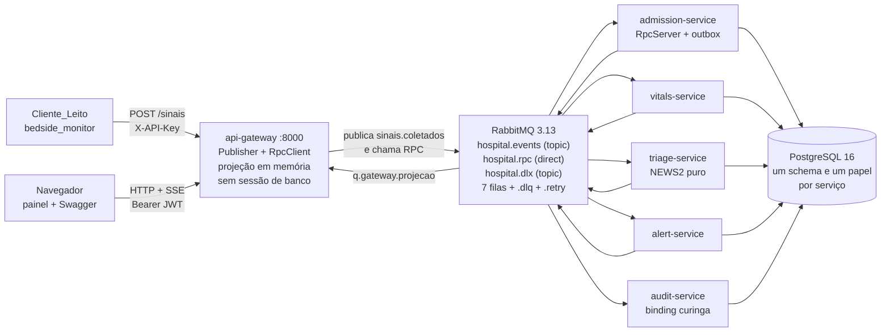

# HospitalMQ — middleware de mensageria para um Hospital Inteligente

| Item | Valor |
|---|---|
| Disciplina | Sistemas Distribuídos |
| Entrega | Atividade Prática 01 |
| Grupo | **G3** |
| Tipo de middleware | **Message Queue** (fila de mensagens / MOM) |
| Cenário de aplicação | **Hospital Inteligente** |
| Serviço AWS de referência | **Amazon SQS** (proposta arquitetural, sem implantação) |
| Transporte usado no laboratório | RabbitMQ 3.13 (AMQP 0-9-1) |
| Repositório | `git@github.com:ggnery/Atividade-1-SD.git` |

### Integrantes

<!-- PREENCHER: integrantes do G3 -->

- Carlos Alberto Rodrigues
- Gabriel Nery
- Giordana Bucci
- Gustavo Valadares
- Luiz Felipe Belisário


## 1. O que é isto

**O middleware (`hospitalmq/`) é o artefato avaliado.** É um pacote Python escrito pelo grupo que
implementa a semântica de mensageria: o `Envelope` de 10 campos com `correlation_id` e
`causation_id`, publicação com *publisher confirm*, consumo com ACK manual, política de retentativa
exponencial 1 s / 2 s / 4 s com corte na 4ª tentativa, *dead letter queue* com enriquecimento do
motivo da falha, idempotência por `(consumidor, message_id)`, RPC sobre fila com fila de retorno e
timeout, propagação da identidade autenticada até o consumidor, log estruturado em JSON com máscara
de dado pessoal e contadores de operação. Nada disso vem pronto de biblioteca.

**O RabbitMQ é transporte, não é a entrega.** O núcleo do `hospitalmq` conversa apenas com a
interface `Transport` (`hospitalmq/transport/base.py`: `connect`, `declare_topology`, `publish`,
`consume`, `ack`, `nack`, `reply`, `close`), que troca `bytes` — nunca `Envelope`. Existem duas
implementações no repositório: `transport/amqp.py`, que dirige o RabbitMQ via `aio-pika`, e
`transport/memory.py`, um transporte em memória com roteamento por *topic* (`#`, `*`) e atraso de
entrega, que é o que permite rodar 117 testes de unidade sem broker nenhum. O `aio-pika` é o driver
de socket AMQP do HospitalMQ, do mesmo modo que o `asyncpg` é o driver de socket do PostgreSQL;
retentativa, DLQ, idempotência, correlação e RPC são código do grupo. O design descreve ainda um
terceiro transporte, `SqsTransport`, como a rota de portabilidade para a AWS — ele **não** está
implementado nesta entrega (é proposta arquitetural, seção 11 do design).

**A aplicação é o hospital que exercita o middleware.** Um simulador de monitor de beira-leito
(`clients/bedside_monitor/`) publica sinais vitais por HTTP no `api-gateway`; o gateway traduz isso
em um evento `sinais.coletados` no broker e responde `202` sem tocar em banco clínico. A partir daí
tudo é assíncrono: `vitals-service` valida a faixa fisiológica e persiste, `triage-service` calcula
o escore NEWS2, `alert-service` gera e notifica o alerta, `audit-service` grava todo evento do
barramento por um *binding* curinga `#`, e a projeção em memória do gateway alimenta o painel de
leitos por *Server-Sent Events*. As leituras que precisam de resposta imediata (criar paciente,
internar, dar alta, consultar prontuário) usam RPC **sobre fila**, não HTTP entre serviços: nenhum
serviço fala com outro serviço diretamente.

---

## 2. Arquitetura em uma imagem



Propriedade verificável do desenho: **toda seta que sai de um serviço aponta para o broker**. Não
existe aresta serviço → serviço. Detalhamento em [`docs/arquitetura.md`](docs/arquitetura.md).

---

## 3. Pré-requisitos

| Para | Requisito |
|---|---|
| Executar o sistema | Docker Engine 24+ e Docker Compose v2 (validado com Docker 29.4.1 / Compose v5.1.3) |
| Executar o sistema | Portas livres no host: **8000** (gateway), **5672** e **15672** (RabbitMQ), **5433** (PostgreSQL) |
| Executar o sistema | ~4 GB de RAM livres para o Docker |
| Copiar/colar os exemplos | `curl` e `jq` |
| Rodar os testes fora do container | Python 3.12 e [`uv`](https://docs.astral.sh/uv/) (apenas isso; o sistema em si não precisa de Python instalado no host) |

---

## 4. Como executar

```bash
git clone git@github.com:ggnery/Atividade-1-SD.git
cd Atividade-1-SD
cp .env.example .env          # obrigatório: .env não é versionado
docker compose up -d --build
```

**O que sobe.** Nove serviços declarados: `rabbitmq`, `postgres`, `db-init` (aplica
`db/schema.sql` + `db/seed.sql` e termina), `api-gateway` e os cinco consumidores
(`admission-service`, `vitals-service`, `triage-service`, `alert-service`, `audit-service`).
Depois do boot ficam **8 contêineres de pé**, todos com *healthcheck* próprio; o `db-init` sai com
código 0 e não volta.

**Quanto demora.** A primeira execução baixa três imagens base (`python:3.12-slim` ≈ 205 MB,
`postgres:16-alpine` ≈ 411 MB, `rabbitmq:3.13-management` ≈ 408 MB) e instala as dependências
Python — alguns minutos, dominados pela rede. Com as imagens base já presentes, um
`docker build --no-cache` da imagem da aplicação levou **9 s** nesta máquina, e o
`docker compose up -d --build` completo, do clone limpo até os 8 contêineres `healthy`, levou
**~18 s** (11 s de build/criação + 7 s de espera pelos *healthchecks*; o `start_period` é 20 s).
Para bloquear até tudo estar saudável, use `docker compose up -d --wait`.

**Nome do projeto Compose.** O `docker-compose.yml` fixa `name: hospital-g3`, então os contêineres
têm nomes determinísticos (`hospital-g3-alert-service-1`, …) — é isso que faz o `docker kill` de
§6.10 funcionar sem descobrir o nome antes. O efeito colateral é que **dois clones deste repositório
na mesma máquina compartilham o mesmo projeto, os mesmos contêineres e os mesmos volumes**: subir a
stack a partir de um segundo diretório recria a do primeiro em vez de criar uma nova. Se precisar de
duas cópias simultâneas, use `docker compose -p outro-nome up -d`.

**Como conferir:**

```bash
docker compose ps --format "table {{.Service}}\t{{.Status}}"
```

Saída esperada (o `db-init` não aparece porque já terminou):

```
SERVICE             STATUS
admission-service   Up 9 seconds (healthy)
alert-service       Up 9 seconds (healthy)
api-gateway         Up 9 seconds (healthy)
audit-service       Up 9 seconds (healthy)
postgres            Up 10 hours (healthy)
rabbitmq            Up 10 hours (healthy)
triage-service      Up 9 seconds (healthy)
vitals-service      Up 9 seconds (healthy)
```

### Endereços

| O quê | URL | Autenticação |
|---|---|---|
| Swagger UI (documentação executável da API) | <http://localhost:8000/docs> | o botão `Authorize` aceita os três esquemas declarados: `BearerJWT`, `ApiKeyDispositivo` e `CookieSessao` |
| OpenAPI 3.1 em JSON | <http://localhost:8000/openapi.json> | — |
| Painel de Leitos **+ Console de Operação** | <http://localhost:8000/painel> | a casca HTML é pública; o *stream* exige sessão (veja §5) |
| Health check | <http://localhost:8000/health> | — |
| Métricas do middleware | <http://localhost:8000/metrics> | — (protegível com `HOSPITALMQ_METRICS_PROTEGIDO=true`) |
| UI de gerenciamento do RabbitMQ | <http://localhost:15672> | `hospital` / `hospital` |
| PostgreSQL (host) | `localhost:5433`, banco `hospital` | veja a tabela de papéis em §5 |

**A mesma página `/painel` traz o Console de Operação.** O mural continua sendo a tela limpa do
projetor — o console é uma **gaveta lateral retrátil, fechada por padrão**, aberta pelo botão
**Operar** no cabeçalho (e fechada pelo botão **Fechar** ou pela tecla `Esc`). Com ela aberta dá para
conduzir a demonstração inteira **sem terminal**: entrar como `enf.ana` / `med.silva` / `aud.paula`,
admitir um paciente em um leito livre, publicar sinais vitais por presets ou por uma sequência de
deterioração, dar alta e ler o log das últimas 20 chamadas HTTP com método, rota, status e
`correlation_id` clicável. O passo a passo está em §6.A.

> O console é apenas **mais um cliente HTTP da mesma API pública**: ele chama `POST /auth/token`,
> `POST /pacientes`, `POST /internacoes`, `POST /sinais`, `POST /internacoes/{id}/alta` e `GET /leitos`
> — exatamente as rotas de §6.B. Não há endpoint privilegiado, rota nova nem acesso a banco a partir
> do navegador; tudo que o console faz, um `curl` faz igual.

**Nota para quem for mexer no front.** O painel e o console são três arquivos estáticos —
`services/api-gateway/static/painel.html`, `painel.css` e `painel.js` — em HTML, CSS e JavaScript
puros: sem framework, sem CDN, sem etapa de build (R11.6). Eles são **copiados para dentro da imagem**
pelo `Dockerfile` e não há *bind mount*, então depois de editar qualquer um deles é obrigatório
reconstruir:

```bash
docker compose up -d --build api-gateway   # publica os estáticos novos
docker compose restart api-gateway         # NÃO publica: reinicia o contêiner com a imagem antiga
```

Se a página continuar igual depois de uma edição, é quase sempre este o motivo — confirme com
`curl -s http://localhost:8000/painel | grep -c "Console de operação"` (deve ser ≥ 1) antes de
procurar erro no JavaScript.

---

## 5. Credenciais de teste

> **Todas as credenciais desta seção são fictícias e existem apenas para a demonstração.** Estão em
> texto claro no repositório de propósito, para que o avaliador consiga executar o sistema sem
> nenhum passo manual. Nada aqui é segredo real.

**Usuários (JWT HS256, `POST /auth/token`)** — definidos em `services/api-gateway/rotas/auth.py`.
Senha de todos: `demo123`.

| Usuário | Papel | Pode |
|---|---|---|
| `enf.ana`, `enf.bia` | `enfermeiro` | criar paciente, internar, ver prontuário, painel e alertas |
| `med.silva`, `med.joao` | `medico` | dar alta, ver prontuário, painel e alertas |
| `aud.paula` | `auditor` | ver alertas e `/metrics`; **não** cria paciente (é o `403` da demonstração) |
| `admin` | `admin` | tudo acima |

**API Keys de dispositivo (`X-API-Key`, única credencial aceita em `POST /sinais`)** — definidas em
`API_KEYS` no `.env.example`:

| API Key | Identidade do dispositivo |
|---|---|
| `dev-monitor-l07` | `monitor-l07` |
| `dev-monitor-l12` | `monitor-l12` |
| `dev-monitor-uti03` | `monitor-uti-03` |

As credenciais não são intercambiáveis: um JWT de pessoa em `POST /sinais` devolve `401` (a rota só
aceita `X-API-Key`), e uma API Key numa rota de pessoa também devolve `401`.

**Infraestrutura:**

| Componente | Usuário | Senha | Observação |
|---|---|---|---|
| RabbitMQ (AMQP e UI) | `hospital` | `hospital` | vhost `hospital` |
| PostgreSQL — dono | `hospital` | `hospital` | usado **apenas** pelo `db-init` |
| PostgreSQL — `admission-service` | `svc_admission` | `demo-svc_admission` | schema `clinico` (`pacientes`, `leitos`, `internacoes`, `outbox_mensagens`) |
| PostgreSQL — `vitals-service` | `svc_vitals` | `demo-svc_vitals` | schema `vitais` (`sinais_vitais`) |
| PostgreSQL — `triage-service` | `svc_triage` | `demo-svc_triage` | schema `triagem` — só a marca de idempotência, sem tabela de domínio |
| PostgreSQL — `alert-service` | `svc_alert` | `demo-svc_alert` | schema `alertas` (`alertas`) |
| PostgreSQL — `audit-service` | `svc_audit` | `demo-svc_audit` | schema `auditoria` (`eventos_auditoria`) |

O isolamento é real e verificável em um comando:

```bash
docker compose exec -e PGPASSWORD=demo-svc_vitals postgres \
  psql -h 127.0.0.1 -U svc_vitals -d hospital -c 'SELECT count(*) FROM clinico.pacientes;'
# ERROR:  permission denied for schema clinico
```

**Sessão do painel no navegador.** O `EventSource` não envia cabeçalho `Authorization`, então
`/painel/stream` autentica por cookie `hmq_session` (`HttpOnly`, `Path=/painel`). O caminho prático
é: abrir <http://localhost:8000/docs>, executar `POST /auth/token` com `enf.ana` / `demo123` pelo
próprio Swagger — o navegador guarda o cookie — e só então abrir <http://localhost:8000/painel>.
Na linha de comando o *stream* também aceita `Authorization: Bearer`.

O caminho mais curto, porém, é o próprio Console de Operação: abrir <http://localhost:8000/painel>,
clicar em **Operar** e depois em **Entrar**. O `POST /auth/token` disparado pelo console é uma
requisição *same-origin*, então o navegador guarda o mesmo cookie `hmq_session` e o mural passa a
receber o *stream* sem escala pelo Swagger. O JWT em si fica **apenas em memória** — nunca em
`localStorage` ou `sessionStorage` — e some ao recarregar a página.

---

## 6. Roteiro da demonstração

Há **duas formas de conduzir a mesma demonstração**, e elas não competem:

- **§6.A — pela interface**, no Console de Operação embutido em `/painel`. É o caminho
  **recomendado para a apresentação**: acontece na tela que o projetor já está mostrando, sem alternar
  para o terminal, e cada ação move os cards ao vivo.
- **§6.B — pela API com `curl`**, o **contrato cru**. É a evidência de que o sistema é uma API HTTP
  comum, é o que a suíte `tests/e2e` exercita, e é o caminho para os cenários que o console não cobre
  (timeout de RPC, inspeção da DLQ pelo *management* do RabbitMQ, *competing consumers*).

As duas falam com **as mesmas rotas**: o console é um cliente HTTP como o `curl`, sem endpoint
privilegiado nem acesso a banco. Se algo funciona em uma, funciona na outra. As subseções numeradas
(§6.1 a §6.11) pertencem a §6.B e são referenciadas pelo resto do README.

Todos os blocos de §6.B foram executados contra a stack de pé, na ordem em que aparecem. Rode-os a
partir da raiz do repositório.

---

### 6.A Pela interface — Console de Operação (recomendado para a apresentação)

Pré-requisito: `docker compose up -d --wait` e a stack saudável (§4). Nada mais — nem `curl`, nem
`jq`, nem token exportado.

**1. Abrir o mural e a gaveta.** Vá a <http://localhost:8000/painel>. O mural é a tela limpa: um card
por leito, coluna **Alertas recentes** à direita, indicador de conexão e relógio no cabeçalho. Clique
em **Operar** para abrir o Console de Operação à direita (`Esc` ou **Fechar** recolhem a gaveta).

**2. `1 Sessão` — entrar.** Os campos **Usuário** e **Senha** já vêm com `enf.ana` / `demo123`.
Clique em **Entrar**: é um `POST /auth/token`, e a linha de estado passa a
`Sessão ativa: enf.ana · papel enfermeiro · token em memória (expira em 1800 s)`. O JWT fica **só em
memória**; o cookie `hmq_session` que a resposta grava é o que autoriza o *stream* do mural (§5). Ao
lado ficam os chips de **troca rápida de papel** — `enf.ana · enfermeiro`, `med.silva · médico`,
`aud.paula · auditor` — e o campo **API Key do dispositivo (cabeçalho X-API-Key)**, pré-preenchido com
`dev-monitor-l07`, porque telemetria se autentica por API Key e **nunca** por JWT (**R4.5**).

> **Internar não mede.** `POST /internacoes` registra que o paciente ocupa o leito e nada mais —
> sinais vitais só existem depois que algum monitor publica em `POST /sinais`. Por isso o card de um
> paciente recém-admitido aparece com o badge **SEM LEITURA** (âmbar, borda tracejada) e um traço no
> lugar do NEWS2. Esse estado é deliberadamente distinto de **BAIXA**: um leito que ninguém mediu não
> pode se parecer com um paciente avaliado e sem risco, e um leito vago mostra **LIVRE**.

**3. `2 Admitir paciente` — criar o paciente e interná-lo.** O **Nome do paciente** já vem sorteado e
o **Documento** auto-gerado (`DOC-<epoch>`, para o bloco ser re-executável); **Sortear paciente**
troca os dois. Escolha um leito no `select` **Leito livre**, que é populado com os leitos livres lidos
de `GET /leitos`, e clique em **Admitir**. Um clique dispara **duas** chamadas em sequência:
`POST /pacientes` e depois `POST /internacoes` — ambas **RPC sobre fila** (`paciente.criar`,
`paciente.admitir`), respondidas dentro da própria requisição HTTP. O card do leito deixa de ser
`(livre)` e passa a mostrar o nome do paciente. Se algum `select` de leito parecer defasado, o botão
**Recarregar leitos** de `1 Sessão` refaz o `GET /leitos` e reconcilia os três.

**4. `3 Publicar sinais vitais` — a deterioração ao vivo.** Escolha o leito recém-admitido no `select`
**Leito ocupado** e clique em **Sequência de deterioração**: são 8 leituras `POST /sinais` a cada
1,5 s, piorando progressivamente, com o indicador de progresso mostrando `1/8` … `8/8` e um botão
**Cancelar** ao lado. Olhe para o mural enquanto isso: o card muda de cor a cada leitura, sem
recarregar a página (**R11.2**), porque o `triage-service` recalcula o NEWS2 a cada evento
(**R6.2**). Nas últimas leituras o escore cruza 5 e aparece um componente isolado pontuando 3: o card
fica vermelho e um alerta de severidade **alta** entra no topo da coluna **Alertas recentes**
(**R6.3**). Os presets fazem o mesmo em uma leitura só: **Estável** (NEWS2 0), **Atenção** (NEWS2 3)
e **Crítico** (NEWS2 ≥ 7, dispara alerta) — o quarto, **Fora de faixa**, é o passo 5.

**4b. `Monitoramento contínuo` e `Modo enfermaria` — a enfermaria viva.** A *Sequência de
deterioração* do passo 4 tem começo e fim; num hospital o monitor fica **preso ao leito** e
transmite o tempo todo. Dois botões cobrem isso, logo abaixo dos presets:

- **Iniciar monitoramento** publica sem parar no leito selecionado, com **Intervalo entre leituras**
  e **Escalada até crítico** (rápido 30 s · normal 1 min 30 s · lento 3 min) configuráveis. Os
  números mudam a cada leitura e a gravidade sobe sozinha, atravessando **baixa → média → alta**.
- **Modo enfermaria (todos os leitos)** liga um monitor em **cada leito ocupado** de uma vez e fica
  armado: quem for internado depois entra sozinho. O gatilho é o próprio evento de leito que já
  chega por SSE — não há *polling*. **Um** paciente evolui e os demais ficam estáveis, porque todo
  mundo piorando junto não acontece num hospital e apaga o efeito: o que se quer ver é **um card
  ficando vermelho no meio de uma parede verde**.

As três ações são distintas e não se atrapalham: **Desarmar modo enfermaria** só impede novas
internações de entrarem sozinhas (os monitores em curso continuam), **Parar todos** interrompe as
coletas, e a **Sequência de deterioração** assume o leito escolhido parando o contínuo dele. Para a
apresentação, o caminho mais confortável é ligar o Modo enfermaria no começo e falar sobre
arquitetura enquanto o mural ganha vida sozinho.

**5. Preset `Fora de faixa` — a DLQ sem retentativa.** Ainda em `3 Publicar sinais vitais`, clique em
**Fora de faixa** (SpO₂ 20). A borda **aceita** com `202`, porque 20 é um inteiro válido de 0 a 100 na
validação estrutural; o `vitals-service` é que recusa pela faixa fisiológica (50–100) e trata como
`PermanentError` — a mensagem vai **direto à DLQ, na tentativa 1, sem retentativa** (**R6.6**). A
linha de estado do console avisa isso em português; a prova fica no log do serviço:

```bash
docker compose logs vitals-service --since 60s --no-log-prefix \
  | jq -Rc 'fromjson? // empty | select(.evento=="mensagem.dlq") | {servico,evento,tentativa}'
# {"servico":"vitals-service","evento":"mensagem.dlq","tentativa":1}
```

**6. (Opcional) Retentativa 1 s / 2 s / 4 s pelo console.** O leito **`UTI-03`** tem o canal de
notificação sabotado por configuração (`ALERT_FAILURE_LEITOS`, §6.5). Admita um paciente em `UTI-03`
no passo 3 e mande o preset **Crítico**: o alerta é gerado, a notificação falha com `TransientError`,
e o middleware espera 1 s, 2 s e 4 s antes de descartar (**R6.5**). Verificado nesta stack, com o
`correlation_id` da própria linha do log do console:

```bash
docker compose logs alert-service --since 60s --no-log-prefix \
  | jq -Rc 'fromjson? // empty
            | select(.evento=="mensagem.retentativa" or .evento=="mensagem.dlq")
            | {evento, tentativa, correlation_id}'
# {"evento":"mensagem.retentativa","tentativa":1,"correlation_id":"10d23ef9-..."}
# {"evento":"mensagem.retentativa","tentativa":2,"correlation_id":"10d23ef9-..."}
# {"evento":"mensagem.retentativa","tentativa":3,"correlation_id":"10d23ef9-..."}
# {"evento":"mensagem.dlq",        "tentativa":4,"correlation_id":"10d23ef9-..."}
```

**7. O `403` ao vivo.** Clique no chip **`aud.paula · auditor`** (ele já faz o login) e tente
**Admitir** de novo. A resposta é `403` e o **`5 Log de ações`** mostra o corpo RFC 7807 destrinchado
em `type`, `title`, `status` e `detail` — `papel 'auditor' nao autorizado para esta operacao`
(**R4.4**). O mesmo vale para **Dar alta**. A falha vira demonstração do contrato de erro, em vez de
um susto na apresentação. O console avisa que o papel `auditor` não enxerga `/leitos` nem o *stream*;
o mural continua desenhado com a projeção já recebida, e o passo seguinte devolve a sessão a um papel
clínico.

**8. `5 Log de ações` — do clique ao rastreio distribuído.** O log guarda as **últimas 20 chamadas**,
mais recente no topo, cada uma com método, rota, status HTTP e o `correlation_id` em fonte mono.
**Clique no `correlation_id`**: ele é copiado para a área de transferência e o console imprime o
comando pronto `./scripts/trace.sh <cid>`. Cole no terminal e saia da borda para dentro do barramento
— o mesmo identificador aparece nas linhas dos cinco processos, porque ele é preservado em toda a
cadeia (**R5.3**). O detalhamento da saída está em §6.7.

**9. `4 Dar alta` — reiniciar a cena.** Volte para o chip **`med.silva · médico`**, escolha o leito no
`select` **Leito ocupado** de `4 Dar alta`, confira o **Motivo** (`Alta médica`) e clique em **Dar
alta**. O leito é liberado, volta a aparecer no `select` de leitos livres e a demonstração pode
recomeçar do passo 3. Dar alta exige papel **médico** ou **admin** — com `enf.ana` ou `aud.paula` a
resposta é `403` (**R4.4** outra vez).

O que **não** está no console e continua em §6.B: o timeout de RPC → `504` (§6.8), a leitura do
conteúdo da DLQ pelo *management* do RabbitMQ (§6.5), os cenários do simulador (§6.9) e o teste de
*competing consumers* (§6.10).

---

### 6.B Pela API com `curl` — o contrato cru

Este é o caminho que evidencia o **contrato HTTP puro**, sem navegador no meio, e é exatamente o que a
suíte `tests/e2e` exercita (§7). Cada bloco abaixo tem um equivalente no console; o inverso não é
verdade — §6.8, §6.9 e §6.10 só existem aqui.

#### 6.1 Obter um token

```bash
export TOKEN=$(./scripts/token.sh)            # enf.ana / demo123
./scripts/token.sh med.silva demo123          # outro usuário/senha
```

Antes disso, as duas cenas de autenticação (R4.1, R4.4):

```bash
curl -sS -o /dev/null -w '%{http_code}\n' http://localhost:8000/leitos
# 401

T_AUD=$(./scripts/token.sh aud.paula demo123)
curl -sS -X POST http://localhost:8000/pacientes -H "Authorization: Bearer $T_AUD" \
  -H "Content-Type: application/json" \
  -d '{"nome":"Teste Papel","documento":"888.111.000-11","data_nascimento":"1990-01-01","sexo":"M"}'
# {"type":"https://hospitalmq.g3/problems/papel-insuficiente","title":"Permissao insuficiente",
#  "status":403,"detail":"papel 'auditor' nao autorizado para esta operacao","correlation_id":"..."}
```

Os erros seguem RFC 7807 (`application/problem+json`) e sempre carregam `correlation_id`.

#### 6.2 Criar um paciente e interná-lo

O `db/seed.sql` semeia 20 leitos e 10 pacientes, mas **nenhuma internação** — uma internação só
nasce da operação RPC, que é justamente o caminho que a demonstração precisa exercitar. Por isso o
roteiro cria paciente e internação pela borda HTTP. `POST /pacientes` e `POST /internacoes` são
RPC sobre fila (`paciente.criar`, `paciente.admitir` na fila `q.rpc.admission`), respondidos dentro
da mesma requisição HTTP.

```bash
export PACIENTE=$(curl -sS -X POST http://localhost:8000/pacientes \
  -H "Authorization: Bearer $TOKEN" -H "Content-Type: application/json" \
  -d "{\"nome\":\"Maria Souza\",\"documento\":\"demo-$(date +%s)\",
       \"data_nascimento\":\"1958-03-11\",\"sexo\":\"F\"}" | jq -r .paciente_id)
echo "$PACIENTE"
# 938ef819-d6fe-4eba-bb4e-52fafc5a1705

curl -sS -X POST http://localhost:8000/internacoes \
  -H "Authorization: Bearer $TOKEN" -H "Content-Type: application/json" \
  -d "{\"paciente_id\":\"$PACIENTE\",\"leito_id\":\"UTI-02\",
       \"equipe_responsavel\":\"Equipe UTI A\",\"motivo\":\"Observacao clinica\"}" | jq
# {"internacao_id":"ae5fb9d0-...","paciente_id":"938ef819-...","leito_id":"UTI-02",
#  "setor":"UTI","admitido_em":"2026-07-24T11:41:40.933501Z"}
```

O `documento` é único no banco; o `$(date +%s)` deixa o bloco re-executável. Leitos **utilizáveis**
vêm do seed: `UTI-01`..`UTI-05`, `ENF-01`..`ENF-10`, `EME-01`..`EME-04` — dezenove. O vigésimo,
`UTI-06`, é semeado com `ativo = FALSE` de propósito (leito desativado), e por isso não aparece na
projeção: `GET /leitos` devolve 19 itens e `GET /health` reporta `"leitos": 19`. O código do leito
precisa casar `^[A-Z]{2,4}-\d{2}$` na borda (`services/api-gateway/schemas.py`) e
`^[A-Z]{3}-[0-9]{2}$` no banco (`ck_leitos_codigo`, em `db/schema.sql`) — o padrão do banco é o mais
restritivo dos dois. `GET /leitos` mostra quais estão livres.

#### 6.3 Publicar sinais vitais

> **`coletado_em` é obrigatório e precisa ser ISO-8601 com fuso.** O corpo sem ele volta `422`.
> O campo de saturação chama-se `saturacao_o2`, e a rota é `POST /sinais` com `leito_id` **no
> corpo** (não `/leitos/{cod}/sinais`).

Paciente estável — NEWS2 baixo, card verde, nenhum alerta:

```bash
curl -sS -X POST http://localhost:8000/sinais \
  -H "X-API-Key: dev-monitor-l07" -H "Content-Type: application/json" \
  -d "{\"leito_id\":\"UTI-02\",
       \"frequencia_respiratoria\":16,\"saturacao_o2\":98,\"oxigenio_suplementar\":false,
       \"temperatura\":\"36.5\",\"pressao_sistolica\":120,\"frequencia_cardiaca\":75,
       \"nivel_consciencia\":\"A\",\"coletado_em\":\"$(date -u +%Y-%m-%dT%H:%M:%SZ)\"}" | jq
```

```json
{
  "status": "aceito",
  "tipo_evento": "sinais.coletados",
  "message_id": "1edf9467-ad7b-4d70-9b81-10052444df0c",
  "correlation_id": "d878a005-4e65-46c0-832c-dad9a15bc527",
  "recebido_em": "2026-07-24T11:32:40.893206Z",
  "acompanhar_em": "/painel"
}
```

Deterioração — e captura do `correlation_id` do cabeçalho para o rastreio:

```bash
curl -sS -D /tmp/h -X POST http://localhost:8000/sinais \
  -H "X-API-Key: dev-monitor-l07" -H "Content-Type: application/json" \
  -d "{\"leito_id\":\"UTI-02\",
       \"frequencia_respiratoria\":30,\"saturacao_o2\":86,\"oxigenio_suplementar\":true,
       \"temperatura\":\"39.5\",\"pressao_sistolica\":85,\"frequencia_cardiaca\":135,
       \"nivel_consciencia\":\"V\",\"coletado_em\":\"$(date -u +%Y-%m-%dT%H:%M:%SZ)\"}" | jq -c

export CID=$(awk -F': ' 'tolower($1)=="x-correlation-id"{print $2}' /tmp/h | tr -d '\r')
echo "$CID"
```

Se o leito não tiver internação ativa, a resposta é `409 leito-nao-ocupado` — o gateway resolve
`leito_id → internacao_id` pela projeção antes de publicar.

#### 6.4 Ver o alerta, o painel e o prontuário

```bash
curl -sS -H "Authorization: Bearer $TOKEN" \
  "http://localhost:8000/alertas?leito_id=UTI-02" | jq -c '.itens[0]'
```

```json
{"alerta_id":"ab1b0380-ee01-40ec-939a-8916693f04e7","leito_id":"UTI-02",
 "paciente_nome":"Maria Souza","score_news2":19,"severidade":"alta","estado":"notificado",
 "gerado_em":"2026-07-24T11:41:50.660018Z","correlation_id":"a58a7c9f-e68e-47a4-86f4-64be0ec1f67a"}
```

```bash
curl -sS -H "Authorization: Bearer $TOKEN" http://localhost:8000/leitos \
  | jq -c '.itens[] | select(.leito_id=="UTI-02") | {estado,score_news2,componente_critico,severidade}'
# {"estado":"ocupado","score_news2":19,"componente_critico":true,"severidade":"alta"}

./scripts/prontuario.sh "$PACIENTE" | jq '{paciente: .paciente.nome, sinais: (.ultimos_sinais|length)}'
```

O prontuário é montado por dois RPC sobre fila: `prontuario.consultar` no `admission-service` e
`sinais.ultimos` no `vitals-service`. O painel em <http://localhost:8000/painel> reflete o mesmo
estado em tempo real, empurrado por SSE (nenhum *polling*).

#### 6.5 Retentativa e DLQ (o caminho por esgotamento)

O `alert-service` tem um canal de notificação sabotado **por configuração**, e só para os leitos
listados em `ALERT_FAILURE_LEITOS` — padrão `UTI-03`. Interne um paciente em `UTI-03` (mesmo bloco
de §6.2, trocando o leito) e dispare o cenário:

```bash
docker compose --profile demo run --rm bedside-monitor \
  python clients/bedside_monitor/__main__.py --cenario falha-consumidor
```

A partir do 7º passo o NEWS2 passa de 5, o alerta é gerado, a notificação falha com
`TransientError` e o middleware espera 1 s, 2 s e 4 s antes de descartar. Acompanhe:

```bash
docker compose logs alert-service --since 90s --no-log-prefix \
  | jq -Rc 'fromjson? // empty
            | select(.evento=="mensagem.retentativa" or .evento=="mensagem.dlq")
            | {evento, tentativa, correlation_id}'
```

```
{"evento":"mensagem.retentativa","tentativa":1,"correlation_id":"7045e7c3-..."}
{"evento":"mensagem.retentativa","tentativa":2,"correlation_id":"7045e7c3-..."}
{"evento":"mensagem.retentativa","tentativa":3,"correlation_id":"7045e7c3-..."}
{"evento":"mensagem.dlq",        "tentativa":4,"correlation_id":"7045e7c3-..."}
```

O bloco acima é a vida de **uma** mensagem. Na tela virão quatro delas: a partir do 7º passo o
NEWS2 fica acima de 5 em todas as leituras seguintes, então os passos 6 a 9 geram quatro alertas, e
as quatro sequências de retentativa se **intercalam** no log — 12 linhas `mensagem.retentativa` e 4
linhas `mensagem.dlq`, fora de ordem entre si. Para isolar uma só, filtre pelo `correlation_id`:

```bash
docker compose logs alert-service --since 90s --no-log-prefix \
  | jq -Rc --arg cid "$CID_DA_LINHA" 'fromjson? // empty | select(.correlation_id==$cid)
            | select(.evento=="mensagem.retentativa" or .evento=="mensagem.dlq")
            | {evento, tentativa}'
```

Contagem das filas e conteúdo da DLQ:

```bash
docker compose exec rabbitmq rabbitmqctl list_queues -p hospital name messages | grep dlq

curl -sS -u hospital:hospital -X POST \
  http://localhost:15672/api/queues/hospital/q.alert.alerta-gerado.dlq/get \
  -H "Content-Type: application/json" \
  -d '{"count":1,"ackmode":"reject_requeue_true","encoding":"auto"}' \
  | jq -r '.[0].payload' | jq '{chaves: keys, falha}'
```

```json
{
  "chaves": ["envelope", "falha"],
  "falha": {
    "servico": "alert-service",
    "fila_origem": "q.alert.alerta-gerado",
    "motivo": "retentativas_esgotadas",
    "erro_tipo": "TransientError",
    "erro_mensagem": "canal de notificacao indisponivel",
    "traceback_resumo": "alert-service/handler.py:244 in alerta_gerado -> TransientError",
    "tentativas": 4,
    "descartado_em": "2026-07-24T01:45:33.092425Z"
  }
}
```

O `Envelope` original vai para a DLQ **intacto**, dentro da chave `envelope`; o diagnóstico entra
ao lado, em `falha`. Nada é reescrito.

#### 6.6 DLQ imediata (o caminho permanente)

Uma saturação de 20 % passa na validação estrutural da borda (0–100) e é recusada pela faixa
fisiológica do `vitals-service` (50–100). Isso é `PermanentError`: retentar não mudaria o
resultado, então a mensagem vai direto à DLQ, na tentativa 1.

```bash
docker compose --profile demo run --rm bedside-monitor \
  python clients/bedside_monitor/__main__.py --cenario fora-de-faixa    # leito ENF-08

docker compose logs vitals-service --since 60s --no-log-prefix \
  | jq -Rc 'fromjson? // empty | select(.evento=="mensagem.dlq") | {servico,evento,tentativa}'
# {"servico":"vitals-service","evento":"mensagem.dlq","tentativa":1}
```

#### 6.7 Rastrear um `correlation_id`

```bash
./scripts/trace.sh "$CID"                    # todas as linhas JSON daquela requisição
./scripts/trace.sh "$CID" | jq -r .servico | sort | uniq -c
```

```
   4 alert-service
   6 api-gateway
   4 audit-service
   3 triage-service
   3 vitals-service
```

Uma única leitura de sinais produz 20 linhas de log correlacionadas em cinco processos, do `202` do
gateway até `alerta.notificado`. O `causation_id` de cada evento aponta para o `message_id` do
evento que o causou, o que reconstrói a árvore de causalidade.

A auditoria universal (fila `q.audit.todos`, *binding* `#`) grava tudo o que trafega no barramento:

```bash
docker compose exec -e PGPASSWORD=demo-svc_audit postgres psql -h 127.0.0.1 -U svc_audit \
  -d hospital -c "SELECT tipo, count(*) FROM auditoria.eventos_auditoria GROUP BY 1 ORDER BY 2 DESC;"
```

```
         tipo          | count
-----------------------+-------
 sinais.coletados      |    26
 sinais.registrados    |    25
 prontuario.consultado |    12
 alerta.gerado         |    12
 paciente.admitido     |    11
 leito.ocupado         |    11
 alerta.notificado     |    10
 alerta.falhou         |     2
 sinais.rejeitados     |     1
 acesso.negado         |     1
```

(Os números dependem de quanto o sistema rodou; o que a tabela demonstra é que **um único
consumidor vê todos os tipos de evento** sem que ninguém precise se registrar nele.)

#### 6.8 Timeout de RPC → `504`

```bash
docker compose stop admission-service
curl -sS -w '\nHTTP %{http_code} em %{time_total}s\n' -H "Authorization: Bearer $TOKEN" \
  "http://localhost:8000/pacientes/$PACIENTE/prontuario"
docker compose start admission-service
```

```json
{"type":"https://hospitalmq.g3/problems/tempo-esgotado-no-rpc",
 "title":"Tempo esgotado na chamada ao servico","status":504,
 "detail":"A operacao 'prontuario.consultar' nao respondeu em 5.0s. A requisicao foi descartada; nenhuma alteracao foi feita.",
 "correlation_id":"565c229e-91af-4bff-abe0-914c1bd50ac5","retry_after_s":5}
```

```
HTTP 504 em 5.011218s
```

#### 6.9 Os cenários do simulador

##### `plantao` — o paciente que evolui sozinho

Além dos quatro cenários exigidos pelo enunciado, há o **`plantao`**: em vez de uma trajetória
finita, o paciente tem uma **gravidade interna** que sobe de 0 a 1 no horizonte de `--escalada`, com
os sete parâmetros interpolados entre um extremo saudável e um grave e ruído por cima, de modo que
os números mudam a cada leitura. Sem `--duracao` ele roda até `Ctrl+C`.

```bash
# 3 min até crítico, roda até Ctrl+C
.venv/bin/python -m clients.bedside_monitor --cenario plantao

# comprimido em 40 s — bom para ensaiar
.venv/bin/python -m clients.bedside_monitor --cenario plantao --escalada 40

# 5 leitos, cada um com ritmo ±22% diferente (a enfermaria inteira, pelo terminal)
.venv/bin/python -m clients.bedside_monitor --cenario plantao --leitos 5
```

Medido ao vivo com `--escalada 40`: NEWS2 `0 → 1 → 3 → 4 → 7 → 11 → 16`, atravessando
**baixa → média → alta** sem regressão de banda e sem nenhuma leitura recusada por faixa
fisiológica. O ruído fica só em pressão sistólica e frequência cardíaca — os dois parâmetros com
faixa larga na tabela NEWS2; em FR, SpO₂ e temperatura as faixas são estreitas e o ruído fazia o
escore recuar, piscando o card no meio da escalada.

##### Os quatro cenários do enunciado

O simulador é determinístico por semente (`SEMENTE_SIMULADOR`): mesma semente, mesma sequência.

São estes quatro que cobrem os cenários exigidos pelo enunciado. O `--help` lista seis linhas
porque há ainda `tempestade` (N leitos em paralelo, extra) e `dlq` (apelido de `fora-de-faixa`).

```bash
# catálogo completo, com o critério do enunciado que cada cenário cobre
docker compose --profile demo run --rm bedside-monitor \
  python clients/bedside_monitor/__main__.py --help

# 1. paciente estável                (card verde, NEWS2 baixo, nenhum alerta)
docker compose --profile demo run --rm bedside-monitor \
  python clients/bedside_monitor/__main__.py --cenario estavel --leito UTI-01

# 2. paciente em deterioração        (NEWS2 cruza 5 no 7º passo, card vermelho, alerta)
docker compose --profile demo run --rm bedside-monitor \
  python clients/bedside_monitor/__main__.py --cenario deterioracao --leito UTI-01

# 3. falha de consumidor com retentativa   (1s, 2s, 4s → DLQ em ~7 s)
docker compose --profile demo run --rm bedside-monitor \
  python clients/bedside_monitor/__main__.py --cenario falha-consumidor

# 4. mensagem enviada à DLQ          (valor impossível, PermanentError, sem retentativa)
docker compose --profile demo run --rm bedside-monitor \
  python clients/bedside_monitor/__main__.py --cenario fora-de-faixa
```

Duas advertências verificadas na prática:

- O comando precisa da forma **completa** `... run --rm bedside-monitor python clients/bedside_monitor/__main__.py --cenario X`. O `docker compose run` **substitui** o `command` do serviço; passar só `--cenario X` faz o Docker tentar executar `--cenario` como programa e falhar.
- O leito alvo precisa ter **internação ativa**, senão todo `POST /sinais` volta `409 leito-nao-ocupado`. Todos os cenários já usam leitos que existem no seed — `estavel` em `UTI-01`, `deterioracao` em `UTI-02`, `falha-consumidor` em `UTI-03`, `fora-de-faixa` em `ENF-08` e `tempestade` a partir de `ENF-01` — mas é preciso internar alguém neles antes (§6.2). Use `--leito` para escolher outro.

#### 6.10 Competing consumers

```bash
docker compose up -d --scale alert-service=3
docker compose ps alert-service
docker kill hospital-g3-alert-service-2      # mata uma réplica no meio do processamento
docker compose up -d --scale alert-service=1
```

Como o ACK é manual e só ocorre depois do handler, a mensagem em voo da réplica morta é
reentregue a outra réplica; a idempotência por `(consumidor, message_id)` impede o efeito duplicado.

#### 6.11 Nota sobre `scripts/`

Os quatro scripts — `token.sh`, `sinais.sh`, `prontuario.sh` e `trace.sh` — foram executados contra
a stack no ar e funcionam como documentado. O `sinais.sh` publica no leito `UTI-01` por padrão;
passe outro como primeiro argumento, junto da API Key correspondente:

```bash
./scripts/sinais.sh                          # UTI-01
./scripts/sinais.sh UTI-03 dev-monitor-uti03 # leito sabotado, para ver retentativa e DLQ
```

O leito alvo precisa ter internação ativa (§6.2), senão a rota devolve `409 leito-nao-ocupado`.

---

## 7. Como rodar os testes

### Unidade — 117 testes, não precisa de nada no ar

Rodam inteiramente sobre o `MemoryTransport` e um relógio manual: sem broker, sem banco, sem Docker.

```bash
uv run --extra dev --extra borda --extra dominio pytest tests/unit
# 117 passed, 6 warnings in 0.21s
```

O `uv run` cria o `.venv` e instala tudo na primeira chamada (poucos segundos, com a cache do `uv`
quente). Depois disso o ambiente já existe e dá para chamar o pytest direto:

```bash
.venv/bin/pytest tests/unit
```

> Não acrescente `-q`. O `pyproject.toml` já traz `-q` em `addopts`; um segundo `-q` liga o modo
> duplamente silencioso do pytest e **some com a linha `117 passed`** — o comando passa, mas parece
> não ter contado nada. Confira pelo código de saída (`echo $?` → `0`) se isso acontecer.

### Ponta a ponta — 8 testes, exige o compose no ar

Falam HTTP com `http://localhost:8000` como um cliente real: login, criação de paciente, admissão,
telemetria estável, prontuário enriquecido, deterioração com alerta de severidade alta e projeção
de leitos.

```bash
docker compose up -d --wait
uv run --extra dev --extra borda --extra dominio pytest tests/e2e
# 8 passed in 8.20s
```

Com o compose fora do ar, o módulo inteiro é **pulado** com mensagem explicativa em vez de falhar.
Os mesmos testes também rodam de dentro da rede do Compose:

```bash
docker compose --profile test run --rm testes
```

> **Pré-condição da suíte e2e:** ela interna um paciente em um leito de enfermaria **livre**, e o
> seed tem apenas dez (`ENF-01`..`ENF-10`). Depois de várias rodadas de demonstração eles acabam, e
> o teste falha em `test_f_admite_paciente_201` com "nenhum leito de enfermaria livre na projecao".
> A cura é rodar contra uma stack limpa (`docker compose down -v && docker compose up -d --wait`)
> ou liberar um leito com `POST /internacoes/{id}/alta` usando um token de `medico`.

### Análise estática

```bash
uv run --extra dev ruff check .
# All checks passed!
```

---

## 8. Estrutura do repositório

```
.
├── hospitalmq/                 # O MIDDLEWARE — artefato avaliado, código do grupo
│   ├── envelope.py             #   Envelope de 10 campos, derivar(), headers x-hmq-
│   ├── publisher.py            #   publish() com publisher confirm e relay do outbox
│   ├── consumer.py             #   pipeline log → idempotência → identidade → handler → ACK
│   ├── retry.py                #   política 1s/2s/4s, transitório × permanente, corte na 4ª
│   ├── idempotency.py          #   marca (consumidor, message_id) na transação do handler
│   ├── rpc.py                  #   RpcClient/RpcServer sobre fila, timeout, resposta órfã
│   ├── auth.py                 #   JWT HS256, API Key, Identity ↔ Envelope
│   ├── logging.py              #   JSON estruturado, correlação por contextvars, máscara LGPD
│   ├── metrics.py              #   contadores publicadas/consumidas/duplicadas/retentadas/DLQ
│   ├── errors.py               #   hierarquia de erros e mapa para HTTP
│   ├── config.py               #   Settings, TopologySpec, fábrica de transporte
│   ├── clock.py                #   relógio injetável (testes não esperam 7 s reais)
│   └── transport/              #   base.py (interface) · amqp.py (RabbitMQ) · memory.py (testes)
├── services/                   # A APLICAÇÃO que exercita o middleware
│   ├── comum/                  #   NEWS2 puro, sessão SQLAlchemy, app base com /health e /metrics
│   ├── api-gateway/            #   FastAPI: rotas, schemas Pydantic, RFC 7807, projeção, SSE, painel
│   │   └── static/             #     painel.html · painel.css · painel.js — mural SSE + Console
│   │                           #     de Operação (§6.A), HTML/CSS/JS puros, sem build

│   ├── admission-service/      #   RpcServer (paciente.*, prontuario.consultar) + outbox
│   ├── vitals-service/         #   valida faixa fisiológica e persiste sinais
│   ├── triage-service/         #   calcula NEWS2 e publica alerta.gerado
│   ├── alert-service/          #   notifica; é aqui que a falha da demonstração é injetada
│   └── audit-service/          #   consome tudo pelo binding '#'
├── clients/bedside_monitor/    # Simulador do monitor de leito (5 cenários determinísticos)
├── db/                         # schema.sql (5 schemas, papéis, invariantes) + seed.sql
├── tests/                      # unit/ (117, sem Docker) · e2e/ (8, com o compose no ar)
├── infra/rabbitmq.conf         # configuração do broker
├── scripts/                    # token.sh · sinais.sh · prontuario.sh · trace.sh
├── specs/                      # requirements.md, design.md (normativo), tasks.md
├── docs/arquitetura.md         # arquitetura detalhada (topologia, fluxos, decisões)
├── instrucoes/                 # o enunciado da atividade, em PDF
├── .github/workflows/ci.yml    # 4 jobs por push: lint · mypy strict · tests/unit · build
├── docker-compose.yml          # 9 serviços + perfis demo e test
├── Dockerfile                  # uma imagem, dois perfis (borda, dominio)
├── pyproject.toml · uv.lock    # dependências e extras (dev, borda, dominio)
├── CONTRIBUTING.md             # convenções de commit e de código
└── .env.example                # copiar para .env antes de subir
```

---

## 9. Requisitos obrigatórios do enunciado → onde estão no código

| Item obrigatório | Onde está | Como verificar |
|---|---|---|
| Comunicação entre cliente e servidor | `clients/bedside_monitor/` → `services/api-gateway/rotas/sinais.py` → broker → `services/vitals-service/handler.py` | §6.3 e o painel reagindo (ou §6.A, passo 4) |
| **Middleware desenvolvido pelo grupo** | `hospitalmq/` inteiro: `envelope.py`, `publisher.py`, `consumer.py`, `retry.py`, `idempotency.py`, `rpc.py`, `transport/base.py` | leitura do código; nenhum serviço importa `aio_pika` diretamente |
| Autenticação simples (JWT ou API Key) | `hospitalmq/auth.py`; `services/api-gateway/dependencias.py`; `services/api-gateway/rotas/auth.py` | §6.1 (`401` e `403`); o `403` também ao vivo em §6.A, passo 7 |
| Registro de logs com timestamp | `hospitalmq/logging.py` — toda linha é JSON com `timestamp`, `nivel`, `servico`, `evento` e `correlation_id`, e um *processor* mascara dado pessoal | §6.7 (`scripts/trace.sh`), partindo do `correlation_id` clicável de §6.A, passo 8 |
| Tratamento de exceções e timeout | `hospitalmq/errors.py`, `hospitalmq/retry.py`, `hospitalmq/consumer.py` (DLQ), `hospitalmq/rpc.py` (timeout), `services/api-gateway/erros.py` (RFC 7807) | §6.5, §6.6 e §6.8; RFC 7807 formatado no log do console (§6.A, passos 5 a 7) |
| Documentação da API (Swagger/OpenAPI) | `services/api-gateway/main.py` + `schemas.py` (OpenAPI 3.1 gerado do código) | <http://localhost:8000/docs> |
| Testes funcionais | `tests/unit/` (117) e `tests/e2e/` (8) | §7 |
| Repositório GitHub | `git@github.com:ggnery/Atividade-1-SD.git` | — |
| README com instruções de execução | este arquivo | §4 |
| Arquitetura mínima Cliente → Middleware → Servidor → Banco | `clients/bedside_monitor` → `api-gateway` + `hospitalmq` + RabbitMQ → cinco `*-service` → PostgreSQL | diagrama de §2 |
| Serviço AWS equivalente | Amazon SQS + SNS; esboço de `SqsTransport` e mapeamento conceito a conceito na **seção 11** do design (proposta, não implantado) | — |

### Documentação complementar

| Documento | Conteúdo |
|---|---|
| [`docs/arquitetura.md`](docs/arquitetura.md) | arquitetura detalhada: topologia, fluxos, decisões |
| [`specs/middleware-mensageria-hospitalar/design.md`](specs/middleware-mensageria-hospitalar/design.md) | design normativo completo (fundamentação teórica, núcleo do middleware, RPC, topologia, domínio, observabilidade, testes, AWS, decisões) |
| [`specs/middleware-mensageria-hospitalar/requirements.md`](specs/middleware-mensageria-hospitalar/requirements.md) | requisitos numerados (R1–R11) e restrições (C1–C6) |
| [`specs/middleware-mensageria-hospitalar/tasks.md`](specs/middleware-mensageria-hospitalar/tasks.md) | plano de implementação e o que já está feito |

---

## 10. Como derrubar

```bash
docker compose down          # para tudo, preserva os volumes (dados sobrevivem)
docker compose down -v       # para tudo e APAGA os volumes de RabbitMQ e PostgreSQL
```

Use `down -v` sempre que o banco tiver sido criado por uma versão anterior do `db/schema.sql`: um
volume antigo, sem os papéis `svc_*`, faz os consumidores subirem com `permission denied` e o
`db-init` não conserta isso sozinho. Recriar do zero é `docker compose down -v && docker compose up -d --build`.

---

## Licença

MIT (declarada em `pyproject.toml`). Todos os dados de pacientes, credenciais e chaves deste
repositório são fictícios e destinados exclusivamente à demonstração acadêmica.
