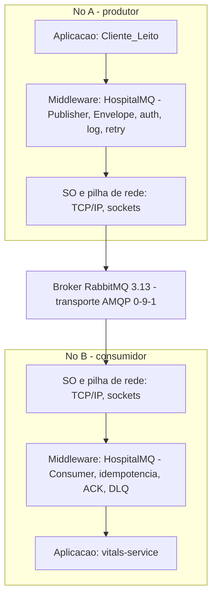
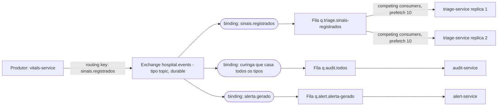
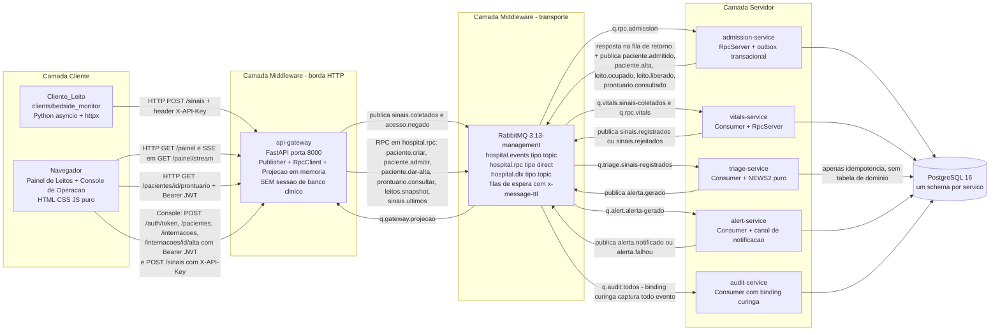
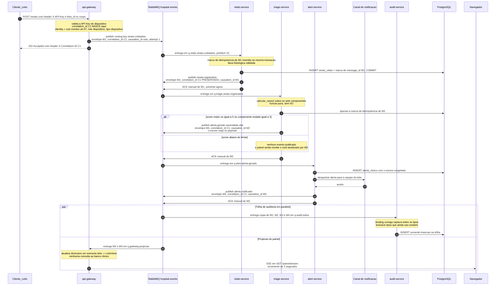
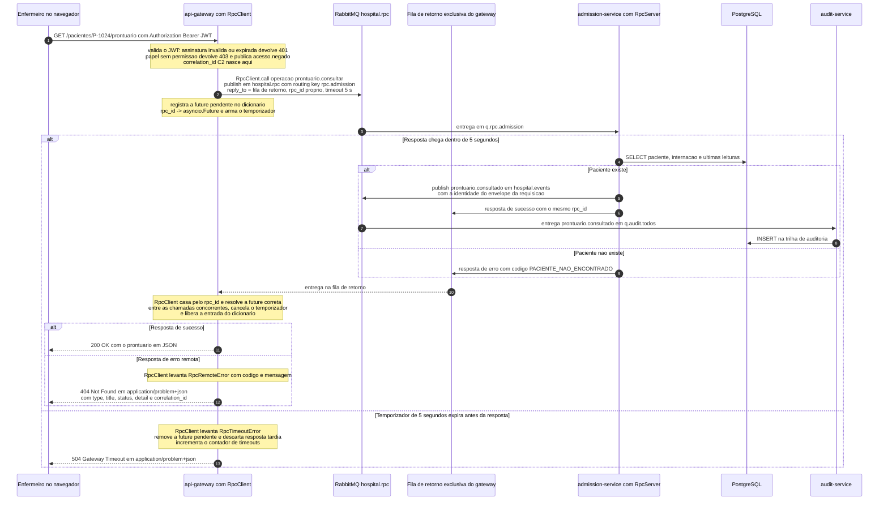
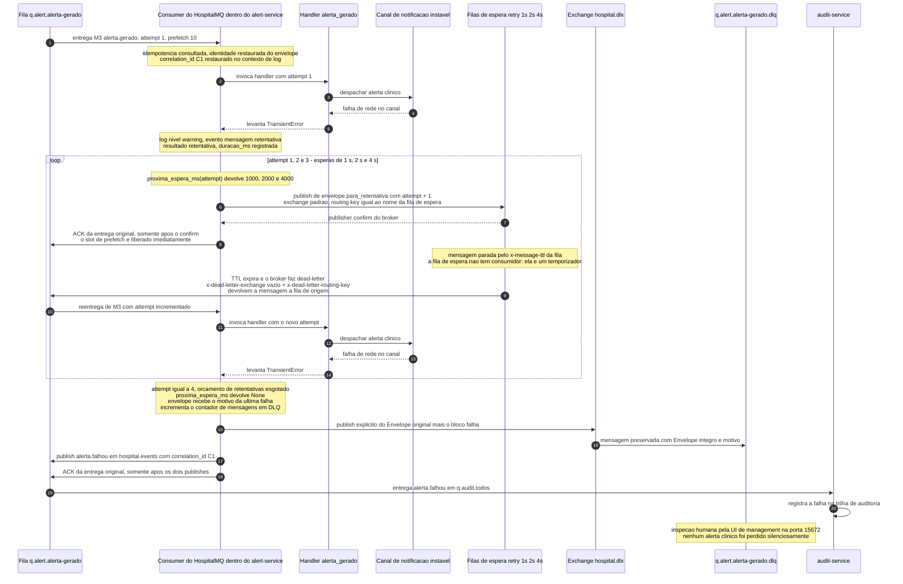
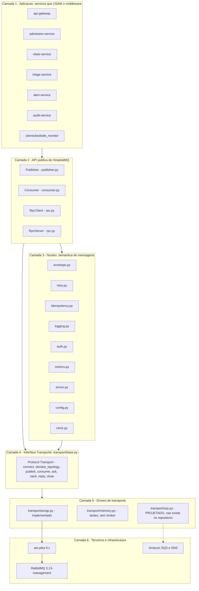
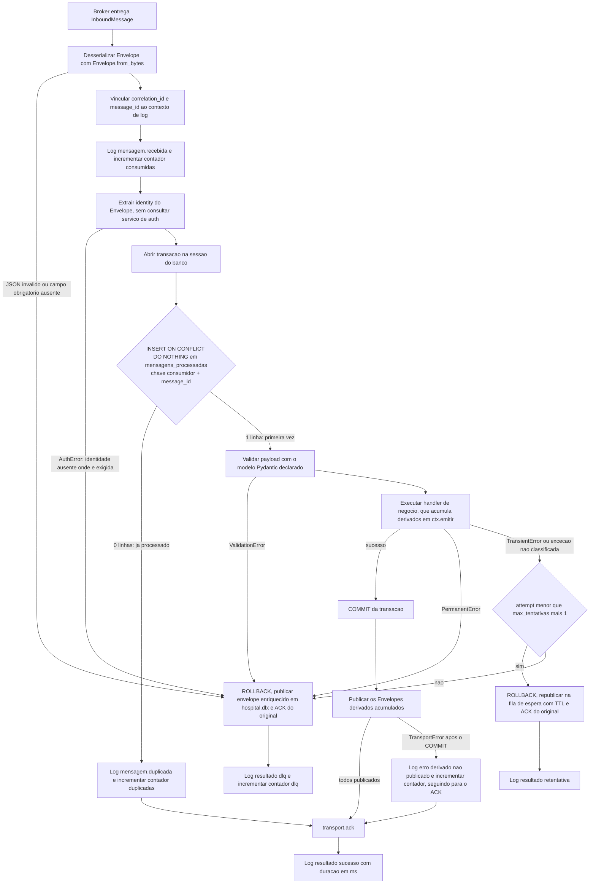
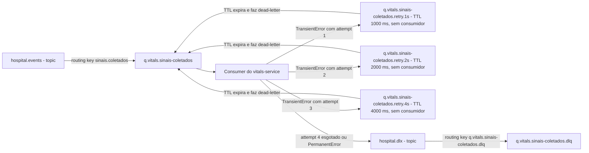
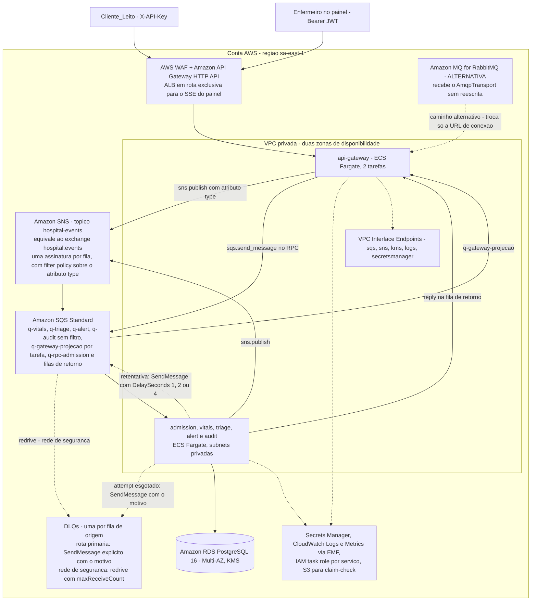

# Documento de Arquitetura — HospitalMQ

**Middleware de mensageria para o cenário Hospital Inteligente**

| | |
|---|---|
| Disciplina | Sistemas Distribuídos — Atividade Prática 01 |
| Grupo | G3 |
| Tema de middleware | **Message Queue** (RabbitMQ / AMQP 0-9-1) |
| Cenário de aplicação | Hospital Inteligente |
| Serviço AWS de referência | Amazon SQS + Amazon SNS |
| Artefato central avaliado | `hospitalmq/` — biblioteca de middleware escrita pelo grupo |
| Documento | Arquitetura da solução (seção 9 do enunciado) |

**Integrantes do grupo G3**

<!-- PREENCHER: integrantes do G3 -->

| Nome | Matrícula | Papel principal no trabalho |
|---|---|---|
| (preencher) | (preencher) | (preencher) |

---

> **Nota sobre este documento.** Este é o documento de arquitetura da entrega. Ele é a versão
> **condensada** do projeto detalhado, que tem cerca de 16 mil linhas e está integralmente
> disponível em `specs/middleware-mensageria-hospitalar/design.md`. Onde este texto for resumido,
> o design é normativo: a interface `Transport` e o núcleo do middleware são normativos na seção 4
> do design; a topologia AMQP, na seção 6; a superfície REST, na seção 8; o esquema do banco, na
> seção 7; as decisões de projeto (ADRs), na seção 13.
>
> Todo comando, nome de arquivo, nome de fila e número citado aqui foi conferido contra o
> repositório em `/Users/gnery/Desktop/Atividade-1-SD`. Onde o design detalhado e o código
> divergirem, **este documento segue o código**, e a divergência está anotada.

---

## Sumário

1. [Contexto e problema](#1-contexto-e-problema)
2. [Fundamentação teórica](#2-fundamentação-teórica)
3. [Arquitetura da solução](#3-arquitetura-da-solução)
4. [O middleware HospitalMQ](#4-o-middleware-hospitalmq)
5. [Topologia de mensageria e escalabilidade](#5-topologia-de-mensageria-e-escalabilidade)
6. [Modelo de domínio e NEWS2](#6-modelo-de-domínio-e-news2)
7. [Segurança, observabilidade e API](#7-segurança-observabilidade-e-api)
8. [Arquitetura de referência em AWS](#8-arquitetura-de-referência-em-aws)
9. [Decisões de design](#9-decisões-de-design)
10. [Resultados verificados](#10-resultados-verificados)
11. [Limitações conhecidas e trabalhos futuros](#11-limitações-conhecidas-e-trabalhos-futuros)

---

## 1. Contexto e problema

### 1.1 O problema

Um hospital instrumentado é um sistema distribuído cujos participantes operam em escalas de tempo
incompatíveis. Um monitor de beira-leito emite sinais vitais a cada poucos segundos e não pode
esperar; um serviço de triagem precisa avaliar cada leitura contra um protocolo clínico; a equipe de
enfermagem precisa ser notificada em segundos quando um paciente começa a deteriorar; e a auditoria
exigida pela LGPD precisa registrar tudo sem entrar no caminho crítico do atendimento.

Integrar esses participantes por chamadas diretas — cada serviço conhecendo o endereço e o contrato
do próximo — produz um sistema frágil por três razões concretas:

1. a indisponibilidade de qualquer serviço interrompe a coleta de dados clínicos;
2. incluir um novo consumidor (por exemplo, um serviço de farmácia que reage a alertas) exige
   alterar e reimplantar o produtor;
3. um pico de leituras derruba o elo mais lento da cadeia, em vez de ser absorvido.

O problema, portanto, não é de domínio clínico. É de **acoplamento**.

### 1.2 A solução

O grupo desenvolveu o **HospitalMQ**, um middleware orientado a mensagens que se interpõe entre os
participantes e assume as responsabilidades que, de outro modo, se espalhariam por cada serviço:
empacotamento e serialização das mensagens, roteamento, confirmação de entrega, retentativa com
espera progressiva, descarte controlado em fila morta, supressão de duplicatas, propagação de
identidade e de correlação, e registro estruturado de tudo o que acontece.

Sobre esse middleware é construída a aplicação **Hospital Inteligente**: seis serviços magros, um
simulador de monitor de leito e um painel de acompanhamento em tempo real. A aplicação existe para
exercitar e demonstrar o middleware — é a prova de que ele funciona sob carga, sob falha e sob
duplicação.

### 1.3 As três decisões que estruturam todo o restante

1. **O RabbitMQ é transporte, não é a entrega.** O HospitalMQ define a interface `Transport` e o
   RabbitMQ é apenas a primeira implementação dela. Toda a semântica — envelope, retentativa,
   idempotência, correlação, RPC — é código do grupo. A biblioteca `aio-pika` fala AMQP e nada mais.
2. **Assíncrono por padrão, síncrono por exceção.** O fluxo de escrita de telemetria é orientado a
   eventos e nunca bloqueia o produtor. Apenas as operações cujo resultado é devolvido na mesma
   requisição HTTP usam RPC — e mesmo elas trafegam sobre fila, nunca por acesso direto ao banco.
3. **Entrega ao menos uma vez com idempotência obrigatória.** O sistema não persegue *exactly-once*
   no transporte; garante *at-least-once* e torna todo consumidor idempotente, obtendo o efeito
   prático de processamento único.

### 1.4 Escopo desta entrega

**No escopo:** a biblioteca `hospitalmq` completa, com transporte AMQP e transporte em memória; os
seis serviços da aplicação; o simulador de monitor de leito; o painel de leitos com o **Console de
Operação** (subseção 3.8); a suíte de testes;
a documentação da API em OpenAPI; e o ambiente completo em Docker Compose, executável com um único
comando.

**Fora do escopo:** a implantação em AWS. A arquitetura em Amazon SNS + SQS é apresentada como
**proposta** (seção 8 deste documento), incluindo o esboço do driver `SqsTransport`, sem
provisionamento de infraestrutura real. O arquivo `hospitalmq/transport/sqs.py` **não existe no
repositório** — o que existe é a interface que o tornaria possível sem alterar nenhum serviço, e é
essa a afirmação que o documento sustenta.

---

## 2. Fundamentação teórica

Esta seção estabelece o vocabulário e os resultados teóricos que sustentam cada decisão de projeto.
Ela não descreve a implementação — descreve *por que* a implementação é como é. As referências
completas, em formato ABNT, estão em [2.10](#210-referências).

### 2.1 Middleware em sistemas distribuídos

Um sistema distribuído é, na definição de Tanenbaum e Van Steen (2017), *uma coleção de elementos
computacionais autônomos que se apresenta aos usuários como um único sistema coerente*. O problema
central é o vão entre duas realidades: a rede oferece apenas troca de bytes não confiável entre
processos, e a aplicação quer raciocinar em termos de "registrar sinais vitais do leito 12" e
"consultar o prontuário do paciente X". **Middleware é a camada de software que preenche esse vão.**

Bernstein (1996) define middleware como o conjunto de serviços de propósito geral que se situa acima
do sistema operacional e abaixo da aplicação distribuída, oferecendo um modelo de programação
uniforme para componentes heterogêneos. Coulouris et al. (2012) acrescentam o critério funcional:
middleware é a camada cuja finalidade é **mascarar a heterogeneidade** (de hardware, de sistema
operacional, de linguagem, de representação de dados) e **prover transparências de distribuição**.



Três observações que o diagrama torna explícitas:

1. **O middleware é horizontal, não vertical.** Ele existe em *todos* os nós, não em um nó
   intermediário. O broker é infraestrutura de transporte; o HospitalMQ é a camada que roda **dentro
   de cada processo participante**. Confundir os dois é o erro conceitual mais comum, e é exatamente
   a distinção exigida pela restrição do enunciado de que o middleware seja desenvolvido pelo grupo.
2. **O middleware oferece uma API, não um protocolo.** O que a aplicação enxerga é
   `Publisher.publish(tipo, payload)`, não `basic.publish` com `exchange`, `routing_key`,
   `delivery_mode` e `properties`.
3. **O middleware concentra as preocupações transversais.** Envelope, autenticação propagada, log
   correlacionado, retentativa, idempotência e métricas são escritos **uma vez** no HospitalMQ, e
   não seis vezes, uma em cada serviço.

#### 2.1.1 Taxonomia clássica de middleware

A literatura consolidou uma taxonomia por **modelo de interação** — a forma como os componentes
conversam — que remonta a Bernstein (1996) e é retomada por Tanenbaum e Van Steen (2017) e por
Coulouris et al. (2012):

| Família | Primitiva oferecida | Modelo de interação | Exemplos | Acoplamento |
|---|---|---|---|---|
| **RPC-based** | `resultado = proc(args)` sobre a rede | Requisição–resposta síncrona, 1:1 | Sun RPC, DCE RPC, gRPC, Thrift | Forte: chamador bloqueia e precisa do endereço |
| **TP Monitors** | Transação distribuída sobre múltiplos recursos | Requisição–resposta com 2PC/XA | CICS, Tuxedo, JTS | Forte: coordenador central, protocolo bloqueante |
| **MOM — Message-Oriented Middleware** | `send(msg)` / `receive()` em canal persistente | Mensagem assíncrona, 1:1 ou 1:N | IBM MQSeries, JMS, **AMQP/RabbitMQ**, Kafka, SQS | Fraco: a fila intermedeia produtor e consumidor |
| **ORB — objetos distribuídos** | `obj.metodo(args)` via IDL, *stub* e *skeleton* | Invocação remota de método, 1:1 | CORBA, Java RMI, DCOM | Forte: referência de objeto, ciclo de vida remoto |
| **Middleware de dados** | Consulta uniforme sobre fontes heterogêneas | Requisição–resposta | ODBC, JDBC | Forte |
| **Middleware de componentes** | Contêiner com ciclo de vida, transação e segurança declarativos | Composição dos anteriores | EJB, COM+, Spring | Variável |

A taxonomia é ortogonal à tecnologia: o que a define é *qual abstração o middleware entrega à
aplicação*. RPC entrega a abstração de **procedimento**; ORB entrega a de **objeto**; MOM entrega a
de **mensagem em um canal**; TP monitor entrega a de **transação**.

#### 2.1.2 Onde o Message Queue se situa

O tema **Message Queue** é uma especialização de MOM. Dentro de MOM há duas subfamílias históricas:

- **Message Queuing (point-to-point)** — canal com semântica de fila; a mensagem é consumida por
  *um* consumidor lógico e desaparece do canal.
- **Publish/Subscribe** — canal com semântica de tópico; a mensagem é entregue a *todos* os
  assinantes interessados.

O HospitalMQ implementa **as duas** sobre o mesmo transporte, porque o modelo AMQP 0-9-1 as unifica
(ver [2.6](#26-o-modelo-amqp-0-9-1-point-to-point-e-publishsubscribe-unificados)), e acrescenta um terceiro modo — **RPC sobre fila** — que
reintroduz deliberadamente a semântica requisição–resposta *dentro* de um MOM. O HospitalMQ é,
portanto, um MOM que empresta do mundo RPC o padrão *Request–Reply* quando o fluxo exige resposta
imediata, sem abandonar o canal de mensagens como único meio de transporte.

Comparando com os demais temas distribuídos na turma, o critério que os distingue não é a camada
que ocupam — todos são middleware — e sim o modelo de interação e a cardinalidade:

| Tema | Primitiva oferecida | Família | Cardinalidade | Acoplamento temporal |
|---|---|---|---|---|
| API Gateway | Fachada HTTP única sobre N serviços | Middleware de borda | 1:1 por requisição | Síncrono |
| RPC / gRPC | Chamada de procedimento remoto tipada por IDL | RPC-based | 1:1 | Síncrono |
| **Message Queue** *(este trabalho)* | Canal de fila durável com entrega confiável | MOM point-to-point | 1:1 lógico, N réplicas competindo | **Assíncrono** |
| Pub-Sub | Canal de tópico com fan-out | MOM publish/subscribe | 1:N | Assíncrono |
| Service Discovery | Resolução de nome lógico para endereço | Middleware de nomeação | 1:1 na resolução | Síncrono na consulta |
| ORB | Invocação de método em objeto remoto | Middleware de objetos | 1:1 | Síncrono |
| IoT (MQTT, CoAP) | Pub/sub para dispositivos restritos, QoS 0/1/2 | MOM publish/subscribe | 1:N | Assíncrono |
| Microsserviços | Estilo arquitetural, não tecnologia | Composição de todas | Variável | Variável |

Dois pontos de arguição: **microsserviços não é "um middleware"**, é um estilo arquitetural
(Newman, 2021) viabilizado pelo middleware que o cerca; e **ORB é o ancestral direto de gRPC** —
IDL + geração de *stub* + *marshalling* é exatamente o que Protocol Buffers + gRPC fazem hoje. A
crítica de Waldo et al. (1994), de que a transparência total de acesso é uma ilusão perigosa porque
a chamada remota falha de maneiras que a chamada local não falha, aplica-se aos dois — e é a razão
pela qual o HospitalMQ **não esconde** a falha do RPC.

### 2.2 Transparências de distribuição

Transparência é a propriedade pela qual o sistema oculta da aplicação o fato de que recursos estão
fisicamente distribuídos. A tabela declara, sem concessões, **o que o HospitalMQ oferece e o que não
oferece**:

| Transparência | HospitalMQ | Como / por que não |
|---|---|---|
| **Acesso** | Oferece | Envelope JSON UTF-8 canônico; o produtor chama `Publisher.publish(tipo, payload)` e a mesma chamada valeria para qualquer transporte |
| **Localização** | Oferece | O produtor não informa fila, endereço nem identidade de consumidor: publica um *tipo de evento*, e o binding no broker decide o destino |
| **Migração** | Parcial | Um consumidor pode reiniciar ou mudar de host sem alteração no produtor, porque a fila durável retém as mensagens no intervalo. Uma mensagem em voo cujo consumidor morre é reentregue do zero — é *crash-recovery*, não migração com estado preservado |
| **Replicação** | Parcial, só do consumidor | Subir N réplicas não altera uma linha do produtor. A replicação do **broker** está fora do escopo: o Compose sobe RabbitMQ de nó único |
| **Concorrência** | Parcial | `prefetch` e *competing consumers* isolam o handler da gestão de concorrência; a idempotência neutraliza a reentrega concorrente. Não há ordenação global nem isolamento transacional entre handlers |
| **Falha** | **Deliberadamente parcial** | No caminho assíncrono, mascara falhas transitórias (retentativa 1s/2s/4s, DLQ, retenção em fila durável). No síncrono, faz o oposto: expõe a falha de forma tipada — `RpcTimeoutError` e `TransportError` em 5 s, `504` no HTTP |
| **Persistência** | Oferece | Filas duráveis e mensagens persistentes; o produtor não sabe se a mensagem está em RAM ou em disco |

**Transparência de falha parcial por escolha.** Em um fluxo clínico, uma consulta de prontuário que
"trava" indefinidamente é pior do que uma que falha em 5 s com erro explícito: o enfermeiro precisa
saber que o dado não veio para buscar outra via. **Alternativa descartada:** retentativa automática
da chamada RPC dentro do middleware — multiplicaria a latência percebida até dezenas de segundos, e
uma operação RPC pode não ser idempotente. Retentativa automática fica restrita ao caminho
assíncrono, onde a idempotência do receptor está garantida.

### 2.3 As três dimensões de desacoplamento

Eugster, Felber, Guerraoui e Kermarrec (2003) propõem o critério hoje canônico para comparar
paradigmas de interação. Um paradigma desacopla as partes em até três dimensões: **espaço** (as
partes não precisam se conhecer), **tempo** (não precisam estar ativas simultaneamente) e
**sincronização** (a comunicação não bloqueia o fluxo principal, nem na produção nem no consumo).

| Paradigma | Espaço | Tempo | Sincr. produção | Sincr. consumo |
|---|---|---|---|---|
| Troca direta (socket, HTTP one-way) | Não | Não | Não | Não |
| RPC síncrono / gRPC / ORB | Não | Não | Não | Não |
| Fila point-to-point com *pull* (SQS) | Sim | Sim | Sim | Não |
| Fila point-to-point com *push* (AMQP `basic.consume`) | Sim | Sim | Sim | Sim |
| Publish/subscribe por tópico | Sim | Sim | Sim | Sim |
| **HospitalMQ — caminho assíncrono** | **Sim** | **Sim** | **Sim** | **Sim** |
| **HospitalMQ — caminho RPC sobre fila** | **Sim** | **Não** | **Não** | Sim (`RpcServer` é *event-driven*) |

O caminho assíncrono atinge o desacoplamento máximo nas três dimensões. O caminho RPC preserva o
desacoplamento **espacial** — o `api-gateway` continua sem conhecer o endereço do
`admission-service`, publicando em `hospital.rpc` — mas abre mão do desacoplamento **temporal** e de
**sincronização**: se o `admission-service` estiver fora do ar, a chamada expira em 5 s e o gateway
responde `504`. É um *trade-off* consciente, não um defeito: desacoplamento espacial dá
evolutividade; desacoplamento temporal dá tolerância a falha, mas custa a impossibilidade de
responder ao usuário **agora** — e em uma consulta de prontuário o usuário está esperando na frente
da tela.

### 2.4 Comunicação síncrona e assíncrona: por que o projeto usa as duas

**Síncrona (requisição–resposta bloqueante):** o chamador suspende a execução até obter a resposta
ou estourar o timeout. Acopla disponibilidade — a disponibilidade percebida é o *produto* das
disponibilidades de todos os elos da cadeia; a latência é a soma das latências.

**Assíncrona (mensagem em canal):** o produtor entrega a mensagem ao canal e segue. A resposta, se
existir, chega por outro caminho e em outro momento. Desacopla disponibilidade — a indisponibilidade
do consumidor vira *backlog na fila*, não erro no produtor.

O critério de escolha adotado é objetivo e tem três perguntas, nesta ordem: (1) *o chamador precisa
do resultado para compor a resposta que devolve agora?* Se sim, RPC. (2) Se não, *a operação é o
registro de um fato que já ocorreu?* (3) Se sim, *o consumidor pode ser idempotente sobre o efeito?*
Se sim, evento assíncrono; se não, o desenho precisa ser revisto — efeito não idempotente em canal
*at-least-once* é fonte de corrupção de dados. Aplicando o critério aos fluxos do cenário:

| Fluxo | Modo | Razão |
|---|---|---|
| Monitor publica leitura de sinais vitais | **Assíncrono** | É um fato consumado. O monitor não precisa do NEWS2 para continuar medindo, e se o `vitals-service` cair a leitura não pode ser perdida |
| `sinais.registrados` → cálculo do NEWS2 | **Assíncrono** | Processamento em cadeia, sem chamador esperando. Permite acrescentar consumidores sem tocar no produtor |
| `alerta.gerado` → notificação da equipe | **Assíncrono** | O canal de notificação é externo e falha; a falha precisa virar retentativa, não erro para o `triage-service` |
| Auditoria de todo evento | **Assíncrono, fan-out** | A auditoria não pode atrasar o atendimento clínico |
| Consulta de prontuário pela API | **Síncrono — RPC sobre fila** | Há um humano esperando a resposta na mesma requisição HTTP |
| Admissão e alta de paciente | **Síncrono — RPC sobre fila** | O usuário precisa saber, na mesma requisição, se o leito estava livre; o `409 Conflict` só é expressável de forma síncrona |
| Painel de leitos | **Assíncrono na entrada, *push* na saída** | Alimentado por uma projeção construída pelo consumo de eventos, empurrada ao navegador por SSE |

**Por que RPC *sobre fila* e não HTTP direto entre serviços?** Porque o `api-gateway` não pode
acessar o banco clínico diretamente, e porque o objetivo é demonstrar que o padrão *Request–Reply*
(Hohpe e Woolf, 2003) é implementável sobre um canal de mensagens usando *Return Address* e
*Correlation Identifier*. O ganho colateral é real: o `admission-service` é escalável por *competing
consumers* na fila `q.rpc.admission` sem nenhum balanceador HTTP na frente — **o broker é o
balanceador**. **Alternativa descartada:** chamada HTTP direta gateway → admission-service.
Descartada por exigir *service discovery* ou endereço fixo (perdendo o desacoplamento espacial), por
precisar de balanceador próprio e por fugir do tema Message Queue.

### 2.5 Garantias de entrega

#### 2.5.1 As três semânticas

A taxonomia vem de Birrell e Nelson (1984) e é hoje o vocabulário padrão de qualquer MOM:

| Semântica | Mecanismo | Falha possível | Onde é aceitável |
|---|---|---|---|
| **At-most-once** | Envia e esquece; sem confirmação | **Perde** mensagens | Telemetria descartável, métrica amostrada, *heartbeat* |
| **At-least-once** | Confirmação do receptor + reenvio se a confirmação não chegar | **Duplica** mensagens | Padrão de qualquer sistema que não pode perder dado |
| **Exactly-once** | Impossível na entrega — ver 2.5.2 | — | — |

O HospitalMQ opera em **at-least-once** por decisão explícita: ACK manual *após* o processamento
bem-sucedido, e somente então. Confirmar antes de processar (`auto_ack`) transformaria o canal em
at-most-once: se o processo morrer entre o ACK e o `commit` no PostgreSQL, a leitura de sinais
vitais some sem rastro.

#### 2.5.2 Por que *exactly-once* fim a fim é impossível

O **problema dos dois generais** — formulado por Akkoyunlu, Ekanadham e Huber (1975) e batizado com
esse nome por Gray (1978) — demonstra que *não existe protocolo que garanta acordo entre dois
participantes sobre um canal que pode perder mensagens, em número finito de trocas*.

A prova é por contradição sobre o protocolo mínimo: se existisse um protocolo correto com *k*
mensagens, a última seria dispensável (o remetente não sabe se ela chegou, logo nenhuma decisão pode
depender dela), reduzindo-se a um protocolo correto de *k−1* mensagens; por indução chega-se a zero
mensagens, o que é absurdo. A impossibilidade **não decorre de falha de processo**: basta que o
canal possa perder mensagens.

A consequência prática é direta e inescapável:

> Quando o produtor envia uma mensagem e **não** recebe a confirmação, ele não consegue distinguir
> dois cenários: (a) a mensagem se perdeu antes de chegar; (b) a mensagem chegou, foi processada, e
> só a confirmação se perdeu. Reenviar produz **duplicata** no cenário (b). Não reenviar produz
> **perda** no cenário (a). Não há terceira opção.

Portanto **exactly-once na entrega é impossível no caso geral** — em qualquer sistema, com qualquer
protocolo, sobre qualquer broker. Toda oferta comercial de "exactly-once" está, na verdade, fazendo
uma de duas coisas: restringindo o domínio (transações internas ao próprio sistema, como o
*read-process-write* transacional do Kafka, que só vale se origem e destino forem tópicos Kafka) ou
movendo o problema para o receptor.

#### 2.5.3 At-least-once + receptor idempotente = *effectively-once*

A solução canônica — e a adotada pelo HospitalMQ — é deslocar a garantia da **entrega** para o
**efeito**: aceitar que a mensagem pode ser entregue *n ≥ 1* vezes e garantir que o efeito
observável seja o mesmo de uma única execução. Uma operação é **idempotente** quando
`f(f(x)) = f(x)`; Helland (2012) argumenta que idempotência não é detalhe de implementação, e sim
propriedade arquitetural obrigatória de qualquer sistema distribuído que não perca dados.

A essa combinação dá-se o nome de **effectively-once** (ou *exactly-once processing*, em oposição a
*exactly-once delivery*). É o termo correto para descrever a garantia do HospitalMQ, e o mecanismo
está no diagrama de sequência da seção 3.6 e no pipeline da seção 4.5.

**Decisão — a marca de idempotência é gravada na mesma transação ACID do efeito de negócio.** Se o
efeito e a marca forem gravados em transações separadas, existe uma janela em que um deles é durável
e o outro não, e o problema volta ao ponto de partida. Com PostgreSQL 16 e SQLAlchemy 2.0 async,
ambos cabem em uma única transação, e a chave primária composta `(consumidor, message_id)` faz o
próprio banco impor a unicidade. **Alternativas descartadas:** cache em Redis com TTL (mais rápido,
mas não atômico com a escrita clínica); *two-phase commit* XA (protocolo bloqueante, sem suporte
prático no RabbitMQ, coordenador como ponto único de falha); e confiar na deduplicação do broker (o
RabbitMQ não deduplica, e o SQS FIFO só dentro de uma janela de 5 minutos).

**O par simétrico — o *dual write*.** Se o produtor grava no banco *e* publica no broker, ele
enfrenta o mesmo dilema no outro sentido. A solução canônica é o **Transactional Outbox**
(Richardson, 2018; Kleppmann, 2017), em que a mensagem é gravada na mesma transação do dado e um
processo separado a publica lendo a tabela de saída. O HospitalMQ usa esse padrão no ponto onde ele
importa: o `admission-service`, que grava a `Internacao` e emite `paciente.admitido`.

### 2.6 O modelo AMQP 0-9-1: point-to-point e publish/subscribe unificados

O erro conceitual frequente é tratar fila e tópico como tecnologias distintas. **São o mesmo
mecanismo com topologias diferentes**: em point-to-point, N réplicas competem pela mesma fila e o
trabalho se divide; em publish/subscribe, N filas recebem cada uma a sua cópia e o processamento se
multiplica. O modelo AMQP 0-9-1 torna isso explícito.

A especificação AMQP 0-9-1 (AMQP Working Group, 2008) define uma cadeia de quatro elementos que
separa *o que o produtor diz* de *quem vai ouvir*:



| Elemento | Responsabilidade | Consequência de projeto |
|---|---|---|
| **Producer** | Publica no *exchange* com uma **routing key** (o *tipo* do evento). Nunca nomeia fila | É o que torna verdadeiro "o produtor não conhece o consumidor" |
| **Exchange** | Aplica a regra de roteamento do seu tipo. Não armazena nada | Trocar a topologia de consumo não toca no produtor |
| **Binding** | Regra declarativa que liga *exchange* a fila, com um padrão de routing key | Acrescentar consumidor = acrescentar binding |
| **Queue** | Armazena a mensagem até o ACK. É a unidade de durabilidade e de consumo | Uma fila = uma "assinatura" lógica |
| **Consumer** | Recebe por *push* (`basic.consume`) e confirma por ACK manual | Entrega de baixa latência com controle de fluxo |

**A regra de ouro que resolve a confusão inteira:** *cópias se multiplicam por fila; trabalho se
divide por consumidor dentro da fila.* Fan-out é N filas ligadas ao mesmo exchange pelo mesmo
padrão; *competing consumers* é N consumidores conectados à mesma fila.

**Tipos de exchange e a escolha do projeto:**

| Tipo | Regra de roteamento | Uso no HospitalMQ |
|---|---|---|
| `direct` | Routing key **exatamente** igual à do binding | `hospital.rpc` — cada operação de RPC tem uma fila nomeada |
| `topic` | Padrão hierárquico com curingas: `*` casa uma palavra, `#` casa zero ou mais | `hospital.events` e `hospital.dlx` |
| `fanout` | Ignora a routing key; entrega a **todas** as filas ligadas | Não usado |
| `headers` | Casa por atributos do cabeçalho | Não usado |

`topic` foi escolhido para `hospital.events` porque os tipos de evento do projeto são hierárquicos
por natureza (`paciente.admitido`, `sinais.coletados`, `alerta.gerado`) e porque a auditoria precisa
registrar *qualquer* mensagem que trafegue **sem exigir alteração de código quando novos tipos
surgirem** — um binding com o curinga `#` na fila `q.audit.todos` satisfaz isso de forma declarativa
e permanente. `fanout` entregaria tudo a todos, transferindo a lógica de roteamento para cada
handler; `direct` casaria só por igualdade exata e tornaria impossível o binding curinga.

### 2.7 Padrões de mensageria de Hohpe e Woolf

*Enterprise Integration Patterns* (Hohpe e Woolf, 2003) é o catálogo de referência da área. A tabela
mapeia cada padrão usado ao artefato correspondente do HospitalMQ:

| Padrão | Intenção | Onde aparece no HospitalMQ |
|---|---|---|
| **Message Envelope** | Separar metadados de infraestrutura do conteúdo de negócio | `hospitalmq/envelope.py`; campos `message_id`, `correlation_id`, `causation_id`, `type`, `version`, `timestamp`, `producer`, `identity`, `attempt`, `payload` |
| **Correlation Identifier** | Casar resposta com requisição e rastrear um fluxo através de N saltos | `correlation_id` gerado no `api-gateway`, propagado por todo Envelope derivado e por toda linha de log |
| **Return Address** | O solicitante informa onde quer a resposta | Propriedade `reply_to` apontando para a fila de retorno exclusiva do processo chamador |
| **Request-Reply** | Obter resposta síncrona sobre canal assíncrono | `hospitalmq/rpc.py` — `RpcClient` e `RpcServer` sobre `hospital.rpc` |
| **Dead Letter Channel** | Isolar mensagens que não podem ser processadas, sem bloquear o canal nem perdê-las | `hospital.dlx` + `q.<nome>.dlq` por fila |
| **Invalid Message Channel** | Separar "mensagem malformada" de "falha transitória" | Leitura fora da faixa fisiológica vai à DLQ **sem** retentativa |
| **Guaranteed Delivery** | A mensagem sobrevive a falha de processo e de broker | Exchanges e filas `durable`, mensagens persistentes, ACK manual, *publisher confirms* |
| **Competing Consumers** | Escalar o consumo sem duplicar processamento | N réplicas do mesmo serviço na mesma fila, com `prefetch` 10 |
| **Publish-Subscribe Channel** | Um evento, N interessados independentes | `hospital.events` do tipo `topic` com múltiplas filas ligadas |
| **Idempotent Receiver** | Tornar seguro o reprocessamento inerente ao at-least-once | `hospitalmq/idempotency.py` — supressão da segunda execução por `message_id` |
| **Wire Tap** | Derivar cópia de todo o tráfego para inspeção, sem afetar o fluxo principal | `q.audit.todos` com binding `#` |
| **Message Store** | Persistir o histórico de mensagens para consulta posterior | Trilha de auditoria em PostgreSQL, somente-inserção |
| **Event-Driven Consumer** | O broker empurra a mensagem; o consumidor não faz *polling* | `basic.consume` via `aio-pika`, em `hospitalmq/consumer.py` |
| **Polling Consumer** | O consumidor busca a mensagem periodicamente | Não usado com AMQP; **obrigatório** no `SqsTransport` projetado |
| **Transactional Outbox** ¹ | Eliminar o *dual write* | Emissão de `paciente.admitido` pelo `admission-service` |

¹ *Transactional Outbox* não pertence ao catálogo original de Hohpe e Woolf; foi catalogado depois
por Richardson (2018), e o problema subjacente — o *dual write* — é analisado por Kleppmann (2017).
Registramos a atribuição correta por rigor acadêmico.

### 2.8 Tolerância a falhas, back-pressure e backoff

#### 2.8.1 Modelo de falha adotado

A classificação canônica é de Cristian (1991), retomada por Tanenbaum e Van Steen (2017):

| Tipo de falha | O HospitalMQ trata? | Mecanismo / justificativa da exclusão |
|---|---|---|
| **Crash (fail-stop)** | **Sim** | ACK manual + reentrega automática; fila durável retém enquanto não há consumidor; marca de idempotência evita dano na reentrega |
| **Omissão** | **Sim** | *Publisher confirms*; ausência de ACK dispara reentrega; `TransportError` em até 5 s se o broker não confirmar |
| **Temporização** | **Sim** | Timeout de RPC de 5 s; `504 Gateway Timeout` no HTTP; `prefetch` limita o acúmulo em réplica lenta |
| **Resposta** (valor errado) | **Não**, mitigação parcial | Validação de faixa fisiológica barra dados absurdos, mas isso é validação de entrada. Um handler que calcule NEWS2 errado é coberto por teste, não pelo middleware |
| **Arbitrária / bizantina** | **Não** | Exigiria replicação com votação, *quorum* de 3f+1 réplicas e assinatura por mensagem (Lamport, Shostak e Pease, 1982). O JWT autentica o chamador na borda, mas **não** assina o Envelope fim a fim |

**Premissa explícita:** modelo *crash-recovery* com canais que perdem mensagens mas não as corrompem
nem as forjam, e rede parcialmente síncrona. Declarar a premissa é parte da resposta correta: um
sistema que não declara seu modelo de falha não pode afirmar nada sobre suas garantias.

#### 2.8.2 Back-pressure e a fila como amortecedor

*Back-pressure* é o mecanismo pelo qual um consumidor sobrecarregado **impede** o broker de lhe
enviar mais trabalho. Sem ele, a sobrecarga vira consumo ilimitado de memória e, em seguida, falha
catastrófica — o modo de falha metaestável descrito por Nygard (2018). No HospitalMQ o mecanismo é o
**`prefetch` (QoS do AMQP) fixado em 10**: o broker não entrega a 11ª mensagem a uma réplica antes
que ela confirme uma das 10 em voo.

A escolha do valor 10 é um meio-termo justificado: `0` (ilimitado) faz o broker despejar a fila
inteira no socket do consumidor, e mensagens ficam reservadas por uma réplica lenta em vez de migrar
para réplicas ociosas; `1` dá balanceamento perfeito mas custa um *round-trip* por mensagem,
limitando a vazão ao inverso do RTT; `100` ou mais maximiza a vazão, porém uma réplica lenta acumula
cem mensagens presas e a latência de cauda cresce. **10 amortiza o RTT mantendo o lote pequeno o
bastante para que uma réplica lenta não sequestre a fila.**

Uma fila entre produtor e consumidor desacopla a **taxa de chegada** λ da **taxa de serviço** μ.
Pela **Lei de Little** (L = λ · W), o backlog é a moeda com que se paga a diferença de ritmo.
Exemplo quantitativo com os números do cenário: 30 leitos publicando a cada 5 s dão λ = 6 msg/s; uma
réplica do `triage-service` processa μ ≈ 50 msg/s; o serviço fica indisponível por 60 s. Sem fila,
360 leituras perdidas. Com fila, nenhuma perda: o backlog é L = 6 × 60 = 360 mensagens, e o tempo de
drenagem é 360 / (50 − 6) ≈ 8,2 s.

> **A fila converte uma falha de disponibilidade em latência.** O erro que o produtor teria visto
> vira tempo de espera. O sistema deixa de falhar e passa a atrasar.

Três qualificações honestas: (i) a conversão não é gratuita — o custo é latência de cauda e ocupação
de armazenamento, e se a indisponibilidade estourar a capacidade da fila a perda volta; (ii) a
conversão só vale se μ > λ na média — fila resolve *pico*, não *subdimensionamento*; (iii) a
conversão **não se aplica ao caminho síncrono**, onde não há para quem transferir a espera.

#### 2.8.3 Backoff exponencial e *jitter*

A política do projeto é espera exponencial de **1 s, 2 s e 4 s**, com no máximo **3 retentativas**,
seguida de envio à DLQ. O atraso da tentativa *n* é `base · fator^(n−1)`, com `base = 1 s` e
`fator = 2`. O fator de amplificação de carga é de até **4 execuções** por mensagem no pior caso; o
teto de 3 tentativas é o que impede que essa amplificação seja ilimitada, e a DLQ é a válvula de
escape.

**Por que exponencial e não fixa?** Porque o objetivo é dar tempo ao recurso para se recuperar, e
não se sabe de quanto tempo ele precisa. O crescimento geométrico cobre ordens de grandeza
diferentes com poucas tentativas.

**Decisão — o HospitalMQ não usa *jitter* por padrão.** O *retry storm* ocorre quando muitos
clientes falham no mesmo instante e retentam em fase, produzindo picos correlacionados que impedem a
recuperação. O *jitter* (Brooker, 2015) descorrelaciona os instantes. Aqui o backoff é
determinístico porque o critério de aceite é *verificável* e a suíte de testes precisa afirmar o
encaminhamento à DLQ após exatamente três retentativas — um atraso aleatório tornaria a asserção
probabilística e a demonstração ao vivo imprevisível. As mitigações que reduzem o risco mesmo sem
jitter são o `prefetch` de 10, a dispersão natural dos instantes de coleta de cada leito, e o teto
de 3 tentativas. **Registrado como a escolha correta para produção em escala** — é a resposta a dar
se a banca perguntar "e se fossem 5.000 leitos?".

#### 2.8.4 CAP e PACELC aplicados a um broker

Aplicar CAP (Gilbert e Lynch, 2002; Brewer, 2012) a um broker exige identificar **qual é o dado
replicado**: é o **estado da fila** — quais mensagens existem, em que ordem, e quais já foram
confirmadas. Abadi (2012) completa com PACELC: **se P**artição, então **A** ou **C**; **E**lse, então
**L**atência ou **C**onsistência.

| Sistema / configuração | Sob partição | PACELC |
|---|---|---|
| RabbitMQ — *quorum queues* (Raft) ou `pause_minority` | **C**: escrita exige maioria; sem maioria a fila fica indisponível, mas nada confirmado se perde | PC/EC |
| RabbitMQ — nó único *(o caso deste projeto)* | — | Sem replicação não há *trade-off* CAP: o nó único é o ponto único de falha. Honestidade acadêmica exige dizer isso |
| Apache Kafka — `acks=all` + `min.insync.replicas ≥ 2` | **C** | PC/EC |
| Amazon SQS Standard | **A** | PA/EL — disponível sob partição e otimizado para latência, pagando com duplicatas e desordem |
| Amazon SQS FIFO | **C** | PC/EC — ordem por `MessageGroupId` e dedup em janela de 5 min, à custa de vazão |

Duas conclusões arquiteturais, não apenas teóricas:

1. **O middleware não pode assumir ordenação nem unicidade em nenhum transporte.** Como o SQS opera
   em um sistema PA/EL e o AMQP perde ordem assim que há *competing consumers* ou reentrega, a
   **idempotência é requisito arquitetural, não otimização** — e é por isso que ela vive no
   middleware, e não em cada serviço.
2. **O escopo local não sofre partição, e isso deve ser dito.** O Compose sobe um RabbitMQ de nó
   único; não há réplicas entre as quais uma partição possa ocorrer. O CAP se manifesta na proposta
   de evolução: cluster de 3 nós com *quorum queues* e `pause_minority`, escolhendo CP — em contexto
   clínico, perder uma leitura confirmada é pior do que recusar temporariamente novas publicações,
   porque a recusa é visível ao produtor e a perda não é.

### 2.9 Comparação fundamentada e justificativa da escolha

Cada célula foi conferida na documentação oficial do respectivo produto: Broadcom ([s. d.]) para o
RabbitMQ 3.13; Apache Software Foundation ([s. d.]) para Kafka e ActiveMQ/Artemis; Amazon Web
Services (2026) para o SQS. As diferenças de **modelo** entre log particionado e fila com broker
roteador são analisadas por Kleppmann (2017, cap. 11).

| Dimensão | **RabbitMQ 3.13** | **Apache Kafka** | **Amazon SQS** | **ActiveMQ / Artemis** |
|---|---|---|---|---|
| **Modelo** | Broker AMQP 0-9-1; *smart broker, dumb consumer*; fila como buffer | Log distribuído particionado, *append-only*; *dumb broker, smart consumer* | Fila gerenciada como serviço; sem broker a operar | Broker JMS multiprotocolo |
| **Roteamento** | **Rico**: `direct`, `topic` com `*` e `#`, `fanout`, `headers` | **Pobre**: tópico e partição; filtragem no consumidor | **Nenhum**: fan-out exige SNS ou EventBridge na frente | **Bom**: filas, tópicos e *selectors* JMS |
| **Ordenação** | FIFO por fila com consumidor único; **perdida** com *competing consumers* e reentrega | **Total dentro da partição** | Standard: *best-effort*. FIFO: por `MessageGroupId` | FIFO por fila; *message groups* |
| **Retenção** | Removida no ACK; sem *replay* | **Por tempo ou tamanho**, independente do consumo; permite *replay* | Até **14 dias** | Removida no ACK; DLQ nativa |
| **Entrega** | At-most-once ou **at-least-once**; sem dedup nativa | At-least-once; *exactly-once* transacional **apenas dentro do Kafka** | Standard: **at-least-once**. FIFO: dedup por 5 min | At-least-once; transações locais e **XA** |
| **Confirmação** | `basic.ack` / `basic.nack` explícitos | *Commit* de offset | **`VisibilityTimeout`**: a mensagem some por N s e reaparece se não for deletada | ACK JMS |
| **Entrega ao consumidor** | ***Push*** — latência de milissegundos | *Pull* com *long poll* | ***Pull*** com *long polling* até 20 s — **sem push nativo** | *Push* e *pull* |
| **Paralelismo do consumo** | N consumidores por fila, **sem limite estrutural** | Limitado pelo **número de partições** | N consumidores; FIFO limita por `MessageGroupId` | N consumidores por fila |
| **DLQ** | **Nativa** via `dead-letter-exchange` | **Não nativa** | **Nativa** via *redrive policy* | **Nativa** |
| **RPC / Request-Reply** | **Idiomático**: `reply_to`, `correlation_id` | Não natural | Não natural: *pull* + latência de *polling* | Suportado via `JMSReplyTo` |
| **Vazão típica** | Milhares a dezenas de milhares msg/s por fila | **Milhões de msg/s** por cluster | Praticamente ilimitada | Dezenas de milhares msg/s |
| **Tamanho de mensagem** | Sem limite rígido prático | Padrão 1 MB, configurável | **256 KB** | Configurável |
| **Operação** | Imagem única com UI de inspeção | Cluster KRaft ou ZooKeeper; operação exigente | **Zero operação** | Broker Java; *tuning* de JVM |

#### 2.9.1 Justificativa explícita da escolha do RabbitMQ

A escolha não é por familiaridade; é por aderência a requisitos específicos deste cenário:

1. **O cenário exige roteamento no broker, não no consumidor.** O mesmo evento `sinais.registrados`
   precisa alcançar `triage-service`, `api-gateway` e `audit-service` com regras diferentes, e a
   auditoria precisa capturar **todo e qualquer** tipo de evento sem alteração de código. Um
   `topic exchange` com binding `#` resolve isso declarativamente. Em Kafka, exigiria um tópico por
   destino ou filtragem no consumidor; em SQS, exigiria SNS com uma assinatura por fila.
2. **Paralelismo do consumo desacoplado da topologia.** Escalar o `alert-service` é subir uma
   réplica — nada muda no broker. Em Kafka, o paralelismo é limitado pelo número de partições, e
   aumentar partições afeta ordenação e particionamento por chave.
3. **RPC sobre fila é idioma de primeira classe no AMQP.** `reply_to`, fila de retorno exclusiva,
   casamento por `correlation_id` e timeout são construídos sobre primitivas que o protocolo já
   oferece. Em Kafka seria artificial e caro; em SQS seria impraticável, pois o *long polling*
   adiciona latência incompatível com uma requisição HTTP interativa.
4. **Latência compatível com o orçamento do painel.** O painel deve atualizar em no máximo 2 s após
   o evento. O modelo *push* do `basic.consume` entrega em milissegundos.
5. **DLQ declarativa e sem código.** O argumento `dead-letter-exchange` na declaração da fila
   resolve o descarte. Kafka não tem DLQ nativa — teria de ser implementada no consumidor.
6. **Custo operacional e valor demonstrativo.** Uma imagem (`rabbitmq:3.13-management`), sem
   ZooKeeper, sem KRaft, sem dependência de nuvem. A UI de gestão permite mostrar filas, DLQ e
   mensagens em voo **ao vivo** durante a demonstração.
7. **Não precisamos do que Kafka oferece.** Não há *replay* histórico, não há *event sourcing* como
   fonte da verdade, não há vazão de milhões de eventos por segundo. Adotar Kafka seria pagar
   complexidade operacional por capacidade não utilizada — e, pior, perder roteamento e RPC, que
   **são** usados.

**Contrapartida assumida, declarada abertamente:** como o RabbitMQ remove a mensagem no ACK, **não
há *replay***. Se um bug no `triage-service` calcular NEWS2 errado, não é possível reprocessar o
histórico a partir do broker. O projeto compensa isso com a trilha de auditoria somente-inserção em
PostgreSQL, que preserva `type`, `timestamp`, `correlation_id` e identidade do produtor de todo
evento — cumprindo o papel de histórico auditável exigido pela LGPD, ainda que não o de log
reprocessável.

**Alternativa descartada — implementar um broker próprio do zero.** O enunciado exige *middleware*
desenvolvido pelo grupo, não *broker* desenvolvido pelo grupo. Reimplementar enfileiramento durável,
roteamento, confirmação e recuperação de falha consumiria todo o orçamento do projeto reproduzindo
um componente maduro. O valor autoral do trabalho está na camada acima: Envelope, retentativa,
idempotência, RPC, autenticação propagada, observabilidade correlacionada e transporte plugável.

**Alternativa descartada — SQS como transporte principal do laboratório.** A solução AWS é proposta,
não implantada, e a suíte de testes não pode depender de serviços externos ao Docker Compose. O SQS
permanece no projeto como o `SqsTransport` **projetado**, e é justamente o exercício que valida a
abstração `Transport`: se a interface só servisse ao RabbitMQ, ela não seria uma abstração, seria um
apelido.

### 2.10 Referências

ABADI, Daniel. Consistency tradeoffs in modern distributed database system design: CAP is only part
of the story. **Computer**, IEEE, v. 45, n. 2, p. 37-42, fev. 2012.

AKKOYUNLU, Eralp A.; EKANADHAM, Kattamuri; HUBER, Richard V. Some constraints and trade-offs in the
design of network communications. In: **Proceedings of the Fifth ACM Symposium on Operating Systems
Principles (SOSP '75)**. New York: ACM, 1975. p. 67-74.

AMAZON WEB SERVICES. **Amazon Simple Queue Service Developer Guide**. Seattle: Amazon Web Services,
2026. Disponível em: https://docs.aws.amazon.com/AWSSimpleQueueService/latest/SQSDeveloperGuide/.
Acesso em: 23 jul. 2026.

AMQP WORKING GROUP. **AMQP: Advanced Message Queuing Protocol — Protocol Specification, Version
0-9-1**. 13 nov. 2008. Disponível em: https://www.rabbitmq.com/resources/specs/amqp0-9-1.pdf.
Acesso em: 23 jul. 2026.

APACHE SOFTWARE FOUNDATION. **Apache ActiveMQ Artemis Documentation**. [S. l.], [s. d.]. Disponível
em: https://activemq.apache.org/components/artemis/documentation/. Acesso em: 23 jul. 2026.

APACHE SOFTWARE FOUNDATION. **Apache Kafka Documentation**. [S. l.], [s. d.]. Disponível em:
https://kafka.apache.org/documentation/. Acesso em: 23 jul. 2026.

BERNSTEIN, Philip A. Middleware: a model for distributed system services. **Communications of the
ACM**, v. 39, n. 2, p. 86-98, fev. 1996.

BIRRELL, Andrew D.; NELSON, Bruce Jay. Implementing remote procedure calls. **ACM Transactions on
Computer Systems**, v. 2, n. 1, p. 39-59, fev. 1984.

BREWER, Eric. CAP twelve years later: how the "rules" have changed. **Computer**, IEEE, v. 45, n. 2,
p. 23-29, fev. 2012.

BROADCOM. **RabbitMQ Documentation**. Disponível em: https://www.rabbitmq.com/docs. Acesso em:
23 jul. 2026.

BROOKER, Marc. **Exponential Backoff and Jitter**. AWS Architecture Blog, 2015. Disponível em:
https://aws.amazon.com/blogs/architecture/exponential-backoff-and-jitter/. Acesso em: 23 jul. 2026.

COULOURIS, George; DOLLIMORE, Jean; KINDBERG, Tim; BLAIR, Gordon. **Distributed Systems: Concepts
and Design**. 5. ed. Boston: Addison-Wesley, 2012.

CRISTIAN, Flaviu. Understanding fault-tolerant distributed systems. **Communications of the ACM**,
v. 34, n. 2, p. 56-78, fev. 1991.

EUGSTER, Patrick Th.; FELBER, Pascal A.; GUERRAOUI, Rachid; KERMARREC, Anne-Marie. The many faces of
publish/subscribe. **ACM Computing Surveys**, v. 35, n. 2, p. 114-131, jun. 2003.

GILBERT, Seth; LYNCH, Nancy. Brewer's conjecture and the feasibility of consistent, available,
partition-tolerant web services. **ACM SIGACT News**, v. 33, n. 2, p. 51-59, jun. 2002.

GRAY, Jim. Notes on data base operating systems. In: BAYER, R.; GRAHAM, R. M.; SEEGMÜLLER, G. (ed.).
**Operating Systems: An Advanced Course**. Lecture Notes in Computer Science, v. 60. Berlim:
Springer-Verlag, 1978. p. 393-481.

HELLAND, Pat. Idempotence is not a medical condition. **ACM Queue**, v. 10, n. 4, p. 30-46, abr.
2012. Republicado em: **Communications of the ACM**, v. 55, n. 5, p. 56-65, maio 2012.

HOHPE, Gregor; WOOLF, Bobby. **Enterprise Integration Patterns: Designing, Building, and Deploying
Messaging Solutions**. Boston: Addison-Wesley, 2003.

KLEPPMANN, Martin. **Designing Data-Intensive Applications: The Big Ideas Behind Reliable, Scalable,
and Maintainable Systems**. Sebastopol: O'Reilly Media, 2017.

LAMPORT, Leslie; SHOSTAK, Robert; PEASE, Marshall. The Byzantine generals problem. **ACM
Transactions on Programming Languages and Systems**, v. 4, n. 3, p. 382-401, jul. 1982.

NEWMAN, Sam. **Building Microservices: Designing Fine-Grained Systems**. 2. ed. Sebastopol: O'Reilly
Media, 2021.

NYGARD, Michael T. **Release It! Design and Deploy Production-Ready Software**. 2. ed. Raleigh:
Pragmatic Bookshelf, 2018.

RICHARDSON, Chris. **Microservices Patterns: With Examples in Java**. Shelter Island: Manning
Publications, 2018.

ROYAL COLLEGE OF PHYSICIANS. **National Early Warning Score (NEWS) 2: Standardising the assessment
of acute-illness severity in the NHS**. Updated report of a working party. Londres: RCP, 2017.

TANENBAUM, Andrew S.; VAN STEEN, Maarten. **Distributed Systems**. 3. ed. [S. l.]:
distributed-systems.net, 2017.

WALDO, Jim; WYANT, Geoff; WOLLRATH, Ann; KENDALL, Sam. **A Note on Distributed Computing**.
Technical Report SMLI TR-94-29. Mountain View: Sun Microsystems Laboratories, 1994.

---

## 3. Arquitetura da solução

### 3.1 Visão geral

O Hospital Inteligente é construído como um sistema **orientado a eventos** (*event-driven*) com
**microsserviços magros** acoplados exclusivamente por um broker de mensageria. Nenhum serviço
conhece o endereço de rede, a linguagem ou o ciclo de vida de outro: todos conhecem apenas o
**Envelope** e os **tipos de evento** publicados no exchange `hospital.events`. O elemento que
transforma esse estilo em código é o **HospitalMQ**, a biblioteca de middleware escrita pelo grupo,
ligada dentro de cada processo e responsável por envelopar, publicar, consumir, autenticar,
correlacionar, retentar, descartar em DLQ e registrar log de tudo o que trafega.

Quatro estilos de interação coexistem, e a escolha entre eles é deliberada:

| Interação | Estilo | Acoplamento temporal | Onde é usada |
|---|---|---|---|
| Ingestão de telemetria e propagação clínica | Publish/subscribe assíncrono sobre exchange `topic` | Nenhum | `sinais.coletados` → `sinais.registrados` → `alerta.gerado` → `alerta.notificado` |
| Comandos e consultas que exigem resposta imediata | RPC sobre fila, com fila de retorno exclusiva | Total — o chamador bloqueia até 5 s | `POST /internacoes`, `POST /pacientes`, `GET /pacientes/{id}/prontuario`, alta |
| Borda com o mundo externo | HTTP request/response REST, autenticado | Total | `Cliente_Leito` e navegador falando com o `api-gateway` |
| Atualização do painel de leitos | *Server-Sent Events*, empurrado pelo servidor | Conexão longa unidirecional | `api-gateway` → navegador |

O ponto arquitetural central é que **o assíncrono é o padrão e o síncrono é a exceção justificada**.
Sempre que um fluxo tolera latência (registrar sinais, calcular escore, notificar, auditar), ele é
assíncrono e ganha de graça retentativa, absorção de picos e independência de falhas. Só quando um
ser humano espera a resposta na mesma requisição HTTP é que se paga o preço do acoplamento temporal
— e ainda assim **sem abrir uma conexão direta entre serviços**: o RPC também trafega por fila.
Consequência prática: existe um único mecanismo de transporte no sistema inteiro e, portanto, uma
única superfície para autenticar, logar, medir e portar para AWS.

#### 3.1.1 Mapeamento literal Cliente → Middleware → Servidor → Banco

O enunciado exige a cadeia **Cliente → Middleware → Servidor → Banco de Dados**. O mapeamento é
literal e sem metáfora:

| Camada exigida | Elemento concreto | Tecnologia | Papel |
|---|---|---|---|
| **Cliente** | `clients/bedside_monitor/` — simulador de monitor de beira-leito | Python 3.12 + `httpx` assíncrono | Produz leituras de sinais vitais e as envia autenticado por API Key |
| **Cliente** | Navegador exibindo o painel de leitos | HTML + CSS + JS puro, sem build (`services/api-gateway/static/`) | Consome o estado dos leitos por SSE |
| **Middleware** | `hospitalmq/` — a biblioteca do grupo, **o artefato avaliado** | Python 3.12, `aio-pika` 9.x | `Publisher`, `Consumer`, `RpcClient`, `RpcServer`, Envelope, retentativa, idempotência, identidade, log e métricas |
| **Middleware** | `services/api-gateway/` — borda HTTP do middleware | FastAPI | Autentica, valida, gera o `correlation_id` e traduz REST em mensagens do HospitalMQ |
| **Middleware** | RabbitMQ 3.13-management — **transporte, não a entrega** | AMQP 0-9-1 | Exchanges `hospital.events`, `hospital.rpc`, `hospital.dlx`, filas duráveis, filas de espera com TTL e DLQ |
| **Servidor** | `admission-service`, `vitals-service`, `triage-service`, `alert-service`, `audit-service` | FastAPI mínimo + `Consumer`/`RpcServer` do HospitalMQ | Executam as regras de negócio e são os únicos donos de dados |
| **Banco de Dados** | PostgreSQL 16 | SQLAlchemy 2.0 async + `asyncpg` | Persistência clínica, de alertas e da trilha de auditoria |

A decisão de fronteira mais importante desta tabela: **o `api-gateway` pertence à camada de
middleware, não à camada de servidor**. Ele não é dono de nenhum dado e não possui sessão de banco
clínico. Isso é detalhado no princípio (a) da subseção 3.7.

> **Por que "Middleware" ocupa três linhas.** O enunciado trata "middleware" como uma camada; a
> literatura de sistemas distribuídos trata middleware como *software de ligação entre processos*.
> Nesta solução, o HospitalMQ é a biblioteca de ligação (o que é escrito pelo grupo e o que é
> avaliado), o RabbitMQ é a infraestrutura que ela dirige, e o `api-gateway` é a terminação HTTP
> dessa camada. **Alternativa descartada:** apresentar o RabbitMQ como "o middleware" — usar um
> broker pronto e chamá-lo de entrega esvaziaria os 30% de nota de "implementação do middleware".

#### 3.1.2 Estilo arquitetural: decisões e alternativas descartadas

| Decisão | Alternativa descartada | Por que a alternativa foi descartada |
|---|---|---|
| Event-driven pub/sub sobre broker | REST síncrono ponto a ponto entre serviços | Acoplamento temporal total: se o `alert-service` cai, o `triage-service` falha em cascata. Nenhum requisito de tolerância a falha seria demonstrável |
| Coreografia por eventos | Orquestração por um serviço central de workflow | O orquestrador vira ponto único de falha e de mudança: acrescentar o `audit-service` exigiria alterá-lo |
| Cada serviço dono do seu schema | Integração por banco de dados compartilhado | Acoplamento pelo modelo físico: qualquer migração quebra todos os serviços |
| Seis processos separados | Monólito modular com filas internas | Falha parcial, *competing consumers* e limite de mensagens em voo só são observáveis com processos independentes — e são exatamente o que a demonstração precisa mostrar |
| Exchange `topic` para eventos | Exchange `fanout` ou `direct` | `fanout` entregaria tudo a todos, obrigando cada consumidor a filtrar em código; `direct` impediria o binding curinga da auditoria |

### 3.2 Diagrama de contêineres



Leitura do diagrama em uma frase: **toda seta que sai de um serviço aponta para o broker, e toda
seta que entra em um serviço vem do broker ou do usuário**. Não existe nenhuma aresta serviço →
serviço. Essa é a propriedade verificável do estilo adotado.

### 3.3 Componentes: responsabilidade, contratos e acesso a dados

| Componente | Responsabilidade | Consome | Publica | Acessa o banco |
|---|---|---|---|---|
| `clients/bedside_monitor` | Simular um monitor de beira-leito: gerar sinais vitais periodicamente e reproduzir os cenários da demonstração — estável, deterioração, falha com retentativa e mensagem em DLQ | — | `POST /sinais` no gateway | Não |
| Navegador / painel de leitos | Renderizar um card por leito ocupado, destacar severidade alta e listar alertas em ordem decrescente de horário. O **Console de Operação** (subseção 3.8) é uma gaveta da mesma página que dispara as chamadas da demonstração — como cliente HTTP comum, sem caminho privilegiado | Fluxo SSE `GET /painel/stream` | `POST /auth/token`, `/pacientes`, `/internacoes`, `/sinais`, `/internacoes/{id}/alta` no gateway | Não |
| `services/api-gateway` | Autenticar JWT e API Key, validar corpo, gerar e propagar o `correlation_id`, traduzir REST em mensagens, expor OpenAPI, servir o painel e manter a **projeção em memória** dos leitos | `q.gateway.projecao` — bindings `paciente.*`, `leito.*`, `alerta.*`, `sinais.registrados`, `sinais.rejeitados` | `sinais.coletados`, `acesso.negado`; requisições RPC em `hospital.rpc` | **Não — por construção** |
| `services/admission-service` | Dono dos agregados `Paciente`, `Internacao` e `Leito`. Atende as operações RPC de criação, admissão, alta, prontuário e snapshot de leitos. Publica mudanças de estado por outbox transacional | `q.rpc.admission` | `paciente.admitido`, `paciente.alta`, `leito.ocupado`, `leito.liberado`, `prontuario.consultado` | Sim — schema `clinico` |
| `services/vitals-service` | Validar faixa fisiológica, persistir a leitura e promovê-la a evento de domínio. Fora de faixa vira `PermanentError` e vai direto à DLQ. Também atende a operação RPC `sinais.ultimos` | `q.vitals.sinais-coletados`, `q.rpc.vitals` | `sinais.registrados`, `sinais.rejeitados` | Sim — schema `vitais` |
| `services/triage-service` | Calcular o escore NEWS2 a partir dos sete componentes clínicos e decidir a severidade. Função de domínio pura, sem dependência de framework | `q.triage.sinais-registrados` | `alerta.gerado` | Sim — apenas idempotência; **sem tabela de domínio** |
| `services/alert-service` | Registrar o alerta clínico — com o escore congelado dentro dele — e despachá-lo ao canal de notificação da equipe. Falha de canal vira `TransientError` e aciona a política de retentativa do middleware | `q.alert.alerta-gerado` | `alerta.notificado`, `alerta.falhou` | Sim — schema `alertas` |
| `services/audit-service` | Gravar a trilha de auditoria somente-inserção com `type`, `timestamp`, `correlation_id` e identidade do produtor, para **todo** evento que trafega | `q.audit.todos` — binding `#` | — | Sim — schema `auditoria` |
| `services/comum/` | Código compartilhado dos serviços: cálculo NEWS2 puro (`news2.py`), *engine* e sessão SQLAlchemy (`db.py`), app FastAPI base com `/health` e `/metrics` (`app.py`), *bootstrap* de topologia (`bootstrap.py`) | — | — | Fornece a sessão |
| `hospitalmq/` | Biblioteca de middleware ligada dentro de **todos** os processos acima | — | — | Não conhece banco de domínio |
| RabbitMQ 3.13 | Transporte durável, roteamento por routing key, *competing consumers*, `prefetch`, atraso por `x-message-ttl` e dead-lettering | — | — | Não |
| PostgreSQL 16 | Persistência dos dados clínicos, dos alertas e da trilha de auditoria | — | — | É o banco |

Todos os serviços consumidores sobem também um FastAPI mínimo com `/health`, `/health/ready` e
`/metrics`, construído por `services/comum/app.py`. Entre os serviços de aplicação, apenas o `api-gateway`
publica porta no host (8000); os cinco consumidores só são alcançáveis dentro da rede do Compose.

Duas linhas da tabela contrariam a expectativa ingênua e merecem leitura atenta:

- O **`triage-service` não persiste o escore NEWS2**. O escore é função pura e determinística de uma
  leitura imutável, portanto estado derivado recomputável; o que precisa de registro histórico é o
  escore *que disparou um alerta*, e esse fica congelado dentro do alerta clínico, de propriedade do
  `alert-service`. O triage só toca o banco para gravar a marca de idempotência.
- O **`api-gateway` não toca o banco em nenhuma hipótese** — nem para o painel, nem para o
  prontuário.

#### 3.3.1 Por que o `Cliente_Leito` fala HTTP e não AMQP

**Decisão:** o `Cliente_Leito` publica via `POST /sinais` no `api-gateway`, que autentica por API
Key e só então chama `Publisher.publish("sinais.coletados", payload)`.

**Justificativa:** (i) a autenticação do dispositivo por API Key precisa ser terminada na borda para
que a identidade entre no Envelope; (ii) a validação de schema acontece uma única vez, no lugar onde
a resposta `422` pode ser devolvida ao cliente; (iii) mantém a cadeia Cliente → Middleware →
Servidor → Banco literal.

**Alternativa descartada:** o dispositivo conectar-se diretamente ao RabbitMQ por AMQP. Descartada
porque exigiria distribuir credenciais de broker para cada monitor de leito, expor a porta 5672 à
rede assistencial, e não haveria ponto de validação nem de tradução de erro para o dispositivo —
uma leitura malformada só seria descoberta na DLQ, tarde demais.

### 3.4 Fluxo assíncrono completo — da beira do leito ao painel

Este é o caminho crítico da demonstração: uma leitura de sinais vitais atravessa cinco processos e
volta à tela do enfermeiro sem que nenhum deles conheça o próximo.



#### 3.4.1 O caminho do `correlation_id`

| Ponto | O que acontece com o `correlation_id` |
|---|---|
| Requisição HTTP chega ao `api-gateway` | Se o cabeçalho `X-Correlation-ID` vier preenchido, é adotado; senão o middleware gera um UUIDv4 novo |
| Resposta HTTP | Devolvido no cabeçalho `X-Correlation-ID`, para que o cliente possa citá-lo em suporte |
| `Publisher.publish` | Copiado do contexto da requisição — um `contextvars.ContextVar` — para o campo `correlation_id` do Envelope |
| `Consumer` entrega ao handler | Restaurado no `ContextVar` do processo consumidor **antes** de invocar o handler |
| Evento derivado publicado pelo handler | Herda o mesmo `correlation_id` e recebe `causation_id` igual ao `message_id` da mensagem que o originou |
| Retentativa | `correlation_id`, `causation_id` e `message_id` são **preservados** na cópia republicada; só `attempt` muda, de modo que as quatro entregas se agrupam no mesmo fluxo de log |
| Toda linha de log de todo serviço | `structlog` injeta `correlation_id` e `message_id` automaticamente pelo processador de contexto |

A distinção entre `correlation_id` e `causation_id` permite duas leituras diferentes da mesma
trilha: `correlation_id` responde *"o que aconteceu por causa daquela leitura do leito UTI-07?"* e
`causation_id` responde *"quem exatamente causou este evento?"*, reconstruindo a árvore de
causalidade. **Alternativa descartada:** manter apenas `correlation_id` — com retentativa e
múltiplos produtores no mesmo fluxo, o grafo de causalidade fica ambíguo.

### 3.5 Fluxo síncrono — RPC sobre fila e o caminho do timeout



Três detalhes que sustentam arguição:

1. **Uma fila de retorno por processo, não por chamada.** A fila é declarada `exclusive` e
   `auto_delete` na inicialização do `RpcClient` — nome `q.rpc.reply.<producer>.<uuid4hex>` — e todas
   as chamadas do processo a compartilham. A desmultiplexação é feita contra um
   `dict[str, asyncio.Future]`. **Alternativa descartada:** criar uma fila por chamada — cada
   declaração custa um *round-trip* AMQP, o que dominaria a latência de uma consulta que deveria
   durar poucos milissegundos.
2. **O timeout é do chamador, não do broker.** O temporizador vive no `RpcClient`; o
   `admission-service` pode responder depois de 5 s, e a resposta tardia é descartada silenciosamente
   porque o identificador já não consta no dicionário de pendências — o que evita o vazamento de
   memória clássico de RPC sobre fila. A resposta órfã é registrada em log (`rpc.resposta_orfa`),
   porque uma **sequência** dela é o sinal de que o timeout está mal calibrado.
3. **Erro remoto nunca vira timeout.** Se o handler do `RpcServer` levanta exceção, o middleware
   captura, serializa código e mensagem e responde na fila de retorno. O chamador recebe
   `RpcRemoteError` em milissegundos, não `RpcTimeoutError` em 5 s. Sem isso, um bug no servidor
   seria indistinguível de uma queda do broker.

Uma diferença deliberada em relação ao fluxo assíncrono: **o RPC não é retentado pelo middleware**.
A política de 1 s/2 s/4 s vale para consumo de eventos, não para chamadas com um humano esperando na
outra ponta — retentar por 7 s uma consulta cujo orçamento é de 5 s produziria apenas um `504` mais
tardio. O RPC falha rápido e explicitamente; quem decide tentar de novo é o usuário.

### 3.6 Fluxo de falha — retentativa exponencial e DLQ

Cenário estrela da demonstração: o canal de notificação da equipe está instável, o `alert-service`
falha ao despachar um alerta clínico e o **middleware — não o serviço** — decide o que fazer.

A ideia central é que **a espera do *backoff* não acontece dentro do processo consumidor: acontece
dentro do broker**. Ao receber `TransientError`, o `Consumer` republica uma cópia do Envelope com
`attempt` incrementado em uma **fila de espera sem consumidor** — `q.<nome>.retry.1s`, `.retry.2s`
ou `.retry.4s` — cujo `x-message-ttl` é exatamente o atraso desejado. Quando o TTL expira, o
RabbitMQ faz *dead-lettering* da mensagem de volta para a fila de origem. Só depois de o *publisher
confirm* da cópia chegar é que a entrega original recebe ACK — a mensagem já está durável em outra
fila, portanto confirmar é seguro.



Duas propriedades do desenho que o avaliador costuma cobrar:

- **As retentativas são invisíveis para a auditoria e para os demais assinantes.** A cópia é
  republicada no *exchange padrão*, com routing key igual ao nome da fila de espera, e **não** em
  `hospital.events`. Se fosse republicada no exchange de eventos, o binding `#` de `q.audit.todos`
  registraria a mesma ocorrência quatro vezes e `q.gateway.projecao` reprocessaria o evento.
- **O `attempt` viaja na mensagem, não na memória do processo.** Uma queda do `alert-service` no
  meio do ciclo não zera a contagem: a mensagem está na fila de espera do broker, com o contador
  correto dentro do Envelope.

#### 3.6.1 Política de erro por tipo de exceção

A hierarquia `HospitalMQError` existe para que **a decisão de retentar seja do middleware e a
classificação do erro seja do serviço**. O handler não escreve nenhuma linha de código de
retentativa: ele apenas escolhe a exceção certa.

| Exceção levantada pelo handler | Retentativas | Espera | Destino final | Efeito na borda HTTP |
|---|---|---|---|---|
| `TransientError` | até 3 | 1 s, 2 s, 4 s na fila de espera do broker | DLQ ao esgotar | — |
| `PermanentError` | nenhuma | — | DLQ imediata — caso da leitura fora da faixa fisiológica | — |
| `InvalidEnvelopeError` | nenhuma | — | DLQ imediata (subclasse de `PermanentError` e de `ValueError`) | — |
| `AuthError` | nenhuma | — | DLQ imediata com log de nível `warning` | `401` ou `403` no gateway |
| `TransportError` na publicação | nenhuma | — | Propagada ao produtor em até 5 s | `503 Service Unavailable`; `/health` continua respondendo |
| `RpcTimeoutError` | nenhuma | — | Future descartada | `504 Gateway Timeout` |
| `RpcRemoteError` | nenhuma | — | Código propagado ao chamador | `404`, `409` ou `502` conforme o código |
| `ConfigError` | nenhuma | — | Falha fatal de *boot* | Processo não sobe |
| Exceção não prevista | até 3 | 1 s, 2 s, 4 s | Tratada como transitória; DLQ ao esgotar | `500` em `application/problem+json` |

O critério de classificação é semântico, não sintático: **transitório é o erro cuja repetição tem
chance real de sucesso** — indisponibilidade do canal de notificação, *deadlock* do banco, queda de
conexão. **Permanente é o erro que vai falhar de novo com a mesma entrada** — um sinal vital fora da
faixa fisiológica não passa a ser válido porque foi tentado quatro vezes; retentá-lo gastaria 7 s
para chegar ao mesmo lugar, atrasando a chegada à DLQ, onde ele é visível.

**Por que exceção não classificada é tratada como transitória.** Com a idempotência funcionando, o
custo de retentar uma mensagem que não deveria ser retentada é uma reexecução suprimida; o custo de
descartar uma mensagem que deveria ser retentada é uma leitura clínica perdida. A assimetria decide.
**Alternativa descartada:** tratar desconhecido como permanente — entulharia a DLQ a cada
indisponibilidade momentânea do PostgreSQL.

#### 3.6.2 Alternativas descartadas para o mecanismo da espera

| Alternativa | Por que foi descartada |
|---|---|
| `await asyncio.sleep(delay)` dentro do handler, com a mensagem não confirmada | Ocupa um dos 10 espaços de `prefetch` durante toda a espera; o contador de tentativas ficaria em memória e voltaria a zero a cada reinício, quebrando o teto de 3 retentativas; um `SIGTERM` no meio de um `sleep` de 4 s bloqueia o encerramento gracioso; aproxima-se do `consumer_timeout` do RabbitMQ; e não se traduz para o SQS, onde segurar a mensagem além do `VisibilityTimeout` a torna visível de novo e faz **outra réplica processá-la em paralelo** |
| `basic.nack(requeue=True)` puro | Não há espera alguma: a mensagem volta à cabeça da fila e é reentregue em microssegundos, criando um laço quente que consome CPU e não dá tempo ao recurso indisponível de se recuperar |
| Republicar em `hospital.events` com a routing key original | Reentraria em **todos** os bindings: a auditoria gravaria a mesma ocorrência uma vez por tentativa e a projeção do painel reprocessaria o evento |
| Uma única fila de espera com TTL por mensagem | O RabbitMQ só avalia a expiração da mensagem que está **na cabeça** da fila: uma mensagem de 4 s à frente bloquearia uma de 1 s atrás dela (*head-of-line blocking*), e o atraso efetivo viraria o do pior caso |
| Plugin `rabbitmq_delayed_message_exchange` | Resolveria o atraso com um único exchange, mas está ausente da imagem `rabbitmq:3.13-management`, exigiria construir imagem própria — quebrando o "`docker compose up` e pronto" — é plugin de comunidade e não tem equivalente conceitual no `SqsTransport` |
| `nack(requeue=False)` como único caminho para a DLQ | O *dead-lettering* nativo copia o corpo intacto e acrescenta apenas o cabeçalho `x-death`, que **não carrega a exceção**. Como a DLQ precisa registrar "o motivo da última falha", o descarte é uma publicação explícita em `hospital.dlx`; o `x-dead-letter-exchange` declarado na fila permanece como rede de segurança |

**Preço aceito, dito por escrito:** (i) a cópia republicada reentra na fila **atrás** das mensagens
publicadas depois dela, portanto a ordem relativa é sacrificada — aceitável porque cada leitura de
sinais vitais é independente e carrega o próprio instante de coleta; (ii) a topologia cresce em três
filas de espera por fila de negócio com retentativa; (iii) a sequência "publica a cópia, depois
confirma a original" abre uma janela de **duplicação** se o processo cair no meio — a ordem inversa
abriria uma janela de **perda**, e duplicar é o erro que a idempotência já sabe absorver.

### 3.7 Princípios arquiteturais e suas consequências práticas

**(a) O `api-gateway` não possui sessão do banco clínico — a violação é impossível por construção.**
O gateway recebe, por injeção de dependência, apenas `Publisher`, `RpcClient` e a projeção em
memória. Não existe `engine`, `sessionmaker` nem `AsyncSession` no seu grafo de dependências, e a
imagem de contêiner do gateway sequer instala o driver de banco: o `docker-compose.yml` a constrói
com o perfil `borda`, **sem `asyncpg`**, e não lhe entrega `DATABASE_URL`. A regra deixa de ser algo
que alguém precisa lembrar de respeitar em revisão de código e passa a ser uma propriedade do grafo
de objetos e da imagem. **Alternativa descartada:** permitir leitura direta no banco "só para o
painel", por desempenho — reintroduziria o acoplamento pelo modelo físico, e a projeção em memória é
mais rápida que qualquer consulta.

**(b) Todo consumidor é idempotente.** Nenhum broker entrega exatamente uma vez. O módulo
`hospitalmq/idempotency.py` consulta o `message_id` antes de invocar o handler e, se já houver
registro de sucesso, suprime a execução e confirma a mensagem. O handler do serviço não escreve uma
linha sobre isso. Detalhe crítico e não óbvio: como a retentativa **preserva o `message_id`** —
retentativa é a mesma mensagem, não uma nova —, a marca só pode ser efetivada em caso de **sucesso**;
por isso ela vive dentro da mesma transação do efeito e é revertida junto com ele no caminho de erro.

**(c) O transporte é plugável — *ports and adapters*.** O HospitalMQ define a interface `Transport`
e escolhe a implementação por variável de ambiente. Duas implementações existem no repositório:
`AmqpTransport` para a execução real e `MemoryTransport` para a suíte de testes. Uma terceira,
`SqsTransport`, está **projetada** na seção 8. O atraso da retentativa é o caso mais instrutivo dessa
portabilidade: `x-message-ttl` no AMQP, `DelaySeconds` no SQS, agendamento em memória no
`MemoryTransport` — **a política de 1 s/2 s/4 s é do middleware, e só a maneira de esperar é do
transporte.**

**(d) A auditoria captura eventos que ainda não existem.** A fila `q.audit.todos` é ligada ao
`hospital.events` com o binding curinga `#`. Quando um novo tipo de evento é criado, a trilha passa a
registrá-lo **sem uma linha de código novo no `audit-service`**. O evento `acesso.negado` é a prova
prática disso: entrou no sistema sem binding novo, sem `QueueSpec` novo e sem migração de banco.

**(e) Serviços não se conhecem, conhecem tipos de evento.** O único vocabulário compartilhado é a
lista de routing keys e o formato do Envelope. Nenhum serviço importa código de outro, nenhum tem
URL de outro em configuração, e a topologia é declarada em um único módulo
(`hospitalmq/config.py`, constante `TOPOLOGIA_PADRAO`). Acrescentar um `pharmacy-service` que reaja
a `alerta.gerado` é declarar uma fila nova com o mesmo binding e subir o processo.

**(f) O middleware não conhece o domínio hospitalar.** A direção de dependência é rígida e
verificável: `clients/` e `services/` dependem de `hospitalmq/`, que depende de
`hospitalmq/transport/base.py`, do qual dependem os drivers — e **nunca o contrário**. O pacote
`hospitalmq/` não contém a palavra `Paciente` em lugar algum e poderia ser publicado como biblioteca
reutilizável por qualquer outro domínio. É esse isolamento que permite afirmar que o middleware é um
artefato próprio, e não um punhado de funções auxiliares do sistema hospitalar. A convenção de idioma
reforça a fronteira: **identificadores de domínio em português, identificadores de infraestrutura em
inglês**.

**(g) A leitura do painel é uma projeção, não uma consulta.** O `api-gateway` mantém um dicionário
`leito → LeitoView` em memória, alimentado exclusivamente pelo consumo de `q.gateway.projecao`, e o
`GET /painel/stream` apenas empurra as mutações desse dicionário por SSE. O painel responde em
memória e sobrevive à indisponibilidade do PostgreSQL. O custo é a volatilidade (limitação L6).
**Alternativa descartada:** *polling* HTTP a cada 2 s a partir do navegador — geraria carga
proporcional ao número de telas abertas para exibir dados que quase sempre não mudaram, e não
permitiria sinalizar o estado desconectado, porque em *polling* não existe "conexão" para cair.

### 3.8 O Painel de Leitos e o Console de Operação

O `Painel_de_Leitos` (R11) é servido pelo próprio `api-gateway` em `GET /painel` e alimentado pela
projeção em memória descrita no princípio (g): um mural com um card por leito, a coluna de alertas
recentes, o indicador de conexão do SSE e um rodapé que exibe o último evento aplicado e o
`correlation_id` dele.

**Por que o console existe.** Até esta versão o painel era **somente leitura**: para produzir
qualquer evento na demonstração era preciso digitar `curl` no terminal, alternando JWT, API Key e
corpo JSON a cada passo. Isso é lento, propenso a erro de digitação e obriga a alternar entre a tela
do projetor e o terminal — três defeitos caros dentro dos 15 minutos de apresentação (restrição C5).
O **Console de Operação** é a resposta: uma **gaveta lateral retrátil dentro da própria página
`/painel`**, **fechada por padrão** — o mural continua sendo a tela limpa do projetor — e aberta pelo
botão "Operar" do cabeçalho (`Esc` fecha; a gaveta fechada sai da ordem de tabulação por `inert`).

| # | Seção do console | O que faz | Endpoints que chama |
|---|---|---|---|
| 1 | **Sessão** | Login com `enf.ana`/`demo123` pré-preenchido; chips de troca rápida de papel entre `enf.ana` (enfermeiro), `med.silva` (médico) e `aud.paula` (auditor); campo separado para a API Key do dispositivo, pré-preenchido com `dev-monitor-l07` | `POST /auth/token`, `GET /leitos` |
| 2 | **Admitir paciente** | Nome fictício sorteado, documento gerado e um `<select>` populado com os leitos **livres**; um botão dispara as duas chamadas em sequência | `POST /pacientes` → `POST /internacoes` |
| 3 | **Publicar sinais vitais** | `<select>` com os leitos **ocupados** e quatro presets que montam o corpo completo, com `coletado_em` em ISO-8601 UTC: *Estável* (NEWS2 0), *Atenção* (NEWS2 3), *Crítico* (NEWS2 19, com componente crítico — dispara alerta) e *Fora de faixa* (`saturacao_o2 = 20`). Além deles, a **sequência de deterioração**: 8 leituras a cada 1,5 s, piorando progressivamente, com indicador de progresso e botão Cancelar | `POST /sinais` com `X-API-Key` |
| 4 | **Dar alta** | Libera o leito para repetir a demonstração; exige papel `medico` ou `admin` | `POST /internacoes/{id}/alta` |
| 5 | **Log de ações** | As últimas 20 chamadas, com método, rota, status HTTP e o `correlation_id` em fonte mono, clicável: o clique copia o identificador e mostra o comando pronto `./scripts/trace.sh <cid>`. Quando a resposta é erro, o corpo RFC 7807 aparece formatado (`type`, `title`, `status`, `detail`) | — |

Três desses controles existem para tornar um requisito visível na tela em vez de citado no slide.
A troca de papel demonstra **R4.4** ao vivo: o auditor recebe `403` ao admitir ou dar alta, e o
console exibe o `application/problem+json` da recusa — a falha vira demonstração do contrato de erro.
O campo separado de API Key materializa **R4.5**: telemetria é autenticada por `X-API-Key` e nunca
por JWT, de modo que publicar sinais não depende de haver sessão humana aberta. O preset *Fora de
faixa* exercita o caminho de rejeição: a borda aceita (`202`), o `vitals-service` recusa como
`PermanentError` e a mensagem vai **direto para a DLQ, sem retentativa** — o contraste exato com o
`TransientError` da subseção 3.6.

#### 3.8.1 O console não é um caminho privilegiado

Este é o ponto que interessa arquiteturalmente. O Console de Operação é **apenas mais um cliente HTTP
da mesma API pública**. Concretamente:

- **Mesma autenticação.** Ele obtém o JWT em `POST /auth/token` e o envia em `Authorization: Bearer`,
  exatamente como o `curl` do roteiro; para `POST /sinais` ele troca para `X-API-Key`, porque o
  endpoint só aceita portador do tipo `dispositivo`. Não há sessão especial nem *bypass* de papel: o
  `403` do auditor acontece para o console pelo mesmo caminho de código que para qualquer outro
  cliente.
- **Mesmos contratos de payload.** Os corpos que ele monta são os mesmos que os modelos Pydantic da
  borda validam; um campo ausente ou malformado devolve `422` para ele como devolveria para o `curl`.
- **Mesmos erros.** Ele não inventa mensagem de erro: exibe o `application/problem+json` como veio no
  fio, com o `correlation_id` da resposta.
- **Nenhum endpoint especial e nenhuma rota nova.** Todas as chamadas do console já constam da tabela
  da subseção 7.2. O gateway não ganhou nenhuma rota para atendê-lo.
- **Nenhum acesso a banco.** Vale para o console a mesma propriedade do princípio (a): o
  `api-gateway` não tem sessão de banco clínico, logo não existe atalho a oferecer. As listas de
  leitos livres e ocupados vêm da projeção em memória e de `GET /leitos`, e a alta viaja por RPC
  sobre fila até o `admission-service`, como qualquer outra escrita.

A consequência é direta: **tudo o que o console faz, um `curl` faz igual** — e é por isso que a
demonstração por `curl` permanece no roteiro, como o caminho de contrato. Os dois caminhos não
competem; o console é o caminho principal e confortável, o `curl` é a prova de que não há mágica na
interface e é o que os testes ponta a ponta exercitam, falando HTTP com a mesma borda. Que uma
interface de operação inteira tenha sido construída **sem uma linha de backend nova** é evidência de
que a superfície REST da subseção 7.2 é boa o bastante para ser consumida por uma UI sem adaptação —
o que só é possível porque o `api-gateway` é a única borda do sistema, com autenticação, validação e
tradução para mensagem concentradas nele (R7.2).

**R11.6 respeitado.** O console é HTML, CSS e JavaScript puros — sem framework, sem CDN, sem *build*,
sem dependência de rede externa em tempo de execução. Ele vive nos **três arquivos que já existiam**,
servidos pelo próprio gateway a partir de `services/api-gateway/static/`:

| Arquivo | Rota que o serve | O que o console acrescentou |
|---|---|---|
| `painel.html` | `GET /painel` | O elemento `<aside id="console">` com as cinco seções e o botão "Operar" no cabeçalho |
| `painel.js` | `GET /painel/painel.js` | Um bloco isolado no fim do mesmo IIFE: sessão, chamadas HTTP, presets, sequência e log |
| `painel.css` | `GET /painel/painel.css` | Os estilos da gaveta, dos chips de papel, dos presets e do log |

#### 3.8.2 Segurança do console e limitação assumida

- **O JWT vive apenas em memória.** O token é guardado em uma variável do módulo
  (`sessao.token`) e **nunca** em `localStorage` ou `sessionStorage`; recarregar a página o descarta,
  e o botão "Sair" o apaga explicitamente. A decisão é a mesma do cookie `HttpOnly` usado pelo
  `/painel/stream`: nenhum material de credencial fica em armazenamento persistente do navegador,
  onde qualquer script sobreviveria ao fim da sessão para lê-lo.
- **O código do console não usa `innerHTML` com dado vindo da API.** Cada nó do log e de cada
  `<select>` é criado com `createElement` e preenchido por `textContent`, o que fecha por construção
  a injeção de HTML a partir de um `detail` de erro ou de um nome de paciente. (O mural, código
  anterior ao console, monta os cards com `innerHTML` e escapa cada valor por uma função `escapar()`
  explícita — a proteção existe, mas depende de o desenvolvedor lembrar de chamá-la; o console adota
  a forma que não depende de lembrança.)
- **Limitação assumida, declarada aqui e não escondida:** as credenciais de demonstração
  (`enf.ana`/`demo123` e a API Key `dev-monitor-l07`) estão **pré-preenchidas na interface**. Isso
  seria inaceitável em produção. É aceitável nesta entrega por duas razões conjuntas: as credenciais
  e os pacientes são **fictícios** (restrição C6, limitação L15) e o ambiente é local, no Docker
  Compose, sem exposição externa. Em um ambiente real, o campo entraria vazio e a base de usuários de
  demonstração não existiria.

**Publicação dos estáticos — armadilha operacional documentada.** Os três arquivos são **copiados
para dentro da imagem** pelo `Dockerfile` (`COPY services/ ./services/`) e o serviço `api-gateway`
**não tem *bind mount*** no `docker-compose.yml`. Portanto, depois de editar qualquer arquivo de
`services/api-gateway/static/`:

```bash
docker compose up -d --build api-gateway   # correto: reconstrói a imagem e publica os estáticos
docker compose restart api-gateway         # NÃO publica: reinicia o processo com a imagem antiga
```

Um `restart` reinicia o contêiner com a camada de imagem antiga e serve a versão anterior da página —
sintoma que se confunde facilmente com cache do navegador. O caminho correto é `up -d --build`.

#### 3.8.3 Modo enfermaria: a frota de monitores, e por que ela vive no cliente

Monitorar um leito por vez, à mão, não corresponde a um hospital: lá o monitor está **preso ao
leito** e transmite desde que o paciente chega. O **Modo enfermaria** do console liga um monitor em
cada leito ocupado e fica armado — quem for internado depois entra sozinho.

O gatilho é o próprio evento de leito que o console já recebe pelo SSE da projeção: a internação
publica, o *stream* entrega, o monitor sobe. Não há *polling* nem endpoint novo — é a mesma projeção
de 3.8 sendo usada como sinal de controle.

**Onde essa automação mora é decisão de arquitetura, não de conveniência.** Seria tecnicamente mais
simples pôr um gerador de sinais dentro de um serviço, e estaria errado: o hospital passaria a
inventar dado clínico, e a cadeia obrigatória Cliente → Middleware → Servidor → Banco (C3) deixaria
de valer justamente no elo que ela existe para provar. O monitor é um **dispositivo**; ele vive do
lado do cliente e entra pela borda, autenticado por API Key (R4.5), como qualquer outro. Se a banca
perguntar de onde vêm os dados, a resposta continua sendo "de fora, pela borda".

Duas decisões de comportamento que o uso real impôs:

| Decisão | Por quê |
|---|---|
| **Um** paciente evolui; os demais ficam estáveis, com a gravidade passeando sob um teto de 12% | Todo mundo piorando ao mesmo tempo não acontece numa enfermaria e apaga o efeito visual. O que comunica é um card ficando vermelho no meio de uma parede verde |
| **Desarmar** o modo não para os monitores em curso | "Modo enfermaria" é a política *"todo leito ocupado tem monitor"*, não um interruptor geral. Desarmar derrubando tudo fazia um clique a mais zerar a escalada em andamento; para interromper existe **Parar todos** |

A automação e a *Sequência de deterioração* são mutuamente exclusivas **por leito**: a sequência
assume o leito escolhido parando o contínuo dele, e o modo enfermaria não retoma esse leito enquanto
a sequência o conduz. Sem essa exclusão as duas se derrubavam em laço — a sequência parava o
monitor, publicava, o evento voltava, o modo re-atachava e o monitor recém-criado matava a sequência.

#### 3.8.4 Ausência de dado não é diagnóstico

O domínio conhece três severidades — `BAIXA`, `MEDIA`, `ALTA` (7.5.2). A projeção usa `"normal"`
como valor inicial, e esse valor significa **"ainda não há leitura"**, não "paciente avaliado e sem
risco".

Desenhar a palavra *NORMAL* num leito que ninguém mediu faz um monitor mudo ficar indistinguível de
um paciente estável — num painel clínico, a confusão mais perigosa possível. O card portanto separa
os três estados, usando `score_news2 === null` como discriminador (só existe escore depois que o
`triage-service` avaliou uma leitura):

| Estado do leito | Rótulo | Tratamento visual |
|---|---|---|
| Vago | `LIVRE` | Neutro |
| Ocupado, nenhuma leitura ainda | `SEM LEITURA` | Âmbar, borda tracejada — pede ação |
| Ocupado, avaliado | `BAIXA` / `MEDIA` / `ALTA` | Cor da banda de risco |

É apresentação apenas: nada muda na regra clínica, no `hospitalmq`, na projeção ou no contrato de
`GET /leitos`, e o navegador continua sem regra clínica (3.8.1). O ganho é de defesa: à pergunta
"e se o sensor de um leito parar de transmitir?", a resposta está na tela.

### 3.9 Atributos de qualidade e como são atendidos

| Atributo | Táticas e mecanismos concretos | Limite conhecido |
|---|---|---|
| **Disponibilidade** | Isolamento de falha por fila durável: se um consumidor cai, o produtor continua publicando e a fila acumula, drenada quando ele volta. Degradação graciosa na borda: broker inacessível devolve `503` nos endpoints de negócio, mas `/health` responde e o painel segue exibindo a projeção | Broker em nó único é ponto único de falha (L1). Publicações são perdidas durante a indisponibilidade, exceto as cobertas por outbox (L4) |
| **Escalabilidade** | *Competing consumers* por fila; `prefetch` de 10 como controle de fluxo; escala independente por serviço, com o `vitals-service` como gargalo natural | Ordem global não preservada entre réplicas (L7); `prefetch` fixo, não adaptativo; o gateway exige fila de projeção por instância para escalar (L5) |
| **Tolerância a falhas** | ACK manual pós-processamento; retentativa 1s/2s/4s em filas de espera com `x-message-ttl`, com a espera **fora** do processo consumidor; DLQ com Envelope íntegro e motivo; idempotência por `(consumidor, message_id)`; timeout explícito em toda espera | Duplicação possível entre commit e ACK, absorvida pela idempotência (L17); a mensagem retentada reentra atrás das publicadas depois dela (L7); a topologia cresce em três filas por fila de negócio (L16) |
| **Evolutividade** | Roteamento por tópico e binding curinga (novo consumidor entra sem alterar produtor); Envelope versionado por `(type, version)`; transporte plugável atrás da interface `Transport` | Sem registro central de schema (L14); `SqsTransport` projetado, não implementado (L13) |
| **Segurança** | Autenticação terminada na borda (JWT para pessoas, API Key para dispositivos); identidade propagada no Envelope; autorização por papel com `acesso.negado` na trilha; mascaramento de dado pessoal em log | Envelope não é assinado (L3, L8); sem TLS entre processos (L9); autorização apenas na borda; sem cifragem em repouso |
| **Observabilidade** | Log estruturado em JSON com vocabulário fechado de eventos; correlação ponta a ponta por `correlation_id` e `causation_id`; contadores em `/metrics` | Sem *tracing* distribuído com *spans* (L11); contadores em memória, zerados no reinício (L10) |
| **Desempenho** | I/O assíncrono de ponta a ponta (FastAPI, `aio-pika`, `asyncpg`), sem *thread pool* no caminho crítico. Orçamento do painel: < 20 ms até o ACK do publish, < 100 ms de persistência, < 30 ms até a projeção, < 50 ms até a tela — **< 250 ms no total**, folga de 8× sobre o limite de 2 s | Alvos de projeto, não medidos sob concorrência alta (L12); handler que bloqueie o *event loop* degrada toda a réplica |
| **Testabilidade** | `MemoryTransport` e relógio injetável: a suíte exercita idempotência, DLQ, retentativa e timeout de RPC sem nenhuma infraestrutura | Não cobre peculiaridades do AMQP real, cobertas apenas pelos testes ponta a ponta |
| **Reprodutibilidade** | Topologia declarada no *bootstrap* a partir de `TOPOLOGIA_PADRAO`: exchanges, filas, filas de espera, bindings e DLQ criados na subida | — |

O orçamento de latência vale para o caminho feliz. Uma mensagem que entra na escada de retentativa
gasta até 7 s antes de chegar à DLQ e, por definição, não atualiza o painel: o limite de 2 s mede a
latência da propagação bem-sucedida, não a do descarte.

---

## 4. O middleware HospitalMQ

Esta é a seção central do trabalho: o artefato avaliado. O detalhamento normativo está nas seções 4
e 5 do design.

### 4.1 Arquitetura em camadas e fronteira do artefato



**A fronteira do artefato avaliado está entre a camada 5 e a camada 6.** As camadas 2 a 5 formam o
pacote `hospitalmq/`; a camada 1 é a aplicação que o exercita e serve de prova de uso.

#### 4.1.1 Mapa de módulos

| Módulo | Responsabilidade única |
|---|---|
| `envelope.py` | Estrutura do Envelope, serialização/desserialização JSON, derivação de mensagens filhas, espelhamento em cabeçalhos AMQP |
| `errors.py` | Hierarquia de exceções e classificação transitório × permanente |
| `config.py` | Leitura de variáveis de ambiente (`Settings`), `TopologySpec` e `TOPOLOGIA_PADRAO`, *factory* de transporte, valores padrão das políticas |
| `logging.py` | Configuração do `structlog`, vocabulário fechado `LogEvent`, processador de mascaramento de dado sensível, propagação de contexto |
| `metrics.py` | Contadores acumulados de publicadas, consumidas, duplicadas, retentadas, DLQ e derivados não publicados |
| `auth.py` | Emissão e validação de JWT, validação de API Key de dispositivo, projeção da identidade no Envelope |
| `retry.py` | Política de espera exponencial, cálculo do destino da retentativa, decisão retentar × DLQ |
| `idempotency.py` | Registro transacional do par `(consumidor, message_id)` processado e supressão de reexecução |
| `publisher.py` | API de publicação, preenchimento automático do Envelope, *publisher confirms*, tabela e *relay* do outbox |
| `consumer.py` | Registro de handlers, laço de consumo, `prefetch`, ACK manual, *pipeline* por mensagem |
| `rpc.py` | `RpcClient` e `RpcServer` sobre fila, casamento requisição–resposta, timeout, mapa `ROTAS_RPC` |
| `clock.py` | Abstração de relógio injetável, para que o tempo seja controlável nos testes sem `sleep` real |
| `transport/base.py` | Contrato abstrato do transporte — `Transport`, `InboundMessage`, `Subscription` |
| `transport/amqp.py` | Driver AMQP sobre `aio-pika`: topologia, confirms, TTL, DLX |
| `transport/memory.py` | Driver em memória para a suíte de testes, sem broker |

**Decisão — um módulo por preocupação, sem "utils".** O critério de qualidade de código é avaliado
por leitura; um módulo com nome de responsabilidade permite ao avaliador localizar em segundos onde
está a idempotência ou a retentativa. **Alternativa descartada:** um único `hospitalmq/core.py` com
tudo — menos arquivos, porém impossível de arguir por partes e propenso a importação circular entre
`consumer` e `retry`.

### 4.2 O Envelope

O Envelope é o contrato de dados do middleware. **Nenhuma mensagem trafega sem ele.** O produtor
entrega apenas `tipo` e `payload`; os demais campos são preenchidos pelo HospitalMQ, o que elimina a
classe de defeito "o desenvolvedor esqueceu de propagar o `correlation_id`".

| Campo | Tipo | Origem | Para que serve |
|---|---|---|---|
| `message_id` | UUIDv4 | Gerado pelo `Publisher` | Identidade única da mensagem. É a chave da idempotência e **não muda entre retentativas nem no reprocessamento a partir da DLQ** |
| `correlation_id` | UUIDv4 | Gerado no `api-gateway` ou herdado da mensagem-mãe | Amarra todo o fluxo de ponta a ponta; aparece em toda linha de log e em toda mensagem derivada |
| `causation_id` | UUIDv4 ou `null` | `message_id` da mensagem que causou esta | Reconstrói a **árvore** de causalidade. `null` na mensagem raiz |
| `type` | `string` | Argumento `tipo` de `publish` | Tipo do evento; é também a *routing key* AMQP e a chave de despacho do `Consumer` |
| `version` | `int` | Constante por tipo de evento, padrão `1` | Versão do schema do `payload`; permite evolução sem quebrar consumidores |
| `timestamp` | ISO-8601 UTC | Relógio do produtor no instante da publicação | Ordenação temporal e cálculo de latência fim a fim |
| `producer` | `string` | Nome do serviço, vindo da configuração | Quem emitiu; alimenta a trilha de auditoria |
| `identity` | objeto ou `null` | Copiada do JWT ou da API Key validados na borda | Quem originou a ação; entregue ao handler **sem nova consulta ao serviço de autenticação** |
| `identity.sub` | `string` | *Claim* `sub` do JWT ou identificador do dispositivo | Identificação do usuário ou do dispositivo |
| `identity.role` | `string` | *Claim* `role` do JWT ou papel fixo do dispositivo | Autorização e registro do papel na auditoria |
| `identity.tipo` | `"usuario"` ou `"dispositivo"` | Definido pelo mecanismo de autenticação usado | Separa credencial de pessoa de credencial de dispositivo |
| `attempt` | `int ≥ 1` | `1` na publicação; incrementado por `retry.py` | Contagem de tentativas de entrega; governa o backoff e o corte para DLQ |
| `payload` | objeto | Fornecido pelo produtor | Corpo do evento; validado por modelo Pydantic no limite do handler |

```python
@dataclass(frozen=True, slots=True)
class Envelope:
    message_id: str
    correlation_id: str
    causation_id: str | None
    type: str
    version: int
    timestamp: datetime          # sempre tz-aware em UTC
    producer: str
    identity: Identity | None
    attempt: int
    payload: dict[str, Any]

    def to_bytes(self) -> bytes: ...
    @classmethod
    def from_bytes(cls, raw: bytes) -> Envelope: ...

    def derivar(self, *, tipo, payload, producer, version=1) -> Envelope:
        """Mensagem-filha: novo message_id, MESMO correlation_id,
        causation_id = self.message_id, identity herdada, attempt = 1."""

    def para_retentativa(self) -> Envelope:
        """Copia identica com attempt = self.attempt + 1. message_id preservado."""
```

**Decisões normativas do Envelope:**

- **Imutável (`frozen=True, slots=True`).** Impede que um handler mal-comportado altere o
  `correlation_id` no meio do fluxo e quebre o rastreamento; `slots` reduz memória em um serviço que
  processa milhares de leituras. As duas únicas transformações legítimas são `derivar` e
  `para_retentativa`, ambas explícitas e produzindo um novo objeto. **Alternativa descartada:**
  `dict` cru circulando pelos serviços — sem *type hints*, sem garantia de campo obrigatório, e o
  erro só apareceria no consumidor, longe da origem.
- **`derivar` é o único caminho para publicar de dentro de um handler.** O `MessageContext` **não
  expõe o `Publisher`**: expõe `ctx.emitir(tipo, payload)` e `ctx.emitir_no_outbox(tipo, payload)`, e
  ambos constroem a mensagem-filha por `Envelope.derivar`, propagando automaticamente
  `correlation_id` e gravando `causation_id`. A única forma confiável de garantir a preservação da
  correlação é tornar impossível esquecê-la.
- **Domínio fechado de `identity.tipo`:** exatamente dois valores, `"usuario"` (JWT) e
  `"dispositivo"` (API Key). Um processo interno sem credencial — o *relay* do outbox, por exemplo —
  usa `identity = null`, **não** um terceiro valor. Inventar `"sistema"` faria a auditoria afirmar
  que "alguém" agiu quando ninguém agiu; a distinção de origem já está no campo `producer`.
- **Serialização em JSON UTF-8.** Quatro razões: demonstração inspecionável (a UI do RabbitMQ, o
  `psql` e o `curl` mostram a mensagem legível); tamanho irrelevante na escala do projeto (o Envelope
  ocupa cerca de 640 bytes, com dezenas de mensagens por segundo); zero atrito no restante da pilha,
  que já é JSON de ponta a ponta; e nenhuma etapa de build. **Alternativas descartadas:** Protobuf
  (exige `protoc` no build e torna a mensagem ilegível na UI), Avro (exige o schema na leitura, o que
  implica um *schema registry*), MessagePack (perde a legibilidade sem ganhar garantia) e `pickle`
  (desserializar `pickle` de uma fila é execução arbitrária de código). **Custo aceito e mitigado:**
  JSON não valida tipos — a mitigação é validar o `payload` com um modelo Pydantic v2 no limite do
  handler, e a falha de validação vira `PermanentError`.

Cabeçalhos AMQP espelhados na publicação, para permitir inspeção e filtragem na UI de management
**sem desserializar o corpo**: `message_id`, `correlation_id` e `type` como propriedades nativas;
`content_type: application/json`; `content_encoding: utf-8`; `delivery_mode: 2` (persistente); e os
cabeçalhos próprios `x-hmq-attempt` e `x-hmq-version`. O prefixo `x-hmq-` é normativo: um
`grep -r "x-hmq-"` lista exaustivamente a superfície de metadados do middleware.

**Evolução de schema — regra do *tolerant reader*.** `version` é um inteiro monotônico **por tipo de
evento**. Acrescentar campo opcional ou campo com valor padrão **não** muda a versão; renomear,
remover, mudar tipo, unidade ou significado semântico **muda**. Os modelos Pydantic dos handlers
ignoram campos desconhecidos, o `Consumer` despacha por `(type, version)`, e uma versão sem handler
registrado vira `PermanentError` com motivo `versao_nao_suportada` — retentar seria inútil, pois
falharia de forma determinística. A ordem de *deploy* é consumidores primeiro, produtores depois.

### 4.3 A interface `Transport`

Esta é a peça que transforma "migrar para AWS" em escrever um arquivo novo. O núcleo do HospitalMQ
**nunca** importa `aio_pika` nem `boto3`: fala apenas com o `Protocol` abaixo.

```python
@dataclass(frozen=True, slots=True)
class InboundMessage:
    """Mensagem recebida, ja normalizada, ainda nao confirmada."""
    body: bytes
    headers: Mapping[str, Any]
    queue: str
    message_id: str | None
    correlation_id: str | None
    reply_to: str | None
    redelivered: bool
    delivery_tag: object          # OPACO: DeliveryTag no AMQP, ReceiptHandle no SQS

@runtime_checkable
class Transport(Protocol):
    # ciclo de vida
    async def connect(self) -> None: ...
    async def declare_topology(self, spec: TopologySpec) -> None: ...
    async def close(self) -> None: ...
    # as cinco operacoes de mensagem
    async def publish(self, *, destination: str, routing_key: str, body: bytes,
                      headers: Mapping[str, Any], message_id: str, correlation_id: str,
                      reply_to: str | None = None, persistent: bool = True,
                      delay_ms: int | None = None) -> None: ...
    async def consume(self, *, queue: str, handler: MessageHandler,
                      prefetch: int = 10) -> Subscription: ...
    async def ack(self, message: InboundMessage) -> None: ...
    async def nack(self, message: InboundMessage, *, requeue: bool = False) -> None: ...
    async def reply(self, message: InboundMessage, *, body: bytes,
                    correlation_id: str) -> None: ...
```

São **oito** métodos: as **cinco operações de mensagem** — publicar, consumir, confirmar, rejeitar e
responder, isto é `publish`, `consume`, `ack`, `nack` e `reply` — mais três de ciclo de vida, que não
são operações de mensagem e existem porque um recurso de rede precisa ser aberto, declarado e
fechado.

#### 4.3.1 Contrato de cada método

| Método | Contrato obrigatório |
|---|---|
| `connect` | Estabelecer conexão. Deve ser seguro chamar em processo que sobe antes do broker: tentar novamente com espera até o limite configurado. **Não** declara topologia |
| `declare_topology` | Materializar a `TopologySpec` inteira de forma **idempotente** antes de qualquer `publish` ou `consume`, na ordem exchanges → DLQs e filas de espera → filas de negócio → bindings. Divergência de argumentos com objeto existente é **falha fatal de boot**, nunca redeclaração destrutiva |
| `publish` | Retornar **somente após confirmação de durabilidade pelo broker**. Nunca engolir falha; nunca bufferizar silenciosamente em memória. Respeitar `delay_ms`. Falhar em no máximo 5 s |
| `consume` | Entregar mensagens ao handler mantendo **no máximo `prefetch` mensagens não confirmadas** por assinatura. **Nunca** confirmar automaticamente. Se a conexão cair com mensagens não confirmadas, elas voltam para a fila. Distribuir entre assinaturas concorrentes em regime de *competing consumers*. Devolver uma `Subscription` cancelável |
| `ack` | Confirmar definitivamente. Deve ser posterior ao commit do efeito colateral. `ack` de mensagem já confirmada ou expirada deve **falhar visivelmente**, não em silêncio |
| `nack` | Com `requeue=False`, entregar ao mecanismo de descarte do broker. Com `requeue=True`, devolver à fila — uso restrito ao encerramento gracioso, **nunca** como retentativa |
| `reply` | Publicar a resposta no endereço indicado por `message.reply_to`, preservando o identificador de correlação recebido. Se `reply_to` for nulo, é erro de programação — falhar alto |
| `close` | Cancelar assinaturas, **aguardar os handlers em voo terminarem**, e fechar canal e conexão. Mensagens não confirmadas devem retornar à fila, jamais serem descartadas |

**Quatro invariantes transversais** que toda implementação deve respeitar:

1. **`delivery_tag` é opaco.** Seu tipo estático é `object`, e o núcleo nunca o inspeciona: apenas
   devolve a `InboundMessage` inteira em `ack`, `nack` e `reply`. É essa opacidade que permite ao
   `ReceiptHandle` do SQS — uma **string** — ocupar o mesmo lugar do `delivery_tag` **numérico** do
   AMQP. Tipar o parâmetro como `int` destruiria o argumento inteiro de portabilidade.
2. **Bytes entram, bytes saem.** O transporte não conhece Envelope, JSON, retentativa ou
   idempotência. A serialização acontece **uma vez**, no `Publisher`, e a desserialização **uma
   vez**, no `Consumer`. Uma assinatura `publish(..., envelope: Envelope)` seria mais curta, mas
   obrigaria cada driver a conhecer o Envelope, e no `SqsTransport` também a decidir o que fazer com
   mensagens acima de 256 KB — o que é decisão de política, não de transporte.
3. **Toda falha de infraestrutura vira `TransportError`.** Nenhuma exceção de `aio_pika`, `aiormq` ou
   `botocore` escapa para as camadas superiores; o driver traduz. É isso que impede o vazamento de
   acoplamento pela porta dos fundos das exceções.
4. **Entrega é *at-least-once*.** Nenhuma implementação promete entrega única; a supressão de
   duplicata é responsabilidade do núcleo.

#### 4.3.2 O mesmo contrato em cada driver

| Operação | `AmqpTransport` (RabbitMQ) | `MemoryTransport` (testes) | `SqsTransport` (projetado) |
|---|---|---|---|
| `connect` | `aio_pika.connect_robust` + canal com `publisher_confirms=True` | Nada a abrir | Cliente `boto3` com política de retentativa |
| `declare_topology` | `exchange_declare` e `queue_declare` com os argumentos derivados da `QueueSpec` | Dicionário de casadores de padrão | `CreateQueue`, `CreateTopic`, `Subscribe`, `RedrivePolicy` |
| `publish` | `exchange.publish(..., mandatory=True)` com *publisher confirms* | `put` em fila `asyncio` | `SendMessage` ou `Publish` no SNS |
| `delay_ms` | Republicação na fila de espera com `x-message-ttl` | Agendamento no relógio virtual | `DelaySeconds`, teto de 900 s |
| `consume` | `channel.set_qos(prefetch_count=10)` + `queue.consume` (*push*) | Tarefa que drena a fila | Laço de `ReceiveMessage` com `WaitTimeSeconds=20` (*long polling*, pois não há *push*) |
| `ack` | `basic.ack` com o `DeliveryTag` guardado em `delivery_tag` | Descarta o item | `DeleteMessage` com o `ReceiptHandle` guardado no **mesmo campo** |
| `nack(requeue=False)` | `basic.nack(requeue=False)` → DLX | Move para lista de DLQ | `ChangeMessageVisibility(0)` + *redrive policy* |
| `reply` | Publica no exchange padrão com `routing_key = message.reply_to` | `put` na fila nomeada | `SendMessage` na fila de retorno |
| Limite de não confirmadas | `prefetch` = 10 | Semáforo de 10 | `MaxNumberOfMessages` = 10 — **coincidência feliz: é o teto da API do SQS** |
| DLQ | `x-dead-letter-exchange` para `hospital.dlx` | Lista em memória | `RedrivePolicy` com `maxReceiveCount` |

A linha `ack` é a prova prática do invariante 1: o mesmo campo carrega um inteiro em um driver e uma
string em outro, e **nenhuma linha do núcleo muda**.

#### 4.3.3 Decisões da interface

- **`declare_topology` pertence à interface, e não a um script de infraestrutura.** A mesma
  `TopologySpec` precisa ser materializada como exchanges, filas e bindings no AMQP, como fila SQS +
  tópico SNS + *redrive policy* na AWS, e como dicionário de casadores de padrão no
  `MemoryTransport`. Se a declaração vivesse fora da interface, cada transporte exigiria seu próprio
  formato de definição. **Alternativa descartada:** `definitions.json` do RabbitMQ carregado pelo
  broker — serve a um único transporte e exige um passo manual.
- **O transporte NÃO tem `request()`; o *round-trip* de RPC vive no `RpcClient`.** A máquina de
  estados do RPC — dicionário de futuros pendentes, registro *antes* da publicação,
  `asyncio.wait_for`, limpeza em `finally`, cancelamento em massa na queda de conexão — é semântica
  de mensageria, não de transporte. Declará-la também no `Transport` obrigaria cada driver a
  reimplementá-la, duplicando exatamente o código cuja autoria é o que está sendo avaliado.
- **A fila de retorno do RPC tem nome gerado pelo *cliente*, não pelo broker.** O `RpcClient` gera
  `q.rpc.reply.<producer>.<uuid4hex>` e a declara com `exclusive=True, auto_delete=True`. Nomes
  gerados pelo servidor são um recurso do AMQP que **não existe no SQS**, onde `CreateQueue` exige o
  nome. Delegar a geração ao cliente mantém o mesmo código de `rpc.py` válido nos dois transportes.
- **`Protocol` (tipagem estrutural) em vez de `ABC` (herança).** O driver não precisa importar
  `base.py` para ser válido, o que elimina acoplamento de importação e facilita *fakes*; `mypy`
  verifica a conformidade estaticamente e `@runtime_checkable` permite um `isinstance` defensivo na
  *factory*.

A seleção do transporte é feita por `HOSPITALMQ_TRANSPORT` (padrão `amqp`). **Nenhum arquivo em
`services/` menciona `AmqpTransport`** — todos recebem o `Transport` construído pela *factory* de
`config.py`. A prova executável dessa afirmação é a suíte: os 117 testes de unidade rodam com o
transporte em memória, sem broker, usando exatamente o mesmo código de serviço.

### 4.4 `Publisher`

```python
class Publisher:
    def __init__(self, *, transport: Transport, producer: str,
                 exchange: str = "hospital.events",
                 confirm_timeout_s: float = 5.0) -> None: ...

    async def publish(self, tipo: str, payload: Mapping[str, Any], *,
                      correlation_id: str | None = None, causation_id: str | None = None,
                      identity: Identity | None = None, version: int = 1,
                      message_id: str | None = None) -> Envelope: ...

    async def publish_envelope(self, envelope: Envelope) -> None: ...
```

O produtor informa **tipo e payload**. Não informa fila, endereço de rede, host, porta nem
identidade de consumidor. Quem consome é decidido pelos bindings declarados no broker.

O que o `Publisher` preenche automaticamente: `message_id` (UUIDv4 novo, salvo quando o *relay* do
outbox reapresenta um já gravado); `correlation_id` (argumento explícito → contexto de log corrente
via `contextvars` → novo UUIDv4, nesta ordem); `causation_id`; `timestamp`; `producer`; `identity`;
`attempt = 1`; `version`. A *routing key* é **igual ao `tipo`** — o tipo do evento **é** a chave de
roteamento, o que elimina uma tabela de mapeamento e um ponto de divergência.

Existe `publish_envelope` porque em dois casos o Envelope já foi criado dentro de uma transação, com
`message_id` definitivo: o *relay* do outbox e a drenagem dos derivados de `ctx.emitir` após o
commit. Reconstruí-lo geraria um `message_id` novo a cada tentativa e destruiria a idempotência que o
outbox existe para preservar.

**Três mecanismos combinados garantem que a mensagem publicada não se perca:**
**`publisher_confirms=True`** (o `await` só retorna após o `basic.ack` do broker, emitido depois de a
mensagem estar gravada em disco em todas as filas destino — sem isso, `publish` seria
*fire-and-forget* e uma queda do broker perderia mensagens já dadas como aceitas ao produtor);
**`delivery_mode=2` com exchanges e filas `durable`** (sem os três juntos não há durabilidade); e
**`mandatory=True`** (se nenhuma fila estiver ligada à routing key, o broker devolve a mensagem e o
driver a converte em `TransportError`, em vez do descarte silencioso que é o padrão do AMQP — erro de
digitação em tipo de evento vira falha imediata e visível).

**Comportamento quando o broker cai.** A conexão usa `connect_robust`, que tenta restabelecer o
*link* automaticamente. Durante a reconexão, a chamada de publicação ficaria pendurada
indefinidamente — por isso o `asyncio.wait_for` externo é obrigatório: **em no máximo 5 segundos o
produtor recebe `TransportError`**. O `Publisher` **não** guarda a mensagem em um buffer de memória
para reenviar depois: um buffer em RAM cria exatamente a perda silenciosa que se quer evitar — se o
processo morre, o buffer morre junto, e o produtor já havia recebido "sucesso". Falhar alto devolve a
decisão a quem tem contexto:

| Quem publicou | O que faz com o `TransportError` |
|---|---|
| `api-gateway` | Responde `503 Service Unavailable` em RFC 7807 e mantém `/health` respondendo |
| `admission-service` | Não é afetado: o evento já está no outbox dentro da transação, e o *relay* republica quando o broker voltar |
| `bedside_monitor` | Registra a falha, aguarda e emite a leitura seguinte — telemetria periódica é auto-recuperável por natureza |
| Serviços de telemetria | Antes do commit, sobe como transitório e a política de retentativa se aplica; depois do commit, é registrado e contado, e a mensagem é confirmada — janela conscientemente aceita |

### 4.5 `Consumer`: o pipeline por mensagem

Todo o valor do HospitalMQ está nesta sequência. O handler de negócio é apenas **um estágio** dela.



O registro de handler é declarativo, por *decorator*:

```python
consumer = Consumer(service="vitals-service", transport=transport,
                    session_factory=async_sessionmaker(engine), prefetch=10)

@consumer.on("sinais.coletados", queue="q.vitals.sinais-coletados",
             modelo=SinaisVitaisPayload, version=1)
async def registrar_sinais(ctx: MessageContext[SinaisVitaisPayload]) -> None:
    leitura = SinaisVitais.de_payload(ctx.payload)
    ctx.session.add(leitura)                                  # mesma transacao da idempotencia
    ctx.emitir("sinais.registrados", leitura.para_evento())   # publicado APOS o COMMIT
```

Repare que **`ctx.emitir` não é `await`** e não publica nada: enfileira o Envelope derivado em uma
lista dentro do `MessageContext`. Quem publica é o `Consumer`, depois do commit e antes do ACK.
Publicar de dentro da transação seria o *dual write* na sua forma mais perigosa — o evento sai antes
do commit e um `ROLLBACK` posterior deixa o resto do sistema reagindo a um fato que nunca existiu.
**A API torna esse erro inexprimível**: o `MessageContext` não expõe o `Publisher`.

| Método do contexto | Onde a mensagem é gravada | Quando é publicada | Serviços que usam |
|---|---|---|---|
| `ctx.emitir` | Lista em memória, no `MessageContext` | Pelo `Consumer`, após o commit, antes do ACK | `vitals-service`, `triage-service`, `alert-service` |
| `ctx.emitir_no_outbox` | Tabela `outbox_mensagens`, na mesma transação | Pelo *relay*, em ciclo curto | `admission-service` |

O `MessageContext` entrega ao handler: `envelope`, `payload` já validado, `identity` (sem nova
consulta ao serviço de autenticação), `session` (a **mesma** transação da marca de idempotência),
`log` já vinculado a `correlation_id` e `message_id`, `producer`, `attempt` e `tentativas_restantes`.

**Cinco observações sobre o pipeline que a banca costuma cobrar:**

1. **O `ack` fica fora da transação.** Se o processo morrer entre o commit e o `ack`, a mensagem é
   reentregue; a marca de idempotência já commitada faz o pipeline detectar duplicata e confirmar sem
   reexecutar. A janela existe e é **benigna por construção**.
2. **Exceção não classificada é tratada como transitória**, pela assimetria de custos já explicada
   em 3.6.1.
3. **A mensagem-veneno vai direto para a DLQ.** Se o Envelope nem desserializa, não há `message_id`,
   não há como deduplicar e não há como retentar com proveito.
4. **A ordem `idempotência → validação → handler` não é arbitrária.** Marcar antes de validar evita
   repetir o trabalho de validação numa reentrega; e como a transação é revertida no caminho de erro,
   a marca também é revertida, deixando a DLQ como único destino.
5. **A falha ao publicar os derivados não vira retentativa.** Depois do commit, retentar a mensagem
   original é comprovadamente inútil: a marca já está no banco e a reentrega cairia no ramo
   "duplicada", que dá `ack` sem executar o handler — ou seja, o evento derivado **não** seria
   republicado de qualquer forma. Registrar em nível `error`, contar a ocorrência e confirmar a
   mensagem é a única conduta honesta, e é exatamente a janela que o `admission-service` evita usando
   `emitir_no_outbox`.

**`prefetch` e encerramento gracioso.** `prefetch=10` limita a 10 mensagens não confirmadas em voo
por réplica, reforçado por um `asyncio.Semaphore(prefetch)` do lado da aplicação, para que o limite
valha mesmo em drivers sem QoS nativo. *Competing consumers* sai de graça da topologia: as réplicas
assinam **a mesma fila**, e o broker entrega cada mensagem a exatamente um consumidor por vez. Ao
receber `SIGTERM`, o `Consumer` chama `Subscription.cancel()` (para de receber novas — é por isso que
`consume` devolve uma `Subscription` em vez de `None`), aguarda os handlers em voo com limite de
tempo, aplica `nack(requeue=True)` no que sobrar e só então fecha. Perda zero durante *deploy*.

### 4.6 Retentativa e Dead Letter Queue

#### 4.6.1 A escada de tentativas

| `attempt` na entrega | Falha transitória leva a | Espera | Fila de espera usada | Latência acumulada |
|---|---|---|---|---|
| 1 | Retentativa 1 | 1 s | `q.<nome>.retry.1s` | 1 s |
| 2 | Retentativa 2 | 2 s | `q.<nome>.retry.2s` | 3 s |
| 3 | Retentativa 3 | 4 s | `q.<nome>.retry.4s` | 7 s |
| 4 | **Esgotado → DLQ** | — | — | 7 s |

Exatamente três esperas e três retentativas, em até quatro entregas.

```python
# hospitalmq/retry.py
ESPERAS_MS: tuple[int, ...] = (1_000, 2_000, 4_000)
MAX_TENTATIVAS: int = len(ESPERAS_MS)              # 3

def proxima_espera_ms(attempt: int) -> int | None:
    """attempt e a tentativa que acabou de falhar, comecando em 1.
    Devolve o atraso da proxima entrega, ou None quando esgotou."""
    if attempt > MAX_TENTATIVAS:
        return None
    return ESPERAS_MS[attempt - 1]
```

Declaração das filas de espera: `x-message-ttl` igual ao atraso (1000, 2000 ou 4000 ms),
`x-dead-letter-exchange` igual ao exchange padrão (`""`), `x-dead-letter-routing-key` igual ao nome
da fila original, `durable=true` e **nenhum consumidor** — a fila é um temporizador, não um destino
de trabalho. Nota de projeto: as filas de espera **não** recebem `x-expires`; como nunca têm
consumidor, o broker as consideraria "não usadas" e as apagaria, provocando redeclaração constante e
perda de mensagens em trânsito.



#### 4.6.2 Como `attempt` sobrevive entre tentativas

O contador **não** vive na memória do consumidor — vive na mensagem. É isso que o torna resistente a
queda de processo, *deploy* e reentrega por outra réplica:

1. `attempt` é campo do Envelope, e o Envelope é o corpo da mensagem; ao republicar na fila de
   espera, o corpo republicado é `envelope.para_retentativa()`, com `attempt + 1`.
2. O mesmo valor é espelhado no cabeçalho AMQP `x-hmq-attempt`, apenas para inspeção na UI.
3. **`message_id` é preservado.** Retentativa é a mesma mensagem, não uma nova. Consequência direta e
   crítica: a marca de idempotência só é efetivada em caso de **sucesso** — se fosse gravada antes do
   handler e sobrevivesse ao erro, a primeira retentativa seria classificada como duplicata e
   descartada em silêncio.
4. `correlation_id` e `causation_id` também são preservados, de modo que os logs das quatro entregas
   se agrupam no mesmo fluxo.

**Alternativa descartada:** usar o cabeçalho `x-death` que o próprio RabbitMQ acrescenta ao fazer
*dead-lettering*. Ele de fato conta as passagens, mas é uma estrutura aninhada específica do
RabbitMQ, com semântica sutil de agregação por par fila/motivo, e **não existe no SQS** — usá-lo
vazaria detalhe de broker para o núcleo.

#### 4.6.3 Caminhos até a DLQ e formato da mensagem descartada

| Caminho | Gatilho | Retentativas gastas |
|---|---|---|
| Envelope indecifrável | `Envelope.from_bytes` falha | 0 — vai direto |
| Erro permanente do domínio | `PermanentError` levantado pelo handler | 0 — vai direto |
| Payload inválido | `ValidationError` do Pydantic, inclui sinais fora da faixa fisiológica | 0 — vai direto |
| Identidade ausente ou inválida | `AuthError` em fila que exige identidade | 0 — vai direto |
| Tipo/versão sem handler | `version` desconhecida | 0 — vai direto |
| **Retentativas esgotadas** | Quarta falha transitória | 3 |
| Rejeição pelo próprio broker | Fila cheia, TTL de mensagem, `nack(requeue=False)` | rede de segurança via `x-dead-letter-exchange` da fila principal |

A publicação na DLQ é feita **explicitamente** pelo `Consumer` na exchange `hospital.dlx`, com
**routing key igual ao nome da DLQ de destino** — `<nome-da-fila-de-origem>.dlq`. O Envelope
original é preservado sob a chave `envelope`; o diagnóstico vai em um objeto irmão, sem contaminar o
original:

```jsonc
{
  "envelope": {
    "message_id": "8f2a1c74-...", "correlation_id": "3b9d6f10-...", "causation_id": "1a0e...",
    "type": "alerta.gerado", "version": 1, "timestamp": "2026-07-23T14:02:07.412903Z",
    "producer": "triage-service", "attempt": 4,
    "identity": { "sub": "monitor-uti-07", "role": "dispositivo", "tipo": "dispositivo" },
    "payload": { "leito_id": "UTI-07", "score_news2": 9, "severidade": "alta" }
  },
  "falha": {
    "servico": "alert-service", "fila_origem": "q.alert.alerta-gerado",
    "motivo": "retentativas_esgotadas", "erro_tipo": "TransientError", "tentativas": 4,
    "erro_mensagem": "canal de notificacao indisponivel: timeout apos 3000 ms",
    "primeira_falha_em": "2026-07-23T14:02:08.031000Z",
    "descartado_em": "2026-07-23T14:02:15.774000Z"
  }
}
```

Cabeçalhos AMQP acrescentados para triagem na UI de management sem abrir o corpo:
`x-hmq-dlq-motivo`, `x-hmq-dlq-servico`, `x-hmq-dlq-erro-tipo` e `x-hmq-attempt`. A distinção entre
`PermanentError` e `TransientError` esgotado nesse último cabeçalho é o que torna a triagem da DLQ
uma decisão de dez segundos e não uma investigação: mensagem com `PermanentError` volta ao autor do
dado; mensagem com `TransientError` esgotado volta à fila depois que a dependência externa se
recuperar.

**Por que publicar explicitamente em vez de apenas `nack(requeue=False)`.** A DLQ precisa preservar
o Envelope original **e acrescentar o motivo da última falha**; o *dead-lettering* nativo copia o
corpo intacto e só acrescenta o cabeçalho `x-death`, que não carrega a exceção. Publicando nós
mesmos, controlamos exatamente o que a mensagem de DLQ contém.

**A convenção do sufixo `.dlq` importa mais do que parece.** Como *toda* publicação usa
`mandatory=True`, se o `Consumer` publicasse com um prefixo (`dlq.q.vitals.sinais-coletados`) a
chave **não casaria** com o binding, a mensagem seria não roteável, o `publish` levantaria
`TransportError`, o `ack` da entrega original jamais aconteceria e a mensagem entraria em reentrega
perpétua. Daí duas providências: o sufixo é a **única** convenção, gerada por uma única expressão
(`f"{spec.name}.dlq"`), e a suíte verifica que a chave usada pelo `Consumer` casa com o binding
declarado.

**Reprocessamento (*redrive*) é manual por decisão de projeto** — a DLQ existe para inspeção humana,
e um *redrive* automático realimentaria indefinidamente uma mensagem que falha de forma
determinística. O procedimento é: inspecionar pela UI de management na porta 15672 (`Get messages`
com `Ack Mode: reject requeue true`, leitura não destrutiva) ou filtrar pelo `correlation_id` nos
logs estruturados; diagnosticar e corrigir a causa raiz; republicar preservando o `message_id` e
reiniciando `attempt` para 1. **O passo final é seguro porque o `message_id` é preservado**:
reprocessar duas vezes por engano não duplica efeito. *Observação de honestidade:* o design descreve
um utilitário `scripts/redrive.py`; ele **não existe no repositório** nesta entrega — o
reprocessamento é feito pela UI de management.

### 4.7 Idempotência

A tabela `mensagens_processadas`, replicada no schema de cada serviço consumidor:

```sql
CREATE TABLE mensagens_processadas (
    consumidor      TEXT        NOT NULL,
    message_id      UUID        NOT NULL,
    tipo            TEXT        NOT NULL,
    correlation_id  UUID        NOT NULL,
    tentativa       SMALLINT    NOT NULL DEFAULT 1,
    processado_em   TIMESTAMPTZ NOT NULL DEFAULT now(),
    CONSTRAINT pk_mensagens_processadas PRIMARY KEY (consumidor, message_id)
);
```

**Por que a chave primária é o par `(consumidor, message_id)` e não `message_id` sozinho.** A mesma
mensagem é entregue a mais de uma assinatura: `sinais.coletados` chega a
`q.vitals.sinais-coletados` **e** a `q.audit.todos` (binding `#`), com o mesmo `message_id`. Enquanto
cada serviço tiver o seu próprio schema, a chave simples até funcionaria — mas ela **quebra no
instante em que um mesmo serviço passa a assinar duas filas**, que é uma mudança de topologia, não de
código: as duas entregas competiriam pela mesma linha e a marca de um handler suprimiria
indevidamente o outro, produzindo perda silenciosa. O valor da coluna `consumidor` é
`"<servico>:<fila>"`, por exemplo `vitals-service:q.vitals.sinais-coletados`. **Regra geral aplicada
aqui: a chave deve conter tudo o que define a unicidade do fato registrado**, e o fato é "esta
assinatura processou esta mensagem", não "esta mensagem foi processada".

A exclusão mútua entre réplicas concorrentes é feita pelo próprio índice único, com
`INSERT ... ON CONFLICT DO NOTHING RETURNING`: não há tabela de *locks* nem coordenação externa. Se
zero linhas voltarem, a mensagem já foi processada e o pipeline confirma sem executar o handler.

**Retenção de 7 dias**, com expurgo periódico por `processado_em`. A janela cobre com folga o cenário
realista mais longo: uma mensagem parada na DLQ durante um fim de semana e reprocessada na
segunda-feira, quando a supressão de duplicata ainda precisa estar disponível. **Alternativas
descartadas:** nunca expurgar (o índice cresce sem limite e o `INSERT` do caminho crítico
desacelera); reter 1 hora (torna o *redrive* de uma DLQ antiga uma operação sem rede de proteção);
Redis com TTL nativo (quebra o requisito central de a marca estar na **mesma transação** do efeito, e
acrescenta um contêiner ao Compose); plugin `x-message-deduplication` do RabbitMQ (deduplicaria na
entrada do broker, não no efeito, e é específico do RabbitMQ).

### 4.8 RPC sobre fila

O RPC usa um exchange próprio, `hospital.rpc`, do tipo `direct`, separado de `hospital.events` por
uma razão semântica precisa: se as requisições trafegassem por `hospital.events`, o binding `#` de
`q.audit.todos` as capturaria, e a trilha registraria *comandos pedidos* misturados com *fatos
ocorridos*. O comando "consultar prontuário" não é auditável; o fato `prontuario.consultado`,
publicado pelo `admission-service` **depois** de atender a chamada, é — e esse sim vai por
`hospital.events`.

**Regra de nomenclatura: operação não é evento.** Operações RPC usam o infinitivo
(`paciente.admitir`); eventos usam o particípio (`paciente.admitido`). A distinção é gramatical de
propósito: o infinitivo é uma ordem que pode ser recusada, o particípio é um fato consumado que só
pode ser observado.

O mapa lógico operação → routing key é código, em `hospitalmq/rpc.py`:

```python
ROTAS_RPC: Final[dict[str, str]] = {
    # Atendidas pelo admission-service, fila q.rpc.admission.
    "paciente.criar":        "rpc.admission",
    "paciente.admitir":      "rpc.admission",
    "paciente.dar-alta":     "rpc.admission",
    "prontuario.consultar":  "rpc.admission",
    "leitos.snapshot":       "rpc.admission",
    # Atendida pelo vitals-service, fila q.rpc.vitals.
    "sinais.ultimos":        "rpc.vitals",
}
```

São **seis operações reais**, atendidas por dois servidores. O chamador nomeia a **operação**, nunca
a fila: o mapeamento operação → routing key vive no middleware, e trocar qual serviço atende uma
operação é editar uma linha desse dicionário, sem tocar em nenhum chamador.

**Mecânica do `RpcClient`:**

1. Na inicialização, declara **uma** fila de retorno por processo, `q.rpc.reply.<producer>.<uuid4hex>`,
   `exclusive` e `auto_delete`, não durável, e passa a consumi-la.
2. Em cada chamada, usa como identificador de casamento o **`message_id` do Envelope de
   requisição** (`rpc_id`), que viaja na **propriedade AMQP `correlation_id`** e é distinto do
   `correlation_id` de negócio que está **dentro** do Envelope. Registra um `asyncio.Future` no
   dicionário de pendentes **antes** de publicar (para não perder uma resposta muito rápida),
   publica em `hospital.rpc` com `reply_to` apontando para a fila de retorno, e arma
   `asyncio.wait_for` com o timeout.
3. Ao receber uma mensagem na fila de retorno, casa pelo `rpc_id`, resolve a *future* correta entre
   as chamadas concorrentes e libera a entrada do dicionário.
4. No `finally`, remove a pendência sempre — inclusive no caminho de timeout, que é o que evita o
   vazamento de memória clássico. Uma resposta que chegue depois disso é registrada como
   `rpc.resposta_orfa` e descartada.

**Por que dois identificadores.** O `correlation_id` de negócio, que vive **no corpo** do Envelope,
agrupa **todo o fluxo** — uma requisição HTTP pode gerar várias chamadas RPC. O `rpc_id`, que vive
**na propriedade AMQP `correlation_id`**, identifica **uma chamada específica**. Usar o mesmo valor
para os dois tornaria impossível desmultiplexar duas chamadas RPC concorrentes dentro do mesmo fluxo
— as duas respostas casariam com a mesma *future*. Como o `rpc_id` é o `message_id` da requisição, o
cliente pode reapresentá-lo deliberadamente para tornar idempotente a repetição de uma escrita cujo
resultado ficou indeterminado por timeout; o `RpcClient` conta essas ocorrências em uma métrica
própria (`rpc_escritas_indeterminadas_total`), porque timeout em operação de escrita é o único caso
em que o chamador **não sabe** se o efeito ocorreu.

**No lado do servidor**, o `RpcServer` registra operações por *decorator*, com declaração de papéis
autorizados e se a operação é de escrita:

```python
@servidor_rpc.operacao("sinais.ultimos", roles=PAPEIS_SINAIS_ULTIMOS, escrita=False)
async def sinais_ultimos(...): ...
```

Se o handler levanta exceção, o middleware **captura, serializa código e mensagem e responde na fila
de retorno** — o chamador recebe `RpcRemoteError` em milissegundos, não um timeout em 5 s. Operações
de escrita passam pela mesma máquina de idempotência do caminho assíncrono, para que uma retentativa
do usuário não crie duas internações.

**Quando NÃO usar RPC sobre fila — os custos, ditos abertamente:**

| Custo | Descrição |
|---|---|
| Latência adicional | Dois saltos pelo broker em vez de um salto de rede direto. No AMQP com *push* isso custa poucos milissegundos; no SQS, com *long polling*, custaria de 50 a 150 ms por chamada |
| Acoplamento temporal reintroduzido | Se o servidor está fora do ar, a chamada expira — a fila retém a requisição, mas ninguém a atende a tempo, e o resultado é `504`. O desacoplamento espacial permanece; o temporal, não |
| Bloqueio de cabeça de fila | Uma operação lenta na fila de RPC atrasa as seguintes se não houver réplicas suficientes. A mitigação é escalar réplicas — o broker já é o balanceador |

O que deliberadamente **não** é RPC: registrar sinais vitais (é fato consumado, e o monitor não pode
bloquear), calcular NEWS2, notificar a equipe e auditar. Toda operação em que ninguém está esperando
o resultado permanece assíncrona.

### 4.9 Transactional Outbox

O `admission-service` é o único produtor com outbox, e a razão é o custo da perda. Ele grava a
`Internacao` e emite `paciente.admitido` e `leito.ocupado`. Se o processo cair entre o commit e o
publish, o resto do sistema nunca saberá que o leito está ocupado — e **nada** no fluxo futuro
corrige isso, porque não há um segundo evento de admissão vindo depois.

A solução é gravar o Envelope-filho na tabela `clinico.outbox_mensagens` **dentro da mesma
transação** da escrita de domínio (`ctx.emitir_no_outbox`), e deixar um *relay* assíncrono publicá-lo
depois, apagando a linha só após o *publisher confirm*. Como o `message_id` é gravado junto, uma
republicação após falha reapresenta o **mesmo** `message_id` e a idempotência do consumidor absorve a
duplicata.

**Por que os serviços de telemetria publicam direto, sem outbox.** Porque o próximo evento reconstrói
o estado: se o `vitals-service` grava a leitura e falha ao publicar `sinais.registrados`, a leitura
seguinte — que chega em 5 segundos — atualiza o painel e o escore. O dado clínico permanece no banco;
o que se perde é uma atualização de tela que a próxima leitura corrige. Pagar o custo do outbox
(uma tabela, um *relay*, uma varredura periódica) em cinco serviços para proteger um evento
auto-corretivo seria complexidade sem retorno. **Isso está registrado como limitação L4** — não como
descuido.

### 4.10 O que o grupo escreveu × o que veio de biblioteca

Tabela de resposta direta à pergunta "vocês só usaram o RabbitMQ?". As linhas em **negrito** são as
que caracterizam middleware de mensageria e são, sem exceção, código do grupo.

| Preocupação | Quem implementa | Onde | O que a biblioteca de terceiros faz |
|---|---|---|---|
| **Formato de Envelope, serialização e desserialização** | **Grupo** | `envelope.py` | Nada. `aio-pika` transporta `bytes` opacos; `json` da biblioteca padrão apenas converte texto |
| **Correlação e causalidade fim a fim** | **Grupo** | `envelope.derivar`, `logging.py` | Nada. AMQP tem uma propriedade `correlation_id`, mas não propaga nem herda nada |
| **Retentativa com espera exponencial e corte** | **Grupo** | `retry.py` | RabbitMQ oferece TTL e *dead-lettering* como primitivas cruas; a política 1/2/4 s, a contagem em `attempt` e a decisão retry × DLQ são nossas |
| **Enriquecimento e formato da DLQ** | **Grupo** | `consumer.py`, `errors.py` | O broker sabe apenas mover a mensagem intacta e anexar `x-death` |
| **Idempotência do consumidor por `(consumidor, message_id)`** | **Grupo** | `idempotency.py` | Nenhuma. Nem RabbitMQ nem SQS Standard deduplicam por efeito |
| **Outbox transacional e seu *relay*** | **Grupo** | `publisher.py` + tabela `outbox_mensagens` | `SQLAlchemy` só executa o SQL que escrevemos |
| **Classificação transitório × permanente** | **Grupo** | `errors.py`, `retry.classificar` | Nada |
| **Pipeline por mensagem: log → idempotência → auth → handler → derivados → ack** | **Grupo** | `consumer.py` | Nada. `aio-pika` entrega a mensagem e para por aí |
| **Registro declarativo de handler e despacho por (type, version)** | **Grupo** | `consumer.py` | Nada |
| **RPC sobre fila: fila de retorno, casamento por correlação, timeout** | **Grupo** | `rpc.py` | AMQP fornece as propriedades `reply_to` e `correlation_id`; toda a máquina de futuros pendentes, timeout e liberação de recursos é nossa |
| **Interface Transporte e portabilidade de broker** | **Grupo** | `transport/base.py` | Nada — é justamente a abstração *sobre* as bibliotecas |
| **Propagação de identidade do JWT até o consumidor** | **Grupo** | `auth.py`, campo `identity` | `PyJWT` só assina e valida a assinatura de um token |
| **Log estruturado com máscara de dado sensível** | **Grupo** | `logging.py` | `structlog` fornece a cadeia de *processors*; o *processor* de mascaramento e o vínculo de contexto são nossos |
| **Contadores de publicadas, consumidas, duplicadas, retentadas, DLQ e derivados não publicados** | **Grupo** | `metrics.py` | Nada |
| **Declaração da topologia: exchanges, filas, bindings, DLX, filas de espera** | **Grupo** | `transport/amqp.py`, a partir da `TopologySpec` | RabbitMQ executa os comandos de declaração que emitimos |
| Enquadramento do protocolo AMQP 0-9-1, canais, *heartbeats*, reconexão | Terceiros | — | `aio-pika` / `aiormq` |
| Roteamento por *topic*, persistência em disco, entrega, *prefetch* | Terceiros | — | RabbitMQ 3.13 |
| Armazenamento relacional, índices, transações | Terceiros | — | PostgreSQL 16 + `SQLAlchemy` + `asyncpg` |
| HTTP, OpenAPI, validação de entrada | Terceiros | — | FastAPI + Pydantic |
| Assinatura e verificação de JWT | Terceiros | — | `PyJWT` |

Resumo defensável em uma frase: **`aio-pika` é o driver de socket AMQP do HospitalMQ, exatamente
como `asyncpg` é o driver de socket do PostgreSQL.** Ninguém diria que uma aplicação "não tem camada
de dados porque usa `asyncpg`"; pelo mesmo raciocínio, o HospitalMQ é o middleware, e o RabbitMQ é o
transporte que ele dirige.

---

## 5. Topologia de mensageria e escalabilidade

Toda a topologia é **dado declarativo** — a constante `TOPOLOGIA_PADRAO`, do tipo `TopologySpec`, em
`hospitalmq/config.py` — e não código espalhado pelos serviços. É essa especificação que
`Transport.declare_topology` materializa no *boot*, o que torna `docker compose up` suficiente e
dispensa qualquer passo manual de criação de filas.

### 5.1 Convenções normativas de nomenclatura

Nomes de objetos AMQP são comparados por igualdade literal pelo broker: uma divergência de grafia
não é questão de estilo, é uma mensagem que não chega. As formas abaixo são as **únicas** válidas, e
cada uma é ancorada no artefato de código que a gera.

| Objeto | Forma normativa | Exemplo | Ancorada em |
|---|---|---|---|
| Routing key de evento | `<agregado>.<fato-no-particípio>`, minúsculas | `sinais.registrados` | Igual ao `Envelope.type` |
| Binding key de RPC | `rpc.<namespace-do-serviço>` | `rpc.admission` | Valores do dicionário `ROTAS_RPC` |
| Nome de fila de negócio | `q.<serviço>.<assunto>` | `q.alert.alerta-gerado` | `QueueSpec.name` em `config.py` |
| Nome e routing key de DLQ | `<nome-da-fila>.dlq` — **sufixo** | `q.alert.alerta-gerado.dlq` | `f"{spec.name}.dlq"` no driver AMQP |
| Nome de fila de retentativa | `<nome-da-fila>.retry.<atraso>` | `q.alert.alerta-gerado.retry.2s` | `QueueSpec.retry_delays_ms` |
| Cabeçalho AMQP do middleware | prefixo `x-hmq-` | `x-hmq-attempt` | `hospitalmq/envelope.py` |
| Fila de retorno de RPC | `q.rpc.reply.<producer>.<uuid4hex>`, nome gerado pelo **cliente** | `q.rpc.reply.api-gateway.9f2c1a...` | `QueueSpec(exclusive=True, auto_delete=True, durable=False)` |

Duas regras de desempate: **o código vence o texto** (se a prosa discordar de um trecho de código, o
código está certo por construção — é ele que roda); e **um prefixo só para cabeçalhos** — as
variantes `x-hospitalmq-*` e `x-attempt` não existem no projeto. Os cabeçalhos `x-death`,
`x-first-death-reason` e `x-message-ttl` são do **broker**, não do middleware.

O uso do particípio nas routing keys é deliberado: `sinais.coletados` é um fato consumado e
imutável, não uma ordem. **Comandos vão pelo `hospital.rpc`, fatos vão pelo `hospital.events`.**

### 5.2 A topologia real declarada no broker

**Três exchanges**, todos duráveis:

| Exchange | Tipo | Papel |
|---|---|---|
| `hospital.events` | `topic` | Todos os fatos de domínio. Roteamento hierárquico com curingas `*` e `#` |
| `hospital.rpc` | `direct` | Requisições RPC. Igualdade exata, sem curinga, sem fan-out |
| `hospital.dlx` | `topic` | Descarte. `topic` (e não `direct`) porque permite ligar uma fila de inspeção consolidada com `#` ou por domínio com `q.alert.#` durante a demonstração, sem redeclarar nada |

**Sete filas de negócio**, todas `classic`, duráveis, com ACK manual e `prefetch` 10 por réplica:

| Fila | Exchange | Binding key | Consumidor | Retentativa | DLQ |
|---|---|---|---|---|---|
| `q.vitals.sinais-coletados` | `hospital.events` | `sinais.coletados` | `vitals-service` | 1s/2s/4s | sim |
| `q.triage.sinais-registrados` | `hospital.events` | `sinais.registrados` | `triage-service` | 1s/2s/4s | sim |
| `q.alert.alerta-gerado` | `hospital.events` | `alerta.gerado` | `alert-service` | 1s/2s/4s | sim |
| `q.audit.todos` | `hospital.events` | `#` | `audit-service` | 1s/2s/4s | sim |
| `q.gateway.projecao` | `hospital.events` | `paciente.*`, `leito.*`, `alerta.*`, `sinais.registrados`, `sinais.rejeitados` | `api-gateway` | **não** | sim |
| `q.rpc.admission` | `hospital.rpc` | `rpc.admission` | `admission-service` | **não** | sim |
| `q.rpc.vitals` | `hospital.rpc` | `rpc.vitals` | `vitals-service` | **não** | sim |

Mais **7 DLQs** (uma por fila de negócio), **12 filas de espera** (as quatro filas com retentativa ×
três níveis de atraso) e as filas de retorno de RPC efêmeras
`q.rpc.reply.api-gateway.<uuid4hex>`, criadas na subida do processo chamador e removidas
automaticamente quando ele sai.

Duas filas **sem** retentativa, por razões distintas e deliberadas:

- **`q.gateway.projecao`** — a projeção do painel é estado derivado e efêmero; quando a retentativa
  chegasse, o card já teria sido atualizado por um evento mais recente. Retentar produziria uma
  regressão visual, não uma correção.
- **`q.rpc.admission` e `q.rpc.vitals`** — a exceção do servidor precisa voltar ao chamador como
  resposta de erro. Retentar em silêncio manteria o `RpcClient` esperando até virar
  `RpcTimeoutError`, transformando um erro diagnosticável em um timeout genérico.

### 5.3 Catálogo de eventos

Todos os eventos trafegam em `hospital.events`, com `type` do Envelope igual à routing key.

| Routing key | Produtor | Consumidores | Papel |
|---|---|---|---|
| `paciente.admitido` | `admission-service` | auditoria, projeção | Nova internação criada |
| `paciente.alta` | `admission-service` | auditoria, projeção | Internação encerrada |
| `sinais.coletados` | `api-gateway`, em nome do `Cliente_Leito` | `vitals`, auditoria | Leitura bruta, ainda não validada |
| `sinais.registrados` | `vitals-service` | `triage`, projeção, auditoria | Leitura validada e persistida |
| `sinais.rejeitados` | `vitals-service` | projeção, auditoria | Leitura fora da faixa fisiológica |
| `alerta.gerado` | `triage-service` | `alert`, projeção, auditoria | Severidade alta detectada |
| `alerta.notificado` | `alert-service` | projeção, auditoria | Equipe notificada com sucesso |
| `alerta.falhou` | `alert-service` | projeção, auditoria | Canal de notificação esgotou as retentativas |
| `leito.ocupado` | `admission-service` | projeção, auditoria | Mudança de estado do leito |
| `leito.liberado` | `admission-service` | projeção, auditoria | Mudança de estado do leito |
| `prontuario.consultado` | `admission-service`, após atender o RPC | auditoria | Registro de acesso a dado clínico, exigência da LGPD |
| `acesso.negado` | `api-gateway` | auditoria | Tentativa de acesso com papel insuficiente |

Três pontos de leitura obrigatória:

- **`sinais.coletados` não alimenta o painel.** O painel só exibe leituras já validadas, isto é,
  `sinais.registrados`. É por isso que `q.gateway.projecao` não pode usar o binding `sinais.*` — ele
  traria os dados brutos ainda não validados, e um valor fisiologicamente impossível apareceria no
  card antes de ser rejeitado.
- **`prontuario.consultado` é o único evento cujo produtor age em resposta a um RPC.** Ele existe
  para que o registro de acesso seja auditável sem que o `audit-service` precise espiar a fila de
  RPC — a auditoria continua ouvindo apenas fatos.
- **`acesso.negado` é o único evento que não descreve um fato clínico**, e sim um fato de segurança.
  Ele custou **zero** de topologia e zero de schema: o binding `#` já casa a chave nova e a tabela de
  auditoria guarda o payload como `JSONB` opaco. É a prova prática de que a auditoria universal
  funciona.

O `401` (credencial ausente ou inválida) fica **fora** do evento de auditoria de propósito: sem token
válido não há identidade confiável para gravar, e um endpoint público sob varredura automatizada
produziria milhares de linhas por minuto — inflar uma tabela somente-inserção com ruído de varredura
é um vetor de negação de serviço contra o próprio armazenamento. Varredura é assunto de log e de
métrica; negativa de papel a um usuário **identificado** é assunto de auditoria.

### 5.4 Escalabilidade

| Eixo | Como escala | Limite conhecido |
|---|---|---|
| Consumo de telemetria | N réplicas do `vitals-service` na mesma fila; o broker distribui por *competing consumers* | Ordem global entre leituras não é preservada |
| Cálculo de escore | N réplicas do `triage-service`; a função NEWS2 é pura e sem estado | — |
| Notificação | N réplicas do `alert-service` (o Compose demonstra o cenário com réplicas) | O canal de notificação externo é o gargalo real |
| RPC | N réplicas do `admission-service` na fila `q.rpc.admission`; **o broker é o balanceador**, sem nenhum balanceador HTTP | Bloqueio de cabeça de fila se as réplicas forem insuficientes |
| Borda HTTP | O `api-gateway` roda em réplica única nesta entrega | `q.gateway.projecao` é durável e única: com duas réplicas, os eventos seriam divididos entre elas e cada projeção ficaria parcial (limitação L5) |
| Broker | Nó único | Ponto único de falha (limitação L1); a evolução é cluster de 3 nós com *quorum queues* |
| Banco | Instância única com um schema e um papel por serviço | Ponto único de falha (limitação L2) |

O ponto de projeto que sustenta a escalabilidade é que **acrescentar réplica é uma decisão
operacional, não uma mudança de código**: as réplicas assinam a mesma fila, o `prefetch` de 10 impede
que uma réplica lenta sequestre o trabalho, e nenhum produtor sabe quantas réplicas existem.
Acrescentar um **consumidor novo** — não uma réplica, mas um serviço diferente interessado no mesmo
evento — é acrescentar uma `QueueSpec` à `TOPOLOGIA_PADRAO` e subir o processo: nenhum produtor é
recompilado, reconfigurado ou reiniciado.

---

## 6. Modelo de domínio e NEWS2

### 6.1 Agregados e propriedade de dados

| Agregado | Dono | Schema | Invariante principal |
|---|---|---|---|
| `Paciente` | `admission-service` | `clinico` | Documento único |
| `Internacao` | `admission-service` | `clinico` | Um paciente não pode ter duas internações ativas |
| `Leito` | `admission-service` | `clinico` | Um leito ocupado não pode receber outra internação |
| `SinaisVitais` | `vitals-service` | `vitais` | Toda leitura pertence a uma internação e é imutável |
| `AlertaClinico` | `alert-service` | `alertas` | Severidade coerente com o escore que a gerou |
| Trilha de auditoria | `audit-service` | `auditoria` | Somente-inserção |
| `mensagens_processadas` | Cada serviço, no seu schema | — | Chave `(consumidor, message_id)` |
| `outbox_mensagens` | `admission-service` | `clinico` | Gravada na mesma transação do efeito |

A separação é imposta pelo banco, não só pela disciplina: cada serviço recebe um **papel PostgreSQL
próprio** com privilégio apenas no seu schema, e o `api-gateway` **não recebe papel nenhum**. O DDL
completo está em `db/schema.sql` e os dados de demonstração em `db/seed.sql`, aplicados pelo
contêiner `db-init` na subida.

**Decisão — o `triage-service` não persiste o escore.** O escore NEWS2 é função pura e determinística
de uma leitura imutável, portanto estado derivado recomputável. O que precisa de registro histórico é
o escore *que disparou um alerta*, e esse fica congelado dentro do `AlertaClinico`, com
`score_total`, `componente_critico` e o JSONB dos componentes. Persistir o escore de toda leitura
duplicaria o volume de telemetria para armazenar um valor que qualquer consumidor recalcula em
microssegundos.

### 6.2 A tabela normativa do NEWS2

Sete parâmetros, cada um pontuando de 0 a 3. Todas as faixas são fechadas nos dois extremos e
mutuamente exclusivas — não existe valor fisiologicamente aceito sem faixa correspondente, o que
torna `calcular_news2` uma **função total**.

| Parâmetro | 3 | 2 | 1 | 0 | 1 | 2 | 3 |
|---|---|---|---|---|---|---|---|
| **Frequência respiratória** (rpm) | ≤ 8 | — | 9–11 | 12–20 | — | 21–24 | ≥ 25 |
| **Saturação de O₂** (%) | ≤ 91 | 92–93 | 94–95 | ≥ 96 | — | — | — |
| **Oxigênio suplementar** | — | sim | — | não, ar ambiente | — | — | — |
| **Temperatura** (°C) | ≤ 35.0 | — | 35.1–36.0 | 36.1–38.0 | 38.1–39.0 | ≥ 39.1 | — |
| **Pressão arterial sistólica** (mmHg) | ≤ 90 | 91–100 | 101–110 | 111–219 | — | — | ≥ 220 |
| **Frequência cardíaca** (bpm) | ≤ 40 | — | 41–50 | 51–90 | 91–110 | 111–130 | ≥ 131 |
| **Nível de consciência** (AVPU) | V, P ou U | — | — | A, alerta | — | — | — |

Pontuação máxima teórica: 3 + 3 + 2 + 3 + 3 + 3 + 3 = **20**.

A tabela é consumida pelo código como **dado, não como código**: cada linha é uma tripla
`(limite_inferior, limite_superior, pontos)` em `services/comum/news2.py`. Nota de precisão: as
faixas de temperatura são contíguas apenas na resolução de uma casa decimal — 36.05 não pertence a
nenhuma faixa e faria a função de pontuação levantar `ValueError`. Isso é intencional e seguro
porque a coluna é `NUMERIC(4,1)` e o modelo Pydantic quantiza a entrada com
`Decimal.quantize(Decimal("0.1"))` antes do cálculo: nenhum valor com duas casas chega à função.

### 6.3 Regra de agregação e classificação de severidade

```
total              = soma dos sete componentes                          # 0..20
componente_critico = existe componente cujo valor seja exatamente 3
severidade         = 'alta'   se total >= 5 OU componente_critico
                     'media'  se 3 <= total <= 4  e nao componente_critico
                     'baixa'  se total <= 2       e nao componente_critico
exige_alerta       = severidade == 'alta'
```

```python
def classificar_severidade(total: int, componente_critico: bool) -> Severidade:
    if total >= 5 or componente_critico:
        return Severidade.ALTA
    if total >= 3:
        return Severidade.MEDIA
    return Severidade.BAIXA
```

**A regra do componente isolado igual a 3 é a parte não óbvia e a que a banca costuma questionar.**
Ela existe porque a soma esconde deterioração concentrada. Um paciente com todos os parâmetros
normais exceto `nivel_consciencia = P` soma apenas 3 pontos — abaixo do limiar de 5 — mas está
inconsciente respondendo só a dor. Somar parâmetros trata o risco como se fosse linear e
distribuído; a regra do componente isolado corrige isso, disparando alerta sempre que **um único**
sistema fisiológico esteja em falência, independentemente do total. Consequência de projeto:
`componente_critico` é gravado como coluna própria na tabela de alertas, e não recalculado a partir
dos componentes, para que a restrição `CHECK` de coerência possa ser validada pelo banco sem chamar
função.

O `triage-service` publica `alerta.gerado` **exclusivamente** quando a severidade é alta. Leituras de
severidade baixa ou média não geram evento adicional — o painel obtém o escore delas recalculando
localmente a partir de `sinais.registrados`.

**Exemplo A — paciente estável.** FR 18 (0), SpO₂ 95 % (1), sem O₂ suplementar (0), 37.2 °C (0),
PAS 118 (0), FC 88 (0), consciência `A` (0). Total **1**, sem componente crítico, severidade
**baixa**, sem alerta. O card do leito é atualizado com NEWS2 = 1 em cor neutra.

**Exemplo B — paciente em deterioração.** FR 26 (3), SpO₂ 92 % (2), com O₂ suplementar (2),
38.6 °C (1), PAS 96 (2), FC 118 (2), consciência `V` (3). Total **15**, componente crítico
**verdadeiro**, severidade **alta**, alerta gerado. O `alert-service` insere o alerta com o escore
congelado e despacha ao canal da equipe; se o canal falhar, o handler levanta `TransientError` e o
middleware retenta em 1 s, 2 s e 4 s antes da DLQ.

### 6.4 Validação de faixa fisiológica

Antes de qualquer cálculo, os cinco parâmetros numéricos passam por faixas de **aceitação** — que são
mais largas que as faixas de pontuação, porque servem a outro propósito: separar "valor clínico
extremo" de "valor fisicamente impossível, portanto defeito de sensor ou de digitação".

| Parâmetro | Faixa aceita | Unidade |
|---|---|---|
| `frequencia_respiratoria` | 0 – 80 | rpm |
| `saturacao_o2` | 50 – 100 | % |
| `temperatura` | 25.0 – 45.0 | °C |
| `pressao_sistolica` | 40 – 300 | mmHg |
| `frequencia_cardiaca` | 20 – 250 | bpm |

Um valor fora dessas faixas é rejeitado pelo `vitals-service`, que levanta `PermanentError`,
publica `sinais.rejeitados` e encaminha a mensagem **direto à DLQ, sem gastar retentativas** —
retentar quatro vezes uma saturação de 150 % gastaria 7 segundos para chegar ao mesmo lugar. Esse é
o cenário de DLQ da demonstração.

### 6.5 Divergências deliberadas em relação ao NEWS2 clínico

Declarar as divergências é parte da honestidade acadêmica do trabalho.

| Aspecto | NEWS2 do Royal College of Physicians (2017) | Este projeto | Motivo |
|---|---|---|---|
| Escala de SpO₂ | Duas escalas; a Escala 2 vale para pacientes com insuficiência respiratória hipercápnica | Apenas a Escala 1 | A Escala 2 exige prescrição médica registrada por paciente, dado que o simulador não produz. Adotá-la sem esse dado produziria escore clinicamente errado |
| Consciência | ACVPU, com `C` de nova confusão pontuando 3 | AVPU, com `V`, `P`, `U` pontuando 3 | O contrato do projeto fixa AVPU. `C` seria mapeado a `V`, com pontuação idêntica |
| Bandas de risco | Baixo (0–4), baixo-médio (componente 3), médio (5–6), alto (≥ 7) | baixa (0–2), media (3–4), alta (≥ 5 ou componente 3) | As três bandas derivam do requisito de alerta do enunciado, não da tabela clínica |
| Uso | Instrumento de apoio à decisão clínica | Regra de negócio de uma demonstração acadêmica com dados fictícios | Escopo da atividade |

**Por que o cálculo é uma função pura.** `services/comum/news2.py` não importa `hospitalmq`, não
importa SQLAlchemy, não importa FastAPI, não abre socket, não lê variável de ambiente e não consulta
relógio. Consequências práticas: é testável sem nenhuma infraestrutura (17 dos 117 testes de unidade
são só dele); é reutilizável pelo `api-gateway` para recalcular o escore de leituras que não geraram
alerta, sem duplicar a regra; e uma mudança de protocolo clínico toca **um** arquivo.

---

## 7. Segurança, observabilidade e API

### 7.1 Autenticação: dois mecanismos, dois tipos de portador

| Aspecto | JWT HS256 — humanos | API Key — dispositivos |
|---|---|---|
| Portador | `enfermeiro`, `medico`, `auditor`, `admin` | monitor de beira-leito (`dispositivo`) |
| Transporte | `Authorization: Bearer <jwt>` | `X-API-Key: <chave>` |
| Emissão | `POST /auth/token` contra a base de usuários de demonstração | Provisionada fora de banda, por configuração |
| Validade | `exp` curto, renovável por novo login | Longeva, sem expiração automática |
| Revogação | Esperar `exp` (sem lista de revogação nesta entrega) | Remover a entrada da lista e reiniciar o gateway |
| Estado no servidor | Nenhum (token autocontido) | Tabela de chaves em memória, carregada da configuração |
| `Identity` gerada | `{sub: "enf.ana", role: "enfermeiro", tipo: "usuario"}` | `{sub: "monitor-uti-03", role: "dispositivo", tipo: "dispositivo"}` |

**Por que dois mecanismos e não um só.** O ciclo de vida das credenciais é diferente. Um token com
`exp` curto exige um fluxo de renovação: um monitor embarcado, que só sabe fazer um POST a cada 5
segundos, pararia de publicar no meio do plantão quando o token expirasse — uma falha de segurança
transformada em falha clínica. Uma chave longeva, por sua vez, seria péssima para humanos: sem `exp`,
uma credencial vazada vale para sempre. Separar os mecanismos permite política adequada a cada
portador e deixa explícito, no próprio cabeçalho HTTP, se a origem do dado é máquina ou pessoa —
informação que segue para a trilha de auditoria no campo `identity.tipo` do Envelope.

**Por que HS256 e não RS256.** Existe um único emissor e um único verificador: o próprio gateway.
Chave assimétrica só se paga quando terceiros precisam validar sem poder emitir. O algoritmo está
isolado em `hospitalmq/auth.py`, de modo que a troca é uma constante. A verificação recusa token sem
`exp` (evita token eterno por omissão), com `iat` no futuro além da tolerância, e com algoritmo
diferente de HS256 — esta última checagem é explícita para fechar o ataque clássico de `alg: none`.

**Por que `/sinais` não aceita JWT de enfermeiro.** Telemetria é produzida por equipamento, não por
pessoa. Restringir o endpoint ao tipo `dispositivo` impede que uma credencial humana comprometida
injete sinais vitais falsos, o que corromperia o escore NEWS2 e a trilha de auditoria.

**Propagação de identidade até o consumidor.** A identidade é validada **uma vez**, na borda, e
copiada para o campo `identity` do Envelope. O consumidor a recebe pronta em `ctx.identity`, **sem
nova consulta ao serviço de autenticação** e sem revalidar o token — que, aliás, já pode ter
expirado quando a mensagem for consumida. É essa propagação que permite ao `admission-service`
registrar em `prontuario.consultado` **quem** consultou o prontuário, sem conhecer o JWT.

**Limitação declarada:** o Envelope **não é assinado**. Um processo com acesso ao broker poderia
forjar `identity` e `attempt`. A mitigação seria uma assinatura HMAC do Envelope verificada pelo
`Consumer` (limitações L3 e L8 da seção 11).

### 7.2 Superfície REST

Endpoints implementados no `api-gateway` (conferidos em `services/api-gateway/rotas/`). Legenda de
**Modo**: `ASSÍNC` = publica evento e devolve 202; `RPC` = chamada síncrona sobre fila; `LOCAL` =
respondido pelo próprio processo, sem tocar o broker.

| Método | Rota | Auth | Sucesso | Modo |
|---|---|---|---|---|
| POST | `/auth/token` | nenhuma | `200` com token e cookie de sessão | LOCAL |
| POST | `/pacientes` | JWT | `201` + `Location: /pacientes/{id}/prontuario` | RPC `paciente.criar` |
| GET | `/pacientes/{paciente_id}/prontuario` | JWT | `200` com paciente, internação, últimas leituras e alertas | RPC `prontuario.consultar` |
| POST | `/internacoes` | JWT | `201` + `Location: /internacoes/{id}` | RPC `paciente.admitir` |
| POST | `/internacoes/{internacao_id}/alta` | JWT | `200` com o leito liberado | RPC `paciente.dar-alta` |
| POST | `/sinais` | API Key | `202 Accepted` | ASSÍNC `sinais.coletados` |
| GET | `/leitos` | JWT | `200` a partir da projeção | LOCAL (projeção); `leitos.snapshot` é usado na hidratação de *boot* |
| GET | `/alertas` | JWT | `200` a partir da projeção | LOCAL (projeção) |
| GET | `/painel` | nenhuma (casca HTML) | `200 text/html` | LOCAL |
| GET | `/painel/stream` | cookie de sessão ou JWT | `200 text/event-stream` (conexão longa) | LOCAL (projeção + SSE) |
| GET | `/health` | nenhuma | `200` mesmo com o broker fora | LOCAL |
| GET | `/health/ready` | nenhuma | `200` pronto / `503` não pronto | LOCAL |
| GET | `/metrics` | nenhuma | `200` JSON ou formato Prometheus | LOCAL |
| GET | `/docs`, `/openapi.json` | nenhuma | Swagger UI e OpenAPI 3.1 gerados pelo FastAPI | LOCAL |
| GET | `/` | nenhuma | redireciona para `/painel` | LOCAL |

**Esta tabela é toda a superfície, inclusive para a interface.** O Console de Operação (subseção 3.8)
usa exclusivamente linhas desta tabela — `POST /auth/token`, `POST /pacientes`, `POST /internacoes`,
`POST /sinais`, `POST /internacoes/{id}/alta` e `GET /leitos` — e não acrescentou nenhuma rota. Não
existe endpoint reservado à UI.

Os cinco serviços consumidores expõem também `/health`, `/health/ready` e `/metrics`, construídos
por `services/comum/app.py`. Todas as respostas — inclusive as de erro — carregam o cabeçalho
`X-Correlation-ID`.

**Por que `POST /sinais` e não `POST /leitos/{leito_id}/sinais`.** O recurso criado é a **leitura**,
não o leito; o leito é atributo do corpo, exatamente como `internacao_id` e `coletado_em`. Aninhar a
rota sob `/leitos/{id}` sugeriria que o leito é o agregado dono da leitura, quando o dono é a
internação, e duplicaria o `leito_id` em rota e corpo, obrigando o gateway a decidir qual dos dois
vale em caso de divergência.

**Por que apenas `/sinais` responde `202`.** As escritas do `admission-service` — criar paciente,
admitir e dar alta — são síncronas por RPC porque o usuário precisa saber, na mesma requisição, se o
leito estava livre. Um `409 Conflict` só é expressável de forma síncrona; devolvido de forma
assíncrona, viraria um evento que ninguém está escutando.

### 7.3 Tratamento de erro em RFC 7807

Toda resposta de erro é `application/problem+json`, com `type`, `title`, `status`, `detail` e o
`correlation_id` da requisição. O mapa exceção interna → resposta HTTP:

| Exceção interna | Status HTTP | Observação |
|---|---|---|
| `AuthError` — credencial ausente, expirada ou inválida | `401` | Registrado em log como `auth.negada` |
| `AuthError` — papel insuficiente | `403` | Publica `acesso.negado` **antes** de responder, para que a trilha nunca perca o registro |
| Falha de validação Pydantic na entrada | `422` | Corpo lista os campos inválidos |
| `RpcRemoteError` com código de recurso ausente | `404` | Código propagado pelo servidor |
| `RpcRemoteError` com código de conflito de invariante | `409` | Ex.: leito já ocupado, paciente com internação ativa |
| `RpcTimeoutError` | `504` | Timeout de 5 s do chamador |
| `TransportError` na publicação | `503` | `/health` continua respondendo `200` |
| Exceção não prevista | `500` | Detalhe genérico; a causa vai para o log com o `correlation_id` |

A ordem "publicar `acesso.negado` e só então responder `403`" importa: como a publicação usa
*publisher confirms*, responder primeiro abriria a janela em que o cliente recebe a negativa e a
trilha nunca a recebe. Se a publicação falhar, vale a regra geral — `TransportError` vira `503` —,
o que é coerente com o princípio de que **sob LGPD, operar sem trilha de auditoria é pior do que não
operar**. O custo é um *round-trip* de confirmação no caminho de uma resposta de erro, aceitável
porque `403` é raro por definição.

### 7.4 Log estruturado e correlação

Todas as linhas de log são **JSON em uma linha**, emitidas em `stdout` e coletadas pelo Docker. O
esquema tem duas partes com regras diferentes: um **núcleo fechado**, escrito pelo middleware e
imutável para o desenvolvedor do serviço, e uma **extensão aberta** de campos de domínio, escrita
pelo handler.

Campos do núcleo: `timestamp` (ISO-8601 UTC com sufixo `Z`), `nivel`, `evento`, `servico`,
`message_id`, `correlation_id`, `causation_id`, `tipo`, `tentativa`, `duracao_ms`, `resultado`,
`fila`, `fila_dlq`, `exchange`, `payload_bytes`, `espera_ms`, `tentativas_esgotadas`, `erro`,
`detalhe`, `operacao`, `rpc_id`, `timeout_s`, `fila_retorno`, `status`, `codigo`, `retentavel`,
`motivo`, `identity_sub`.

**Dois relógios distintos, deliberadamente:** `timestamp` usa relógio de parede
(`datetime.now(UTC)`) porque precisa ser comparável **entre** processos; `duracao_ms` usa
`time.perf_counter()`, monotônico e imune a salto de NTP, porque precisa ser correto **dentro** de um
processo. Usar o relógio de parede para medir duração é o erro clássico que produz durações negativas
quando o relógio é ajustado.

O campo `evento` **não aceita texto livre**: é um `StrEnum` fechado (`LogEvent`), com os valores
`mensagem.publicada`, `mensagem.recebida`, `mensagem.processada`, `mensagem.duplicada`,
`mensagem.retentativa`, `mensagem.dlq`, `rpc.chamada_iniciada`, `rpc.resposta_recebida`,
`rpc.timeout`, `rpc.erro_remoto`, `rpc.resposta_orfa`, `rpc.operacao_recebida`,
`rpc.operacao_concluida` e `auth.negada`.

Três ganhos concretos do vocabulário fechado: (a) `jq` pode agrupar por `.evento` e produzir
contagens confiáveis; (b) o `StrEnum` faz o *linter* pegar o erro de digitação em tempo de
desenvolvimento, e não na hora da apresentação; (c) o conjunto de eventos **é a especificação** do
comportamento observável do middleware — testar que o `Consumer` emite exatamente
`retentativa, retentativa, retentativa, dlq` é um teste funcional escrito sobre o log.

**Justificativa dos níveis:** `mensagem.retentativa` é `warning` porque é um estado *esperado* de um
sistema distribuído sob falha parcial — elevá-la a `error` treinaria o operador a ignorar `error`.
`mensagem.dlq` e `rpc.timeout` são `error` porque ambos implicam consequência externa visível.
`auth.negada` é `warning` porque credencial inválida é operação normal de um endpoint público.
`rpc.resposta_orfa` é `warning` pelo raciocínio invertido: isoladamente é inofensivo, mas uma
**sequência** dele é o sinal de que o timeout está mal calibrado.

**O que nunca é logado:** o JWT completo, a API Key do dispositivo, a senha, o cabeçalho
`Authorization` bruto e o payload clínico completo. O mascaramento é feito por um *processor* do
`structlog` escrito pelo grupo, que varre o dicionário inteiro em vez de conhecer o esquema — ele é a
rede de segurança, não a autorização para registrar dado sensível.

**Correlação ponta a ponta.** O `correlation_id` nasce no `api-gateway`, entra no Envelope, é
restaurado no contexto de log de cada consumidor antes de o handler rodar, é herdado por toda
mensagem derivada e é preservado nas quatro entregas de uma retentativa. O `causation_id` responde a
outra pergunta: *quem exatamente causou este evento*. Juntos, permitem reconstruir tanto o
agrupamento por fluxo quanto a árvore de causalidade. O script `scripts/trace.sh` reconstrói o
caminho de um `correlation_id` pelos logs dos contêineres.

**Limitação declarada:** correlação por identificador **não é *tracing* distribuído**. É possível
reconstruir o caminho pelos logs, mas não visualizar *spans* com duração encadeada, atribuir tempo a
cada salto ou detectar automaticamente o gargalo. O caminho de evolução é OpenTelemetry propagando
`traceparent` no Envelope (limitação L11).

### 7.5 Métricas

`hospitalmq/metrics.py` mantém contadores acumulados em memória, expostos em `/metrics` em JSON ou
no formato de texto do Prometheus: publicadas, consumidas, duplicadas, retentadas, enviadas à DLQ,
derivados não publicados, timeouts de RPC, respostas órfãs e escritas indeterminadas. Contadores em
memória bastam no escopo do trabalho porque a demonstração dura minutos e o que se quer mostrar é
uma **variação observável** durante o cenário, não uma série histórica. **O que mudaria com
Prometheus:** retenção, agregação entre réplicas e alertas — nenhum dos três é exigido aqui
(limitação L10).

### 7.6 LGPD e minimização

| Medida | Implementação | Limite |
|---|---|---|
| Trilha somente-inserção | O papel PostgreSQL do `audit-service` não recebe `UPDATE` nem `DELETE` sobre a tabela de auditoria | Imutabilidade é imposta por privilégio, não por *append-only log* criptográfico |
| Registro de acesso a dado clínico | Evento `prontuario.consultado`, com `identity.sub` e `role` de quem consultou | — |
| Registro de tentativa negada | Evento `acesso.negado`, apenas para o `403` de papel insuficiente | O `401` fica de fora, por não haver identidade confiável |
| Minimização em log | *Processor* de mascaramento no `structlog`; resta o identificador do paciente, não o conteúdo clínico | Sem cifragem em repouso no PostgreSQL |
| Dados fictícios | `db/seed.sql` contém apenas dados de demonstração | Suficiente para a demonstração, insuficiente para uso clínico (limitação L15) |
| Segregação de acesso | Um schema e um papel por serviço; o `api-gateway` sem papel de banco | Sem mTLS nem TLS entre processos na rede do Compose |

---

## 8. Arquitetura de referência em AWS

### 8.1 Escopo e critério de sucesso

A solução em AWS é **proposta arquitetural, sem implantação** — é uma restrição declarada do
trabalho. Esta seção entrega o diagrama alvo, a correspondência de topologia, o mapeamento conceito a
conceito, as diferenças de semântica que afetam o código e o esboço do driver. Não entrega código
executando na nuvem nem infraestrutura como código aplicada.

O critério de sucesso não é "a nuvem funciona". É **provar que a decisão arquitetural da seção 3 —
transporte plugável atrás da interface `Transport` — tem consequência mensurável**: migrar para AWS
custa um arquivo novo em `hospitalmq/transport/` e **zero linha** em `services/`. Se a migração
exigisse tocar nos serviços, a abstração teria sido decorativa.

### 8.2 Arquitetura alvo



Leitura em quatro pontos:

1. **A cadeia Cliente → Middleware → Servidor → Banco é preservada literalmente.** Nenhuma caixa
   nova entra no caminho crítico; as que entram — WAF, VPC endpoints, Secrets Manager — são de
   segurança e operação.
2. **O `api-gateway` continua sem sessão do banco clínico.** O RDS não aparece ligado ao gateway, e
   isso não é omissão: o *security group* do RDS aceita tráfego apenas das tarefas consumidoras, e a
   *task role* do gateway não tem permissão de conexão.
3. **O roteamento sobe do broker para o SNS.** O que no RabbitMQ era um binding com routing key vira
   uma *filter policy* de assinatura SNS sobre o atributo `type`.
4. **Amazon MQ é o plano B sem reescrita.** Se a *filter policy* do SNS se mostrar insuficiente, o
   Amazon MQ for RabbitMQ recebe o `AmqpTransport` já existente trocando apenas a URL de conexão.

### 8.3 Mapeamento conceito a conceito

| # | Conceito no HospitalMQ / RabbitMQ | Equivalente em AWS | Fidelidade |
|---|---|---|---|
| 1 | Exchange `topic` `hospital.events` | Tópico Amazon SNS Standard | Alta — o roteamento muda de lugar, não de semântica |
| 2 | Fila durável | Fila Amazon SQS Standard | Total — SQS não tem fila não durável; não há flag `durable` |
| 3 | Binding por routing key | *SNS message filtering policy* por atributo `type` | Alta com ressalva — sem curinga no meio do padrão |
| 4 | Binding curinga `#` da auditoria | Assinatura **sem** `FilterPolicy` | Total |
| 5 | ACK manual após sucesso | `sqs:DeleteMessage` após o handler retornar | Alta — o "não apagar" substitui o "não confirmar" |
| 6 | NACK sem requeue (`PermanentError`) | `SendMessage` explícito na DLQ + `DeleteMessage` na origem | Média — o SQS não tem "rejeitar para DLQ agora" |
| 7 | `prefetch` 10 por réplica | `MaxNumberOfMessages` até 10 + semáforo de 10 em voo | Alta — o teto do serviço é 10, coincidência feliz |
| 8 | *Push* do broker para o consumidor | *Long polling* de 20 s em laço | **Baixa** — diferença estrutural, ver 8.4.1 |
| 9 | DLQ via `dead-letter-exchange` | **Rota primária:** `SendMessage` explícito na DLQ com o motivo nos atributos. **Rede de segurança:** *redrive policy* | Alta — o envio explícito é o que preserva o motivo |
| 10 | Retentativa 1s/2s/4s | `publish(delay_ms=...)` realizado por `DelaySeconds`: reemitir o Envelope com `attempt` incrementado na fila de origem, e só então `DeleteMessage` do original | **Total** — é o análogo direto da fila de espera com TTL, e igualmente não consome vaga de `prefetch` |
| 11 | Contador `attempt` no Envelope | `attempt` continua no Envelope, reescrito no corpo a cada retentativa; `ApproximateReceiveCount` mede outra coisa | Total |
| 12 | Fila de retorno RPC `exclusive`/`auto_delete` | Fila SQS temporária por instância, criada no *startup* e removida no *shutdown*, com retenção curta | Média — não há `auto-delete` |
| 13 | `correlation_id` como propriedade AMQP | *Message attribute* `correlation_id` | Total |
| 14 | `reply_to` como propriedade AMQP | *Message attribute* `reply_to` com a URL da fila | Total |
| 15 | Credenciais do broker em `.env` | **IAM role** da tarefa ECS, credencial temporária rotacionada | Alta e **melhor** — some a senha estática |
| 16 | Log JSON em stdout | CloudWatch Logs via *log driver* `awslogs` | Total — `structlog` já emite JSON |
| 17 | Contadores de `metrics.py` | CloudWatch Metrics via *Embedded Metric Format* no próprio log | Alta |
| 18 | Ordenação dentro de uma fila | SQS **FIFO** com `MessageGroupId` | Parcial e cara |
| 19 | Deduplicação por `message_id` | Tabela `mensagens_processadas` **permanece obrigatória** | Nenhuma configuração AWS a substitui |
| 20 | Segredo do JWT e API Keys em variável de ambiente | AWS Secrets Manager, lido no *boot* | Alta e **melhor** |
| 21 | `/health` checando conexão AMQP | `sqs:GetQueueAttributes` na fila própria | Média — não há "conexão" para inspecionar |
| 22 | Limite de tamanho de mensagem | 256 KB duro no SNS e no SQS | *Claim-check* em S3 acima de 200 KB — requer código novo |
| 23 | Painel por SSE a partir da projeção | SSE pelo ALB, **não** pelo API Gateway | Requer decisão de roteamento |
| 24 | `redelivered` do `InboundMessage` | `ApproximateReceiveCount > 1` | Alta — no AMQP indica reentrega após queda de canal; no SQS, expiração de `VisibilityTimeout` |
| 25 | `delay_ms` do `publish` | `DelaySeconds` nativo, teto de 900 s | **Total** — no AMQP exige fila de espera com TTL; aqui não exige objeto nenhum |

As linhas 9, 10 e 11 se sustentam mutuamente: como cada retentativa é um `SendMessage` de um corpo
**novo**, o `attempt` do Envelope continua sendo a única contagem que atravessa as tentativas,
exatamente como no AMQP. Isso mantém válidos, sem exceção, `proxima_espera_ms(envelope.attempt)` e o
corte por esgotamento. O `maxReceiveCount` deixa de ser o mecanismo de corte e passa a ser rede de
segurança.

### 8.4 Diferenças semânticas que afetam o projeto

#### 8.4.1 Não existe *push*: o consumidor vira um laço de *polling*

No AMQP o broker empurra a mensagem assim que ela chega. O SQS não tem esse mecanismo: o consumidor
**pergunta**. **O `Consumer` do HospitalMQ não muda uma linha**, porque ele já recebe mensagens por
*callback* do transporte; quem muda é o corpo de `SqsTransport.consume()`, que passa de "registrar
*callback*" para "manter uma tarefa de laço" com `ReceiveMessage`.

**Decisão: `WaitTimeSeconds = 20`, o máximo permitido, e não *polling* curto.**

| Razão | Números |
|---|---|
| Custo de chamadas vazias | Com *polling* de 1 s, uma fila ociosa gera 86.400 chamadas/dia por consumidor. Com 20 s, cai cerca de 20× |
| Latência: o *long polling* **não** piora | A chamada retorna assim que a **primeira** mensagem chega, não ao fim dos 20 s. É o *polling* curto que introduz espera média de meio intervalo. Este ponto costuma ser entendido ao contrário |
| Falsos vazios | O *polling* curto amostra um subconjunto dos servidores que armazenam a fila e pode devolver vazio com a fila cheia; o *long polling* consulta todos antes de responder |

**Custo residual honesto:** com a fila carregada, a latência fica em dezenas de milissegundos,
próxima do *push* AMQP. O impacto real aparece nas filas quase sempre vazias — `q-rpc-admission` e as
filas de retorno. A estimativa é de **50 a 150 ms adicionais por chamada RPC**, dentro do orçamento
de 5 s, mas suficiente para que **o RPC seja o argumento mais forte contra o SQS neste projeto**.

#### 8.4.2 `VisibilityTimeout` no lugar de ACK

No AMQP a mensagem fica não confirmada **indefinidamente** enquanto o canal viver; não há relógio
correndo. No SQS a mensagem entregue fica invisível por `VisibilityTimeout` segundos e, passado o
prazo, **volta à fila e é entregue a outra réplica**, mesmo que a primeira ainda esteja processando.
O handler lento deixa de ser um problema de desempenho e vira um problema de correção.

Três mecanismos que o `AmqpTransport` não precisa ter, todos confinados dentro de
`transport/sqs.py`: prorrogação periódica da visibilidade enquanto o handler roda (o análogo do
"canal aberto" do AMQP); retentativa por reemissão do corpo com `attempt` incrementado e
`DelaySeconds`, antes de apagar o original; e descarte por `SendMessage` explícito na DLQ para
`PermanentError` e para o esgotamento.

#### 8.4.3 As outras três diferenças

| Diferença | Impacto | Decisão |
|---|---|---|
| **Sem exchange:** o roteamento sobe do broker para o SNS | *Filter policies* não têm curinga no meio do padrão como o `topic` do AMQP | Filtro por igualdade e por prefixo cobre os casos do projeto; a auditoria vira assinatura **sem** filtro, que é o análogo exato do `#` |
| **Limite de 256 KB** | O Envelope tem cerca de 640 bytes, mas o limite é duro | *Claim-check* em S3 acima de 200 KB: grava o corpo no S3 e trafega a referência. Requer código novo no driver, não nos serviços |
| **Ordenação só em FIFO** | Filas FIFO têm vazão limitada e exigem `MessageGroupId` | Não adotada: o projeto já não depende de ordenação, porque cada leitura carrega o próprio instante de coleta |

### 8.5 O SQS Standard duplica: a idempotência continua obrigatória

Este é o ponto que fecha o argumento de portabilidade. O SQS Standard é **explicitamente**
*at-least-once*, e as fontes de duplicata são pelo menos quatro: (a) a natureza distribuída do
serviço, que replica a mensagem entre servidores; (b) a expiração do `VisibilityTimeout` com o
handler ainda rodando; (c) a reemissão deliberada do corpo pela política de retentativa; (d) o
próprio *redrive* manual a partir da DLQ.

Nenhuma configuração da AWS substitui a tabela `mensagens_processadas`. O SQS FIFO deduplica apenas
dentro de uma janela de 5 minutos — insuficiente para uma reentrega após indisponibilidade longa — e
custa vazão e disponibilidade. **A idempotência do HospitalMQ é, portanto, a peça que torna a
migração possível sem repensar a correção do sistema.** Foi escrita uma vez, no middleware, e vale
para os três transportes.

### 8.6 Esforço de portabilidade e comparação de serviços

| Componente | Muda ao migrar? |
|---|---|
| `services/` — os seis serviços | **Não muda nenhuma linha** |
| `hospitalmq/` — núcleo (envelope, retry, idempotency, consumer, publisher, rpc, auth, logging, metrics) | **Não muda nenhuma linha** |
| `hospitalmq/transport/base.py` | **Não muda** — é o contrato |
| `hospitalmq/transport/sqs.py` | **Arquivo novo** — a única entrega de código |
| `hospitalmq/config.py` | Um ramo novo na *factory* de transporte e as variáveis de região/credencial |
| Infraestrutura | Novo: Terraform/CDK, IAM, VPC, RDS, ECS — fora do escopo desta entrega |

| Serviço | Quando escolher | Contra |
|---|---|---|
| **Amazon SNS + SQS** *(recomendado)* | Zero operação, escala elástica, DLQ nativa, `DelaySeconds` nativo, IAM em vez de senha | Sem *push*, sem exchange, latência maior no RPC, roteamento menos expressivo |
| **Amazon MQ for RabbitMQ** *(plano B)* | Recebe o `AmqpTransport` existente trocando a URL: risco de migração próximo de zero | Volta a ser um broker a operar (versões, *failover*, dimensionamento), e paga por instância |
| **Amazon MSK (Kafka)** | Se surgisse necessidade de *replay* e *event sourcing* | Complexidade operacional alta, sem DLQ nativa, sem RPC idiomático — pagaria por capacidade não utilizada |

**Recomendação:** SNS + SQS, com Amazon MQ como plano B caso a *filter policy* do SNS se mostre
insuficiente ou a latência do RPC por *polling* se torne inaceitável.

---

## 9. Decisões de design

O registro completo tem 20 ADRs na seção 13 do design. Estas são as doze que sustentam a arguição.

| ADR | Decisão | Justificativa em uma linha | Alternativa descartada |
|---|---|---|---|
| **ADR-001** | RabbitMQ 3.13 como broker, com `topic`, ACK manual, TTL e DLX | O cenário exige roteamento no broker, DLQ declarativa e RPC idiomático — as três coisas que Kafka não dá e que SQS dá pela metade | Kafka (paga complexidade por *replay* não usado) e Redis Streams (sem DLQ nem roteamento nativos) |
| **ADR-002** | Toda a semântica de mensageria vive em `hospitalmq/`; `aio-pika` só aparece em `transport/amqp.py` | É o que faz existir um middleware do grupo, e não uso de biblioteca de terceiros | Usar `aio_pika` diretamente nos serviços — sem fronteira própria não há middleware |
| **ADR-003** | Entrega *at-least-once* com idempotência obrigatória no consumidor | *Exactly-once* na entrega é impossível (problema dos dois generais); a garantia se desloca da entrega para o **efeito** | Perseguir *exactly-once* no transporte, ou `auto_ack` (que seria at-most-once e perderia dado clínico) |
| **ADR-004** | Retentativa por republicação em fila de espera com TTL do broker, nunca por `sleep` no consumidor | A espera não consome `prefetch`, sobrevive a reinício, é visível na UI e traduz-se para `DelaySeconds` do SQS | `asyncio.sleep` no handler; `nack(requeue=True)` imediato; plugin de *delayed exchange* |
| **ADR-005** | Outbox transacional no `admission-service`; publicação direta na telemetria | Perder `paciente.admitido` é irreversível; perder uma atualização de telemetria é corrigido pela leitura seguinte, 5 s depois | Outbox em todos os produtores (complexidade sem retorno) ou em nenhum (perda irreversível na admissão) |
| **ADR-006** | `api-gateway` sem privilégio no banco clínico; leitura por RPC e painel por projeção | A regra deixa de depender de disciplina em revisão de código e passa a ser propriedade do grafo de objetos e da imagem de contêiner | Leitura direta "só para o painel", por desempenho — a projeção em memória é mais rápida de qualquer forma |
| **ADR-007** | JWT HS256 curto para pessoas, API Key longeva por dispositivo, normalizados em um único tipo `Identity` | O ciclo de vida das credenciais é diferente: token com `exp` curto pararia o monitor no meio do plantão; chave eterna seria péssima para humanos | JWT para tudo com `exp` de 30 dias; API Key para tudo; mTLS no dispositivo (correto em produção, incompatível com o prazo) |
| **ADR-010** | Envelope serializado em JSON UTF-8 | Inspecionabilidade vale mais que compactação num sistema de dezenas de mensagens por segundo, e 10% da nota é demonstração prática | Protobuf (exige build e torna a mensagem ilegível na UI), Avro (exige *schema registry*), `pickle` (execução arbitrária de código) |
| **ADR-011** | `q.audit.todos` ligada a `hospital.events` com binding `#` | A auditoria captura tipos de evento que ainda não existem, sem uma linha de código novo — comprovado pelo `acesso.negado` | Um binding explícito por tipo de evento, que transformaria cada evento novo em alteração do serviço de auditoria |
| **ADR-013** | `MemoryTransport` como base da suíte, com relógio virtual | A suíte inteira roda sem broker, em menos de um segundo, exercitando retentativa, DLQ, idempotência e timeout de RPC | *Testcontainers* (lento, exige Docker no CI) e *mocks* (testariam o mock, não o middleware) |
| **ADR-019** | Admissão, alta e prontuário por RPC sobre fila; telemetria permanece assíncrona com `202` | Um `409 Conflict` de leito ocupado só é expressável de forma síncrona; uma leitura de sinais vitais nunca precisa de resposta | Comando assíncrono para admissão, que exigiria *polling* do cliente sobre um identificador de requisição |
| **ADR-020** | Contador de tentativa no Envelope (`attempt`), e não `x-death` do broker | O contador precisa sobreviver a queda de processo e ser portátil entre transportes; `x-death` é específico do RabbitMQ e não existe no SQS | Confiar no `x-death`, o que vazaria detalhe de broker para o núcleo |

**Decisões conscientemente adiadas**, registradas para que não pareçam esquecimento: cluster de
broker com *quorum queues*; réplica de leitura no banco; assinatura HMAC do Envelope; *schema
registry*; *tracing* distribuído com OpenTelemetry; e exportação de métricas para Prometheus. Todas
constam da seção 11 com o caminho de resolução.

---

## 10. Resultados verificados

O que segue foi **observado em execução**, não projetado. Os comandos estão indicados para que o
avaliador possa reproduzir.

### 10.1 Suíte de testes e qualidade estática

| Verificação | Comando | Resultado |
|---|---|---|
| Testes de unidade e funcionais | `.venv/bin/python -m pytest tests/unit` | **117 passed** — rodam **sem broker e sem banco**, com `MemoryTransport` |
| Testes ponta a ponta | `.venv/bin/python -m pytest tests/e2e` | **8 testes**, que falam HTTP com `http://localhost:8000` como um cliente real; exigem a stack no ar (`docker compose up -d`) |
| Análise estática | `.venv/bin/python -m ruff check .` | **All checks passed!** |

Os 117 testes de unidade cobrem, entre outras coisas: a tabela normativa do NEWS2 e seus casos de
fronteira (17 testes); publicação e consumo com ACK manual; retentativa e encaminhamento à DLQ;
idempotência; roteamento e topologia; RPC com timeout e remoção da *future* pendente; autenticação
com JWT expirado e assinatura inválida distinguíveis; e o log estruturado.

O fato de a suíte inteira rodar em menos de um segundo, sem nenhuma infraestrutura, é consequência
direta de duas decisões: a interface `Transport` (que permite o `MemoryTransport`) e o relógio
injetável de `hospitalmq/clock.py` (que permite avançar 1, 2 e 4 segundos sem esperar 7 segundos
reais).

### 10.2 Stack completa em um comando

`docker compose up -d` sobe **8 contêineres** que ficam saudáveis: `rabbitmq`, `postgres`,
`api-gateway`, `admission-service`, `vitals-service`, `triage-service`, `alert-service` e
`audit-service`. Além deles, `db-init` roda uma vez (aplica `db/schema.sql` e `db/seed.sql`, de forma
idempotente) e sai; `bedside-monitor` e `testes` ficam atrás dos perfis `demo` e `test`. As portas
publicadas no host são 8000 (gateway), 15672 (UI de management do RabbitMQ), 5672 (AMQP) e 5433
(PostgreSQL, deslocada de 5432 para não colidir com um Postgres local); nenhum dos cinco serviços
consumidores publica porta.

Nenhum passo manual de criação de fila é necessário: a topologia é declarada no *boot* de cada
processo a partir de `TOPOLOGIA_PADRAO`, de forma idempotente.

### 10.3 Topologia efetivamente criada no broker

Observada na UI de management: **3 exchanges** (`hospital.events` `topic`, `hospital.rpc` `direct`,
`hospital.dlx` `topic`), **7 filas de negócio**, **7 DLQs** (uma por fila), **12 filas de espera**
(`.retry.1s`, `.retry.2s` e `.retry.4s` para as quatro filas com retentativa) e a fila de retorno de
RPC nomeada pelo cliente, `q.rpc.reply.api-gateway.<uuid>`, que aparece e desaparece com o processo.

### 10.4 Fluxo clínico completo

`POST /sinais` com uma leitura de deterioração devolve **`202 Accepted`** com o cabeçalho
`X-Correlation-ID`. Segundos depois: o NEWS2 calculado é **19**, com **componente crítico** e
severidade **alta**; o `alerta.gerado` é publicado; o `alert-service` registra o alerta e o
notifica; o painel exibe o card do leito destacado e o alerta no topo da lista; e o prontuário
consultado por `GET /pacientes/{id}/prontuario` reflete a leitura e o alerta.

### 10.5 Rastreabilidade fim a fim

Um **único `correlation_id` atravessa seis serviços** — `api-gateway`, `vitals-service`,
`triage-service`, `alert-service`, `audit-service` e novamente o `api-gateway` na projeção — e
aparece em toda linha de log de todos eles. O script `scripts/trace.sh` reconstrói o caminho
filtrando os logs dos contêineres pelo identificador.

### 10.6 Auditoria universal comprovada

A consulta à trilha de auditoria após um ciclo de demonstração mostra **58 eventos de 8 tipos
distintos**, todos capturados pelo único binding `#` de `q.audit.todos` — sem nenhum binding
específico por tipo e sem nenhuma alteração no `audit-service`.

### 10.7 Retentativa e DLQ comprovadas

Com a falha do canal de notificação ligada, os logs do `alert-service` mostram a sequência
**tentativa 1 → tentativa 2 → tentativa 3 → DLQ na quarta**, com as esperas de 1 s, 2 s e 4 s
observáveis na profundidade das filas `.retry.Ns` na UI de management.

A mensagem que chega à DLQ tem o **Envelope original intacto** e um bloco `falha` irmão com
`motivo: "retentativas_esgotadas"`, `erro_tipo: "TransientError"` e `tentativas: 4`. Nenhum alerta
clínico é perdido silenciosamente.

### 10.8 Operações RPC reais

As seis operações do catálogo respondem sobre fila: `paciente.criar`, `paciente.admitir`,
`paciente.dar-alta`, `prontuario.consultar` e `leitos.snapshot` em `q.rpc.admission`; e
`sinais.ultimos` em `q.rpc.vitals`. O casamento requisição–resposta é feito pela fila de retorno
exclusiva do gateway, e o timeout de 5 s é do chamador.

### 10.9 Scripts de apoio à demonstração

| Script | O que faz |
|---|---|
| `scripts/token.sh` | Obtém um JWT em `POST /auth/token` e o exporta para os demais scripts |
| `scripts/sinais.sh` | Publica uma leitura de sinais vitais em `POST /sinais`, com API Key de dispositivo |
| `scripts/prontuario.sh` | Consulta `GET /pacientes/{id}/prontuario`, exercitando o caminho RPC |
| `scripts/trace.sh` | Filtra os logs dos contêineres por `correlation_id`, reconstruindo o fluxo |

### 10.10 Console de Operação exercitado no navegador

Observado em `http://localhost:8000/painel`, com a stack no ar e sem nenhum terminal aberto:

| Verificação | O que foi observado |
|---|---|
| Sessão | `POST /auth/token` com `enf.ana`/`demo123` devolve `200` e `role: "enfermeiro"`; o token fica em memória e some ao recarregar a página |
| Sequência de deterioração | As **8 leituras** foram publicadas a cada 1,5 s, com o indicador chegando a **8/8**; o card do leito mudou de cor ao vivo, de baixa a alta severidade |
| Alertas em tempo real | As três últimas leituras cruzam o limiar e geram alerta: **NEWS2 9 → 13 → 19**, todas de severidade **alta**, as duas últimas com **componente crítico**; os alertas apareceram no topo da coluna sem recarregar a página |
| Log de ações | As **8 chamadas `POST /sinais` aparecem com status `202`**, cada uma com o seu `correlation_id` clicável e o comando `./scripts/trace.sh <cid>` pronto para colar |
| Cadeia causal visível na tela | O `correlation_id` da primeira leitura da sequência, mostrado no log do console, é **o mesmo** exibido no rodapé do painel junto ao evento `alerta.notificado` — o identificador que nasceu no `POST /sinais` do navegador reaparece depois de atravessar `vitals-service`, `triage-service` e `alert-service` |
| Erro como demonstração | O preset *Fora de faixa* devolve `202` na borda e, com `aud.paula` selecionado, `POST /internacoes/{id}/alta` devolve `403` com o corpo `application/problem+json` (`type: .../papel-insuficiente`, `title: "Permissao insuficiente"`, `detail: "papel 'auditor' nao autorizado para esta operacao"`) renderizado no log |

Os escores da sequência foram conferidos contra a implementação de referência
(`services/comum/news2.py`): leituras 1–3 pontuam 0; a 4ª e a 5ª pontuam 3 e 4 (severidade média); e
as leituras 6, 7 e 8 pontuam 9, 13 e 19 — as três que produzem `alerta.gerado`.

Esta é a mesma cadeia da subseção 10.4 e 10.5, com uma diferença que importa para a arguição: ela foi
disparada **da própria página**, sem terminal, e a correlação ponta a ponta ficou visível sem sair da
tela projetada.

---

## 11. Limitações conhecidas e trabalhos futuros

Honestidade acadêmica: o que segue **não** está resolvido nesta entrega, e a banca deve saber disso
antes de perguntar.

| # | Limitação | Consequência real | Como seria resolvido |
|---|---|---|---|
| **L1** | Broker em nó único, sem cluster nem *quorum queues* | Queda do RabbitMQ derruba todo o tráfego assíncrono; o painel continua exibindo o último estado conhecido | Cluster de três nós com *quorum queues* e `pause_minority`, escolhendo CP; ou Amazon MQ / SQS gerenciado |
| **L2** | PostgreSQL em instância única, sem réplica | Perda do banco interrompe persistência e consultas de prontuário | Réplica de leitura mais *failover* automatizado; RDS Multi-AZ na proposta AWS |
| **L3** | O contador `attempt` viaja na mensagem e o cumprimento da espera é delegado ao broker | Um produtor defeituoso — ou alguém com acesso ao broker — pode reapresentar um Envelope com `attempt` menor e criar laço de retentativa indefinido. Mitigado hoje por `x-max-length` nas filas e pelo `x-death` registrado, que tornam o laço visível em vez de silencioso | Assinatura HMAC do Envelope verificada pelo `Consumer`, tornando `attempt` inforjável |
| **L4** | Publicação de telemetria sem outbox | O `vitals-service` grava e depois publica; queda entre as duas ações perde o evento derivado, embora a leitura permaneça no banco e a leitura seguinte corrija o painel | Estender o outbox transacional — já usado na admissão — a todos os produtores |
| **L5** | `q.gateway.projecao` é durável e única | Com duas réplicas de `api-gateway`, os eventos seriam divididos entre elas em *competing consumers* e cada projeção ficaria parcial. A entrega roda o gateway em réplica única | Declarar uma fila exclusiva e `auto-delete` por instância, transformando a projeção em fan-out |
| **L6** | Projeção do painel é volátil | Reiniciar o `api-gateway` esvazia o painel até que novos eventos cheguem | A hidratação por `leitos.snapshot` no *boot* já mitiga; a solução completa seria reproduzir eventos de um *event store* |
| **L7** | Ordenação apenas por fila e consumidor único | Duas leituras do mesmo leito podem ser processadas fora de ordem por réplicas diferentes — e a retentativa acentua isso | Particionar por `leito_id` com `x-single-active-consumer`, ou filas FIFO com `MessageGroupId` no cenário AWS |
| **L8** | Envelope não é assinado nem cifrado | Quem obtiver acesso ao broker pode forjar a `identity` de um Envelope | Assinatura HMAC do Envelope verificada pelo `Consumer` |
| **L9** | Sem TLS entre processos | Tráfego AMQP e HTTP em claro dentro da rede do Compose | TLS no broker e mTLS entre serviços; na AWS, KMS e VPC endpoints |
| **L10** | Métricas em memória, sem série temporal | Contadores zeram a cada reinício e não há histórico | Exportador Prometheus mais painel Grafana; CloudWatch via EMF na AWS |
| **L11** | Correlação sem *tracing* distribuído | É possível reconstruir o caminho pelos logs, mas não visualizar *spans* com duração encadeada | Instrumentação OpenTelemetry propagando `traceparent` no Envelope |
| **L12** | Sem teste de carga | Os alvos de latência de 3.9 são de projeto, não medidos sob concorrência alta | Ensaio com `locust` variando taxa de leituras e número de réplicas |
| **L13** | `SqsTransport` projetado e não implementado | A portabilidade é argumentada e codificada na interface, mas não comprovada em execução. **O arquivo `hospitalmq/transport/sqs.py` não existe no repositório** | Implementação e implantação conforme a seção 8 — vedadas pelo escopo desta atividade |
| **L14** | Sem registro central de schema de eventos | Uma mudança incompatível de `payload` só é descoberta em tempo de execução | *Schema registry* com validação na publicação e verificação de compatibilidade em CI |
| **L15** | Dados fictícios, sem anonimização real | Suficiente para a demonstração, insuficiente para uso clínico | Pseudonimização e cifragem em repouso conforme LGPD |
| **L16** | A retentativa multiplica a topologia | Três filas de espera por fila de negócio com retentativa — 12 filas adicionais — mais ruído na UI de management | Um *delayed exchange* nativo do broker, ou `DelaySeconds` do SQS, que dispensa filas auxiliares |
| **L17** | Janela de duplicação entre a republicação e o ACK da original | Se o processo cair depois do *publisher confirm* da cópia e antes do ACK, há duas entregas em voo para o mesmo `message_id`. O efeito duplicado é barrado pela idempotência, ao custo de uma execução extra do handler | Publicação transacional no consumidor, ou confirmação em duas fases com registro do estado da retentativa |
| **L18** | Sem utilitário de *redrive* automatizado | O reprocessamento de mensagens da DLQ é feito manualmente pela UI de management. O `scripts/redrive.py` descrito no design não foi implementado | Implementar o utilitário, preservando o `message_id` e reiniciando `attempt` |
| **L19** | O Console de Operação é ferramenta de demonstração, não de produção | Ele cobre exatamente os seis endpoints do roteiro e nada além: **não substitui o Swagger** (`/docs`) para explorar a API, porque não expõe todos os parâmetros nem o esquema dos modelos; **não tem paginação** nem filtro (o log guarda as últimas 20 chamadas e o mural lista todos os leitos); não edita dado clínico nem é um prontuário; e traz credenciais fictícias pré-preenchidas, aceitáveis apenas porque o ambiente é local e os dados são fictícios (C6). Nada disso limita o middleware — limita a interface | Não está previsto: a evolução natural seria um cliente de operação separado, autenticado sem credencial pré-preenchida, com paginação e filtro sobre `GET /leitos` e `GET /alertas` |

**Explicitamente fora do escopo desta entrega:** alta disponibilidade de broker e banco; implantação
em nuvem; autenticação mútua entre serviços internos; interface de operação da DLQ com
reprocessamento por botão; internacionalização do painel; e qualquer integração com sistemas
hospitalares reais.

### 11.1 Trabalhos futuros, em ordem de retorno

1. **Assinatura HMAC do Envelope** (resolve L3 e L8). É a limitação com maior impacto de segurança e
   a de menor custo de implementação: um campo a mais no Envelope e uma verificação no `Consumer`.
2. **Fila de projeção por instância do gateway** (resolve L5). Transforma a única barreira à escala
   horizontal da borda em uma mudança de `QueueSpec`.
3. **Outbox em todos os produtores** (resolve L4). O código já existe e é reutilizável; o custo é
   uma tabela por schema.
4. **Cluster de broker com *quorum queues*** (resolve L1). Elimina o ponto único de falha e permite
   demonstrar CAP na prática.
5. **OpenTelemetry** (resolve L11). O `correlation_id` já está em toda parte; o passo é propagar
   `traceparent` e instrumentar os pontos de entrada e saída.
6. **Implementação do `SqsTransport`** (resolve L13). É a prova executável do argumento de
   portabilidade que hoje é apenas arquitetural.

---

## Encerramento

O artefato central deste trabalho é o pacote `hospitalmq/`: um middleware de mensageria que define
seu próprio contrato de dados (o Envelope), sua própria interface de transporte, sua própria política
de retentativa e descarte, sua própria máquina de idempotência, seu próprio padrão *Request–Reply*
sobre fila, sua própria propagação de identidade e sua própria observabilidade correlacionada. O
RabbitMQ é o transporte que ele dirige, exatamente como o `asyncpg` é o driver de socket do
PostgreSQL.

O Hospital Inteligente — seis serviços, um simulador e um painel — existe para provar que esse
middleware funciona sob carga, sob falha e sob duplicação. Os resultados da seção 10 são a evidência.

> Documento de arquitetura do grupo G3. Projeto detalhado em
> `specs/middleware-mensageria-hospitalar/design.md`.

